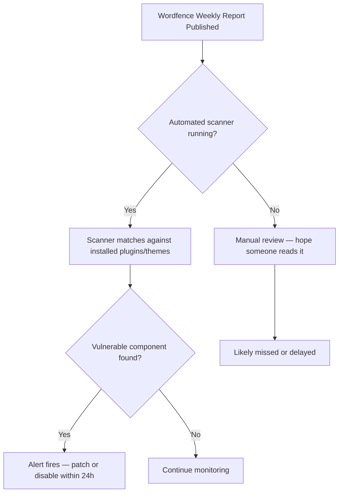

174 new WordPress vulnerabilities in a single week. 139 plugins. 28 themes. 64 security researchers contributing disclosures. That is not a spike — that is the baseline pace.

<!-- truncate -->

:::danger[Scale of Exposure]
174 vulnerabilities across 139 plugins and 28 themes were disclosed in one week. If you run WordPress and do not have automated vulnerability scanning, you are flying blind.
:::

## Week at a Glance

| Metric | Count |
|---|---|
| Total Vulnerabilities | 174 |
| Affected Plugins | 139 |
| Affected Themes | 28 |
| Contributing Researchers | 64 |

## The Real Problem

The volume is not the issue. The issue is that most teams treat these reports like newsletter content instead of operational input.

I keep seeing the same pattern: someone drops the Wordfence report in Slack, a few people react, nobody patches anything until the next sprint. Meanwhile, the actually exploitable plugin is still live in production.


```mermaid
flowchart TD
    A[Wordfence Weekly Report Published] --> B{Automated scanner running?}
    B -->|Yes| C[Scanner matches against installed plugins/themes]
    C --> D{Vulnerable component found?}
    D -->|Yes| E[Alert fires — patch or disable within 24h]
    D -->|No| F[Continue monitoring]
    B -->|No| G[Manual review — hope someone reads it]
    G --> H[Likely missed or delayed]
```

## What I Found

Plugins remain the dominant attack surface. 139 out of 174 vulnerabilities hit plugins — that is 80%. Themes accounted for the rest.

:::tip[Fast Inventory Check]
Run `wp plugin list --format=json` and `wp theme list --format=json` to get a machine-readable snapshot of everything installed. Diff it against the report's affected slugs.
:::

### Severity Distribution

| Severity | What It Means | Typical Action |
|---|---|---|
| Critical | Unauthenticated RCE/SQLi, full compromise | Patch within hours |
| High | Authenticated exploit, significant impact | Patch within 24h |
| Medium | Specific conditions required | Patch within 1 week |
| Low | Informational, defense-in-depth | Schedule in next maintenance window |

## Automate or Drown

Manual tracking of 174 vulnerabilities per week does not scale. Period.

```bash title="Terminal — dump installed plugins to JSON"
wp plugin list --format=json > /tmp/wp-plugins-inventory.json
```

```bash title="Terminal — check for available updates"
wp plugin list --update=available --format=table
```

<details>
<summary>Building your own automated triage pipeline</summary>

The basic shape is straightforward:

1. **Pull the Wordfence feed** — their intelligence API or RSS feed gives you structured vulnerability data.
2. **Inventory your installs** — `wp-cli` on every managed site, output to JSON.
3. **Match and flag** — compare installed plugin/theme slugs and versions against the feed.
4. **Alert and track** — fire Slack/email alerts for matches, create tickets with SLA deadlines.
5. **Verify after patching** — re-run the scan to confirm the vulnerability is resolved.

For a working implementation, see the [Wordfence RSS auditor with WP-CLI](/2026-02-18-wordfence-rss-wp-cli-auditor). Combine it with the [WP Malware Sentinel](/2026-02-08-wp-malware-sentinel-scanner) for deeper file-level scanning.

</details>

## Triage Checklist

- [ ] Run `wp plugin list --update=available` on all managed sites
- [ ] Cross-reference installed versions against the Wordfence report
- [ ] Prioritize critical/high severity patches for immediate deployment
- [ ] Disable or remove any plugins that are abandoned with no fix available
- [ ] Verify patches in staging before production deploy
- [x] Set up automated scanning for next week's report

## Key Takeaways

**Plugins are the primary vector.** 80% of disclosures hit plugins. Vet before installing. Remove what you do not use. Update what you keep.

**Automation is not optional.** 174 vulnerabilities per week cannot be processed manually with any reliability. Automated scanning and alerting are table stakes.

**Community research matters.** 64 researchers contributed to these disclosures. The open-source security ecosystem works, but only if maintainers and site operators act on the findings.

> "Wordfence Intelligence reported 174 new vulnerabilities between February 9 and February 15, 2026, impacting 139 plugins and 28 themes."
>
> — Wordfence Intelligence, [Weekly WordPress Vulnerability Report](https://www.wordfence.com/blog/2026/02/wordfence-intelligence-weekly-wordpress-vulnerability-report-february-9-2026-to-february-15-2026/)

The [AI Vulnerability Guardian](/2026-02-08-drupal-ai-vulnerability-guardian) for Drupal applies the same philosophy on the Drupal side — automated triage at machine speed instead of human reading speed.

## References

- [Wordfence Intelligence Weekly WordPress Vulnerability Report (Feb 9-15, 2026)](https://www.wordfence.com/blog/2026/02/wordfence-intelligence-weekly-wordpress-vulnerability-report-february-9-2026-to-february-15-2026/)
