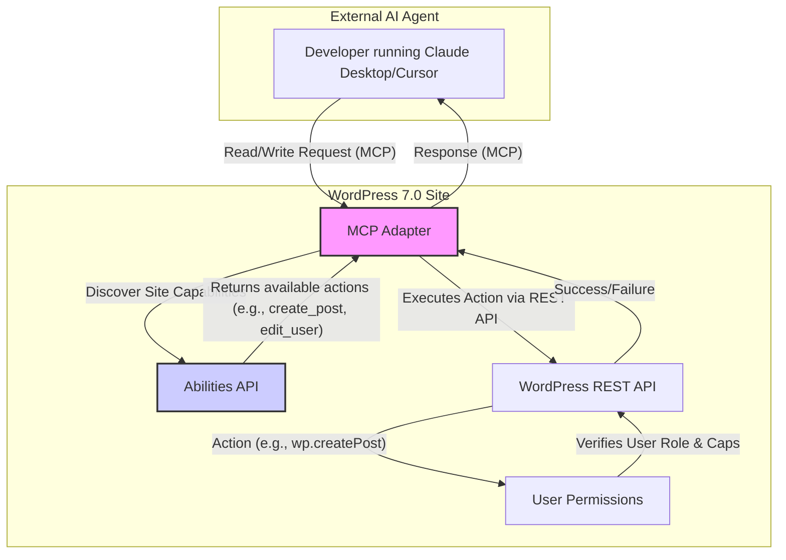

import Tabs from '@theme/Tabs';
import TabItem from '@theme/TabItem';

WordPress 7.0 Beta 1 has been released, and it's packed with features that signal a major evolution for the world's most popular CMS. This release focuses on native AI integration, real-time collaboration, and a significantly improved user experience, making it one of the most anticipated updates in years.

<!-- truncate -->

## The Problem: Keeping Pace in the Age of AI and Collaboration

For years, WordPress has been the go-to platform for building websites, but its core editing experience has lagged behind modern collaborative tools like Google Docs or Notion. Simple tasks like having two authors work on a post simultaneously were impossible without clunky workarounds. Furthermore, integrating advanced AI capabilities often required a patchwork of third-party plugins, creating inconsistency and potential security issues. As AI becomes more integrated into developer and content creator workflows, WordPress needed a foundational shift to remain competitive.

## The Solution: Native AI, Real-time Editing, and a UI Refresh

WordPress 7.0 Beta 1 addresses these challenges head-on with a trio of major updates.

### 1. Built-in AI Agent Support

The most significant new feature is the inclusion of native support for AI agents. This is enabled by a new **MCP (Model Context Protocol) Adapter** shipping with WordPress Core. This allows AI tools and agents to interact with a WordPress site programmatically and semantically.

This architecture allows an AI agent, like one running in a developer's IDE, to understand a site's capabilities (via the Abilities API) and perform actions securely.

### 2. Real-Time Collaboration

Inspired by Google Docs, WordPress 7.0 brings true real-time collaboration to the block editor. Multiple users can now edit the same post simultaneously, with changes reflected instantly for everyone. This includes:
- Live cursors for all active editors.
- Offline editing support with automatic data syncing.
- A new default HTTP polling sync provider to ensure data consistency.

### 3. Admin UI Refresh and New Blocks

The admin interface has received its first major visual update since 2018, resulting in a cleaner and more modern experience. Key changes include:

| Feature                 | Description                                                                 |
| ----------------------- | --------------------------------------------------------------------------- |
| **View Transitions**    | Smooth, animated transitions between admin screens.                         |
| **Font Library**        | A new screen to browse, install, and manage fonts for your site.            |
| **Responsive Controls** | Show or hide specific blocks based on screen size (desktop, tablet, mobile).|
| **Per-Block Custom CSS**| Add custom CSS directly to individual blocks for more granular control.     |

Several new and improved blocks have also been introduced, such as a **Tabs Block**, a responsive-enabled **Grid Block**, and a **Cover Block** that now supports video backgrounds.

## What I Learned

- **AI is a First-Class Citizen:** WordPress is no longer just a CMS; it's becoming a platform for AI-driven content creation and management. The native agent support is a game-changer.
- **Collaboration is Key:** The real-time editing features finally bring the WordPress editor on par with modern collaborative writing tools, which will dramatically improve workflows for content teams.
- **The Modern Web Demands a Modern UI:** The admin refresh and new design controls show a commitment to improving the daily user experience for creators and developers.

## References

- [WordPress 7.0 Beta 1 Announcement](https://wordpress.org/news/2026/02/wordpress-7-0-beta-1/)

This beta release is a bold step forward for WordPress. It embraces the future of web development and content creation, and I'm excited to see how these features evolve for the final release.
