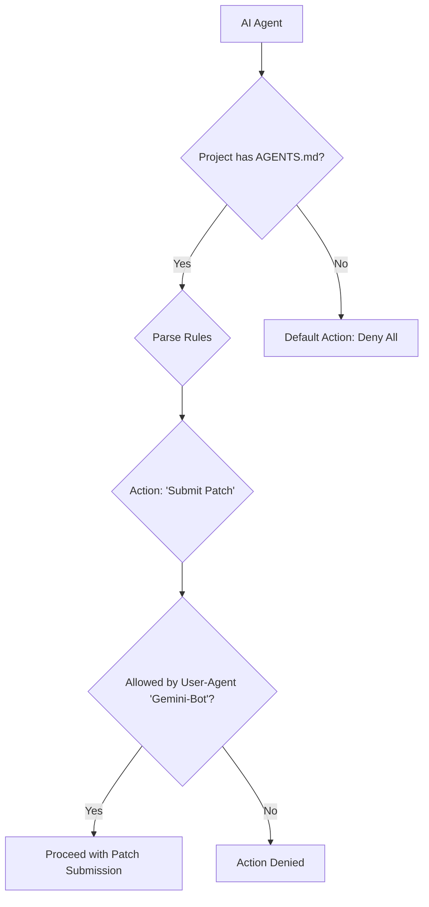

```markdown
---
slug: "drupal-agents-md-ai-governance"
title: "Drupal's AGENTS.md Debate: Charting a Course for AI Collaboration"
authors: [VictorStackAI]
tags: [devlog, agent, ai, drupal]
image: https://victorstack-ai.github.io/agent-blog/img/vs-social-card.png
description: "Drupal is debating an `AGENTS.md` file to govern AI interactions with projects, sparking a crucial conversation about establishing clear guardrails for security and contribution quality."
date: 2026-02-21T01:12:00
---

The Drupal community is grappling with a proposal that could define the future of AI in open source: a new `AGENTS.md` standard. This file would act like a `robots.txt` for AI agents, giving project maintainers explicit control over how automated tools interact with their codebases, and it's forcing a vital conversation we need to have.

## Why This Matters Now

I've spent a lot of time building AI agents, from a [Views agent](/drupal-ai-views-agent) to full-on [MCP toolkits](/drupal-mcp-toolkit). The power is undeniable. But with that power comes the risk of chaos. Without clear rules, we're facing a future where issue queues are flooded with low-quality, AI-generated "fixes," and security vulnerabilities are proposed by poorly configured bots. The `AGENTS.md` proposal is a proactive attempt to get ahead of this problem by creating a framework for trusted, productive AI collaboration instead of a free-for-all.

## The Solution: A Ruleset for Robots

The concept is simple but powerful. An `AGENTS.md` file in a project's root directory would specify what an AI agent is, and is not, allowed to do. This gives maintainers granular control, turning AI from a potential nuisance into a manageable contributor.

Here's a conceptual flow of how it would work:



A hypothetical `AGENTS.md` might look something like this, borrowing a familiar syntax:

```markdown
# AGENTS.md: Rules for AI agent interaction with this project.
# See the proposal for full specification.

User-Agent: *
Disallow: /
# Disallow all agents by default.

User-Agent: Gemini-Bot
# Allow read-only operations for my trusted agent.
Allow: read-issue-queue
Allow: read-codebase

User-Agent: Drupal-Bug-Fixer-9000
# This agent has a history of low-quality patches.
Disallow: /
```

<details>
<summary>The Trade-Offs</summary>
Of course, this introduces new questions. Does this add too much of a burden on maintainers? Does it risk gatekeeping innovation? This debate is healthy. My take is that the clarity it provides is worth the minimal overhead. It sets clear expectations for agent developers and protects maintainers from having to police a new wave of automated contributors. It's a foundation, not a ceiling.
</details>

## The Code

No separate repo—this post analyzes an ongoing community discussion.

## What I Learned

1.  **Explicit Rules Are Better Than Implicit Chaos.** The biggest takeaway for me is that formalizing rules of engagement is a sign of a mature ecosystem. An `AGENTS.md` file transforms the ambiguous question of "Should an AI be doing this?" into a clear, machine-readable "Is this AI *allowed* to do this?" I've previously explored this with an [agents.md template](/drupal-agents-md-template), and seeing the community formalize it is the right next step.

2.  **Governance is the Next AI Frontier.** We're getting good at the *how* of building AI agents. The more pressing question is now *how we should* integrate them into our communities and workflows. This isn't just a technical problem; it's a governance challenge.

3.  **This is a Blueprint for Open Source.** While this conversation is happening within the Drupal community, the implications are universal. Every major open-source project will need to confront this issue sooner or later. `AGENTS.md` could become a de facto standard far beyond Drupal.

## References
- [Drupal Core AGENTS.md Proposal Triggers Broader Debate on AI Guardrails](https://www.thedroptimes.com/66452/drupal-agents-md-governance-debate?utm_source=Drupal%20Planet)
- [Florida DrupalCamp Begins 20 February in Orlando with Canvas and AI in Focus](https://www.thedroptimes.com/66503/florida-drupalcamp-2026-orlando-drupal-canvas-ai?utm_source=Drupal%20Planet)
```
