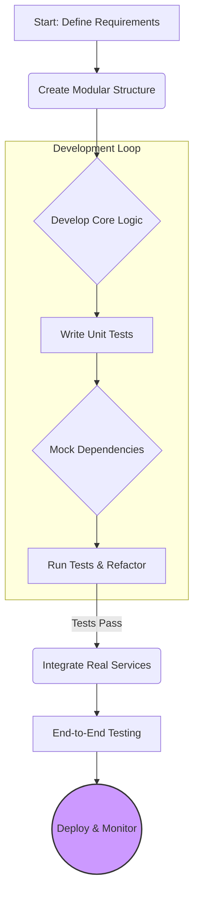

import Tabs from '@theme/Tabs';
import TabItem from '@theme/TabItem';

The world of agentic AI is exhilarating. With just a few lines of code and a powerful LLM, you can create agents that perform complex tasks. This rapid iteration is a huge part of the fun, but it often leads to a development style I call "vibe coding." You tweak a prompt, rerun, and if the "vibe" feels right, you ship it. This works for a quick demo, but it's a recipe for disaster in production.

<!-- truncate -->

## The Problem: The High Cost of "It Just Works"

"Vibe coding" is the practice of developing without a clear structure, relying on intuition and manual spot-checks. When building AI agents, this typically looks like:

*   **Monolithic Code:** The agent's logic, prompts, and API calls are all tangled in a single script.
*   **No Tests:** Verification means running the agent and seeing if the output "looks good." There's no automated way to catch regressions.
*   **Fragile Prompts:** Prompts are treated as magic strings, with no versioning or systematic way to evaluate changes.
*   **Hidden Risks:** Without clear boundaries and tests, it's impossible to know how the agent will behave with unexpected inputs or when a downstream model changes. This can lead to anything from data corruption to serious security vulnerabilities.

This approach creates systems that are brittle, impossible to maintain, and untrustworthy.

## The Solution: A Disciplined, Engineering-First Workflow

To build robust agentic systems, we need to apply the same engineering discipline we use for any other production software. This means adopting a structured workflow that emphasizes modularity, testability, and clear separation of concerns.

Here’s a practical workflow for building a reliable AI agent:



This workflow breaks the problem down into manageable, testable pieces:

1.  **Modular Structure:** Separate your code into distinct components: the agent's main logic, services that interact with external APIs (like LLMs), and configuration.
2.  **Test-Driven Development (TDD):** Before writing the agent's core logic, write tests that define what it should do. This forces you to think about edge cases and desired outcomes.
3.  **Mocking Dependencies:** Your agent's tests should *never* make real API calls. Use mocking libraries to simulate the behavior of the LLM or any other external service. This makes your tests fast, predictable, and free.
4.  **Configuration as Code:** Don't hardcode model names, API keys, or prompts. Store them in configuration files (like YAML or `.env`) and load them into your application.

<Tabs>
<TabItem value="project" label="Example Project Structure">

A clean project structure makes these principles easy to apply. Here’s the layout for the example project that accompanies this article:

```
structured-agent-example/
├── pyproject.toml      # Project definition and dependencies
├── README.md
├── src/
│   └── structured_agent_example/
│       ├── __init__.py
│       ├── agent.py        # Core agent logic
│       └── llm_service.py  # Mocked external service
└── tests/
    └── test_agent.py     # Unit tests for the agent
```

</TabItem>
<TabItem value="test" label="A Sample Test">

This test from the project uses Python's `unittest.mock` to validate the agent's behavior without calling a real LLM. It checks if the agent correctly processes a "positive" sentiment response from the mocked service.

```python
# tests/test_agent.py
@patch('structured_agent_example.llm_service.get_sentiment')
def test_run_positive_sentiment(self, mock_get_sentiment):
    """Tests the agent's run method with a mock."""
    # Configure the mock to return a specific value
    mock_get_sentiment.return_value = "positive"
    
    agent = SentimentAgent({"model_name": "test-model-v1"})
    text = "This is a great product, I love it!"
    result = agent.run(text)
    
    # Assert that our mock was called correctly
    mock_get_sentiment.assert_called_once_with(text, model="test-model-v1")
    
    # Assert that the agent processed the result correctly
    self.assertEqual(result["status"], "success")
    self.assertEqual(result["sentiment"], "positive")
```
This test verifies the agent's internal logic, not the LLM's accuracy.

</TabItem>
</Tabs>

## What I Learned

*   **Structure is Freedom:** A good structure doesn't slow you down; it speeds you up by making your code easier to reason about and safer to change.
*   **Test the Agent, Not the AI:** The goal of unit testing here is to verify your agent's logic, error handling, and data transformations—not to test the intelligence of the LLM itself.
*   **Start Small:** You don't need a complex framework to get started. The principles of modularity and testing can be applied to even the simplest agent. The example project is under 50 lines of Python.

Building agentic AI systems is a new frontier, but the hard-won lessons of software engineering still apply. By moving beyond "vibe coding" to a more disciplined approach, we can build agents that are not just clever, but also reliable, maintainable, and ready for the real world.

## References

*   [View Code: `structured-agent-example` on GitHub](https://github.com/victorstack-ai/structured-agent-example) - *Note: The repo will be created shortly.*
