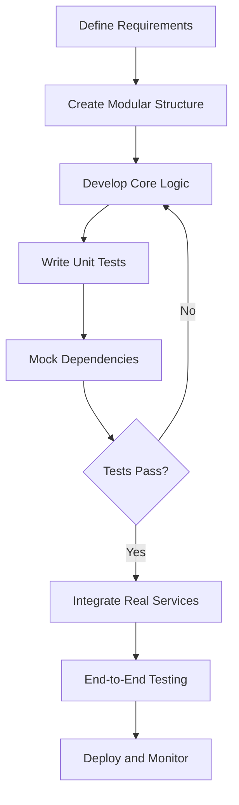
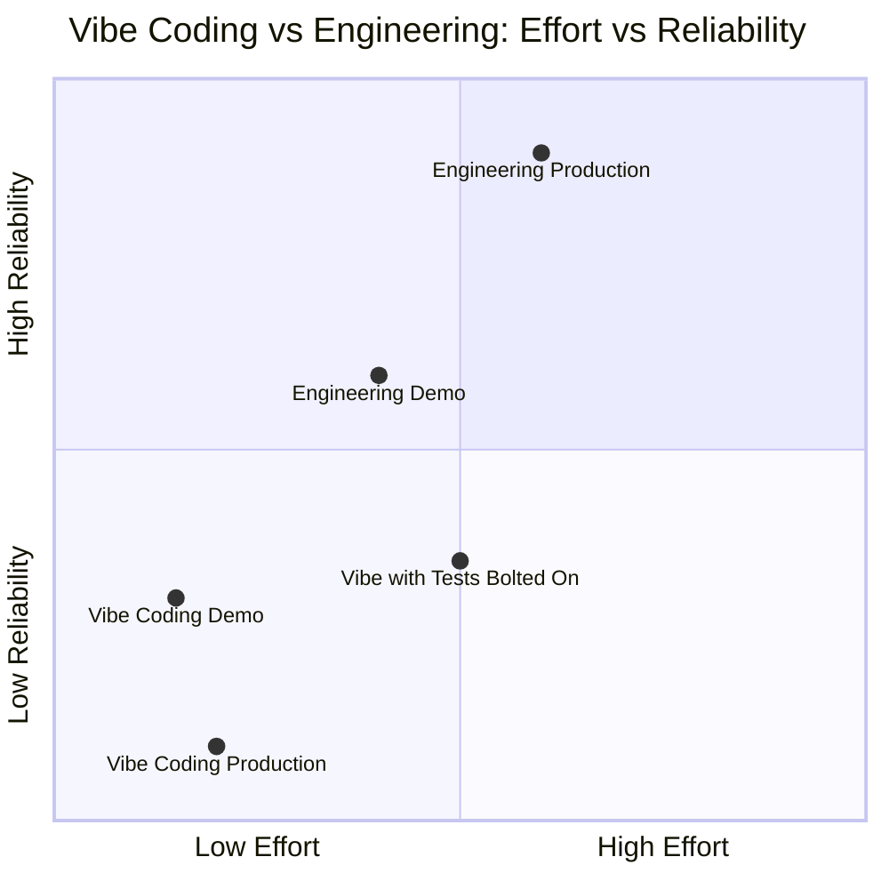

import Tabs from '@theme/Tabs';
import TabItem from '@theme/TabItem';

Agentic AI moves fast. A few lines of code, a powerful LLM, and suddenly an agent is doing something that looks impressive. The rapid iteration is addictive, but it leads to a development style I call "vibe coding" -- tweak a prompt, rerun, and if the output feels right, ship it.

This works for a demo. It is a recipe for disaster in production.

<!-- truncate -->

## The Problem: Vibe Coding

**Vibe coding**: developing without a clear structure, relying on intuition and manual spot-checks.

:::info[Context]
This is not a theoretical complaint. I see this pattern in every team adopting AI agents. The initial prototype is fast and impressive. Then it breaks in production because nobody wrote tests, nobody versioned the prompts, and nobody knows what the agent does with unexpected inputs.
:::

| Vibe Coding Symptom | What Goes Wrong |
|---|---|
| Monolithic code | Agent logic, prompts, and API calls tangled in one script |
| No tests | Verification means running the agent and eyeballing it |
| Fragile prompts | Treated as magic strings, no versioning or evaluation |
| Hidden risks | No boundaries, no tests for unexpected inputs or model changes |

The result: systems that are brittle, impossible to maintain, and untrustworthy.

## The Solution: Engineering-First Workflow


```mermaid
flowchart TD
    A[Define Requirements] --> B[Create Modular Structure]
    B --> C[Develop Core Logic]
    C --> D[Write Unit Tests]
    D --> E[Mock Dependencies]
    E --> F{Tests Pass?}
    F -->|Yes| G[Integrate Real Services]
    F -->|No| C
    G --> H[End-to-End Testing]
    H --> I[Deploy and Monitor]
```

<Tabs>
<TabItem value="project" label="Project Structure">

A clean project structure makes these principles easy to apply:

```text title="structured-agent-example/" showLineNumbers
structured-agent-example/
├── pyproject.toml      # Project definition and dependencies
├── README.md
├── src/
│   └── structured_agent_example/
│       ├── __init__.py
│       ├── agent.py        # Core agent logic
│       └── llm_service.py  # Mocked external service
└── tests/
└── test_agent.py     # Unit tests for the agent
```

</TabItem>
<TabItem value="test" label="A Sample Test">

This test uses Python's `unittest.mock` to validate the agent's behavior without calling a real LLM:

```python title="tests/test_agent.py" showLineNumbers
@patch('structured_agent_example.llm_service.get_sentiment')
def test_run_positive_sentiment(self, mock_get_sentiment):
"""Tests the agent's run method with a mock."""
# Configure the mock to return a specific value
mock_get_sentiment.return_value = "positive"

agent = SentimentAgent({"model_name": "test-model-v1"})
text = "This is a great product, I love it!"
# highlight-next-line
result = agent.run(text)

# Assert that our mock was called correctly
mock_get_sentiment.assert_called_once_with(text, model="test-model-v1")

# Assert that the agent processed the result correctly
self.assertEqual(result["status"], "success")
self.assertEqual(result["sentiment"], "positive")
```

This test verifies the agent's internal logic, not the LLM's accuracy.

</TabItem>
</Tabs>

## Vibe Coding vs Engineering-First

| Aspect | Vibe Coding | Engineering-First |
|---|---|---|
| Structure | Single script | Modular components |
| Testing | Manual spot-checks | Automated unit + integration tests |
| Dependencies | Direct API calls everywhere | Mocked, injectable services |
| Prompts | Hardcoded magic strings | Versioned, evaluated, configurable |
| Configuration | Scattered env vars | Config-as-code (YAML/.env) |
| Failure handling | Hope it works | Explicit error paths |
| Maintainability | Only the author understands it | Any engineer can contribute |


```mermaid
quadrantChart
    title Vibe Coding vs Engineering: Effort vs Reliability
    x-axis Low Effort --> High Effort
    y-axis Low Reliability --> High Reliability
    Vibe Coding Demo: [0.15, 0.3]
    Vibe Coding Production: [0.2, 0.1]
    Engineering Demo: [0.4, 0.6]
    Engineering Production: [0.6, 0.9]
    Vibe with Tests Bolted On: [0.5, 0.35]
```

:::caution[Reality Check]
"Structure is freedom" sounds like a platitude until you are debugging a production agent at 2 AM and realize the prompt changed three times, the mock was never updated, and the error handling path was never tested. The upfront investment in structure pays for itself on the first incident.
:::

<details>
<summary>The four principles in detail</summary>

1. **Modular Structure**: Separate the code into distinct components -- the agent's main logic, services that interact with external APIs (like LLMs), and configuration. Each piece should be independently testable.

2. **Test-Driven Development (TDD)**: Before writing the agent's core logic, write tests that define what it should do. This forces clarity about edge cases and desired outcomes before implementation.

3. **Mocking Dependencies**: Agent tests should never make real API calls. Mocking libraries simulate LLM behavior, keeping tests fast, predictable, and free.

4. **Configuration as Code**: Hardcoded model names, API keys, or prompts are a liability. Configuration files (YAML or .env) enable environment-specific behavior without code changes.

</details>

## Why this matters for Drupal and WordPress

Drupal and WordPress agencies are increasingly building AI agents for content migration, SEO optimization, and automated site audits. The vibe-coding trap is especially dangerous here because CMS integrations touch live content databases. A monolithic agent that bulk-updates WordPress posts or Drupal nodes without proper mocking, test coverage, and error boundaries can corrupt production content. The modular structure and mock-first testing approach in this post directly applies to any agent that calls the WordPress REST API or Drupal's JSON:API.

## What I Learned

- **Structure is freedom.** Good structure does not slow me down. It speeds me up by making the code easier to reason about and safer to change.
- **Test the agent, not the AI.** The goal of unit testing is to verify the agent's logic, error handling, and data transformations -- not to test the intelligence of the LLM.
- **Start small.** The principles of modularity and testing apply to even the simplest agent. My example project is under 50 lines of Python.
- The hard-won lessons of software engineering still apply to AI systems. "It works on my machine" is not a deployment strategy.

## References

- [View Code: `structured-agent-example` on GitHub](https://github.com/victorstack-ai/structured-agent-example)


***
*Looking for an Architect who doesn't just write code, but builds the AI systems that multiply your team's output? View my enterprise CMS case studies at [victorjimenezdev.github.io](https://victorjimenezdev.github.io) or connect with me on LinkedIn.*
