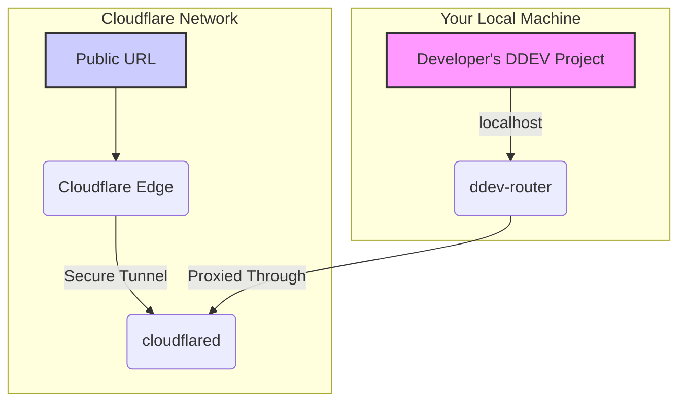

import Tabs from '@theme/Tabs';
import TabItem from '@theme/TabItem';

DDEV, the open-source local development tool, has long been a staple for web developers. With its v1.25.0 release, it fundamentally improves how we share work in progress, introducing a modular share provider system with Cloudflare Tunnel as the star.

<!-- truncate -->

## The Problem: The Old Share Workflow

Previously, `ddev share` relied exclusively on ngrok. While functional, this approach had several pain points:

*   **Account Required:** Users needed an ngrok account and an authtoken configured to get reliable and long-lasting URLs.
*   **Opaque Process:** The underlying mechanism was a bit of a black box, making it difficult to troubleshoot when things went wrong.
*   **Rate-Limiting:** The free ngrok tier has limitations that could be disruptive for active collaboration sessions with clients or team members.
*   **Configuration Overhead:** Managing the ngrok token and ensuring it was correctly configured for DDEV added an extra setup step for developers.

This friction often made sharing a quick preview of a site more trouble than it was worth.

## The Solution: Modular Providers and Cloudflare Tunnels

DDEV v1.25.0 completely reworks the `ddev share` command, making it extensible through a provider system. The default and most exciting new provider is `cloudflare`, which leverages Cloudflare's Ingress Rules and Quick Tunnels.

This new system is incredibly simple to use and requires **zero configuration**. No accounts, no API keys, no tokens.

To share your project, you now simply run:

```bash
ddev share --provider cloudflare
```

DDEV handles the rest, creating a secure tunnel from your local project to a public URL.

### How It Works: The Cloudflare Tunnel Architecture

The Cloudflare provider uses a temporary, on-the-fly tunnel that securely exposes your local DDEV instance to the internet.

Here is a simplified diagram of the architecture:



This approach is not only simpler but also more robust and secure than the previous ngrok implementation.

### Provider Comparison

| Feature | Legacy ngrok Provider | New Cloudflare Provider |
| :--- | :--- | :--- |
| **Account Required** | Yes | No |
| **Authentication** | Auth Token | None |
| **Configuration** | `ddev config global --ngrok-token=<token>` | None |
| **URL Stability** | Variable (depends on account) | Stable for session |
| **Extensibility** | None | Modular system allows new providers |

## What I Learned

*   The new `cloudflare` provider in `ddev share` is a game-changer for ad-hoc project sharing, removing all setup friction.
*   This is a perfect example of a tool improving developer experience by abstracting away complex configuration. The modular architecture is a smart design choice, paving the way for future integrations.
*   For anyone who previously found `ddev share` cumbersome, it's time to give it another look. It's now a genuinely useful tool for quick collaboration.

## References

*   [DDEV v1.25.0 Release Notes](https://ddev.com/ddev-local/ddev-v1-25-0-whats-new-for-developers/)
