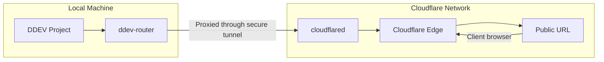

import Tabs from '@theme/Tabs';
import TabItem from '@theme/TabItem';

DDEV v1.25.0 fundamentally improves how we share work in progress. The new modular share provider system with Cloudflare Tunnel as the default is the best developer experience improvement in DDEV in years. Zero config, zero accounts, zero friction.

I have been using it daily since the release, and the old ngrok workflow feels ancient.

<!-- truncate -->

## The Old Problem

> "Previously, `ddev share` relied exclusively on ngrok. Users needed an ngrok account and an authtoken configured to get reliable URLs."
>
> — DDEV Release Notes, [v1.25.0](https://ddev.com/ddev-local/ddev-v1-25-0-whats-new-for-developers/)

:::info[Context]
The `ddev share` command has always been one of DDEV's most useful features for client demos and team collaboration. But the ngrok dependency made it frustrating: account required, token configuration, rate-limiting on free tier, and opaque debugging when things went wrong. Most developers I know just stopped using it.
:::

## The New Way: Zero-Config Cloudflare Tunnels

```bash title="Terminal"
# highlight-next-line
ddev share --provider cloudflare
```

That is it. No accounts. No API keys. No tokens. DDEV handles the rest, creating a secure tunnel from your local project to a public URL.

### How It Works


```mermaid
flowchart LR
    subgraph Local Machine
        A[DDEV Project] --> B[ddev-router]
    end
    subgraph Cloudflare Network
        C[cloudflared] --> D[Cloudflare Edge]
        D --> E[Public URL]
    end
    B -->|Proxied through secure tunnel| C
    E -->|Client browser| D
```

<Tabs>
<TabItem value="cloudflare" label="Cloudflare (New Default)">

| Aspect | Detail |
|---|---|
| Account required | **No** |
| Authentication | **None** |
| Configuration | **None** |
| URL stability | Stable for session |
| Cost | Free |
| Setup time | Zero |

```bash
ddev share --provider cloudflare
# URL appears in terminal, share it
```

</TabItem>
<TabItem value="ngrok" label="ngrok (Legacy)">

| Aspect | Detail |
|---|---|
| Account required | Yes |
| Authentication | Auth Token |
| Configuration | `ddev config global --ngrok-token=<token>` |
| URL stability | Variable (depends on account tier) |
| Cost | Free tier has limitations |
| Setup time | Account creation + token config |

```bash
ddev config global --ngrok-token=YOUR_TOKEN
ddev share
```

</TabItem>
</Tabs>

## Provider Comparison

| Feature | Legacy ngrok | New Cloudflare |
|---|---|---|
| **Account Required** | Yes | No |
| **Authentication** | Auth Token | None |
| **Configuration** | Token setup required | None |
| **URL Stability** | Variable | Stable for session |
| **Extensibility** | None | Modular system allows new providers |
| **Debugging** | Opaque | Better visibility |
| **Rate Limiting** | Free tier limits | No limits observed |

:::caution[Reality Check]
Cloudflare Quick Tunnels are temporary by design. The URL changes every time you restart the share session. For persistent, stable URLs that survive restarts, you still need a paid Cloudflare Tunnel or similar service. This is perfect for "hey, look at this" demos. It is not a staging environment replacement.
:::

<details>
<summary>The modular provider architecture</summary>

DDEV v1.25.0 introduces a provider system for the `share` command:

- **Cloudflare** is the default provider (zero config)
- **ngrok** remains available as an alternative provider
- **Custom providers** can be added via DDEV's extensibility model
- The architecture is designed for future integrations (Tailscale, bore, etc.)

This is smart design. Instead of hardcoding one sharing solution, DDEV now has an abstraction layer that can evolve with the ecosystem.

</details>

## Why this matters for Drupal and WordPress

DDEV is the primary local development tool for Drupal and a growing choice for WordPress. The zero-config `ddev share` with Cloudflare Tunnels eliminates a major friction point for Drupal and WordPress agencies doing client demos, stakeholder reviews, and remote pair programming. Instead of deploying to a staging server just to show a content editor a layout change, a developer can share a live tunnel URL in seconds. This is especially valuable for Drupal site builders testing recipe configurations and WordPress theme developers iterating on Customizer changes with remote clients.

## What I Learned

- The new `cloudflare` provider in `ddev share` removes all setup friction for ad-hoc project sharing. This is a genuine developer experience win.
- The modular architecture is a smart design choice that paves the way for future integrations without coupling DDEV to any single vendor.
- For anyone who previously found `ddev share` cumbersome, it is time to give it another look. It actually works now.
- Zero-config tools win adoption. Every step of friction you remove doubles the number of people who will actually use the feature.

## References

- [DDEV v1.25.0 Release Notes](https://ddev.com/ddev-local/ddev-v1-25-0-whats-new-for-developers/)


***
*Looking for an Architect who doesn't just write code, but builds the AI systems that multiply your team's output? View my enterprise CMS case studies at [victorjimenezdev.github.io](https://victorjimenezdev.github.io) or connect with me on LinkedIn.*
