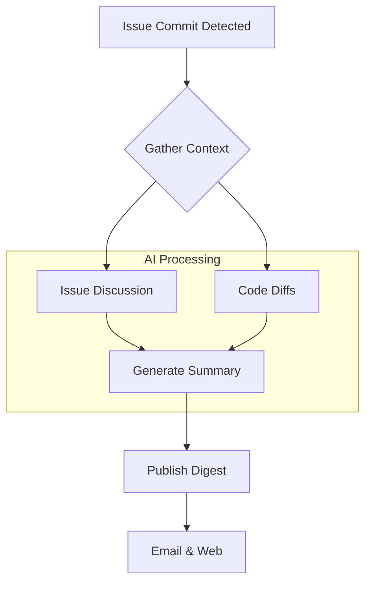

import Tabs from '@theme/Tabs';
import TabItem from '@theme/TabItem';

Dries Buytaert has introduced "Drupal Digests," a new initiative designed to help contributors track development activity across various Drupal projects, including Drupal Core and the ambitious new AI Initiative. This AI-powered system generates summaries of issue updates, making it easier to stay informed.

<!-- truncate -->

## The Problem: Keeping Pace with Innovation

As the Drupal ecosystem expands, with major initiatives like Drupal CMS, Drupal Canvas, and the Drupal AI Initiative running in parallel, the volume of development activity has become immense. For contributors, stakeholders, and agency developers, tracking important changes across dozens of issue queues on Drupal.org is a significant challenge. It's easy to miss critical updates, which can lead to duplicated effort or building on outdated information.

## The Solution: AI-Powered Summaries

Drupal Digests solve this problem by using AI to automate the process of tracking and summarizing development progress. The system monitors the issue queues of selected strategic projects and, upon detecting a significant commit, triggers a process to create a digest.

Here is the workflow for generating a digest:

The AI-generated summaries are designed to be concise and informative, explaining:
-   **What** has changed in the issue.
-   **Why** the change is important for the project.
-   **If** any action is required from other contributors.

This allows developers to quickly grasp the essence of a change without needing to read through long and complex issue threads.

## What I Learned

-   **AI as a Force Multiplier:** This is a fantastic example of using AI not just for code generation, but for improving the developer experience and productivity of an entire open-source community.
-   **Targeted Information:** By focusing on strategic initiatives, the digests provide high-signal, low-noise updates that are relevant to those most invested in Drupal's future.
-   **Scalability:** As Drupal continues to grow, systems like this will become essential for maintaining project velocity and ensuring effective collaboration. This approach could be a model for other large open-source projects.

For more insights on how AI is shaping the Drupal landscape, consider reading about the [tools you can use from day one](/ai-in-drupal-cms-2-0-dayone-tools) or the recent [Drupal AI Hackathon](/drupal-ai-hackathon-review).

## References

-   [The Drop Times: Dries Buytaert Introduces Drupal Digests, an AI-Powered Tool to Track Drupal Development](https://thedroptimes.com/39321/dries-buytaert-introduces-drupal-digests-ai-powered-tool-track-drupal-development)
-   [GitHub: Drupal Digest AI Project](https://github.com/dries/digest)
