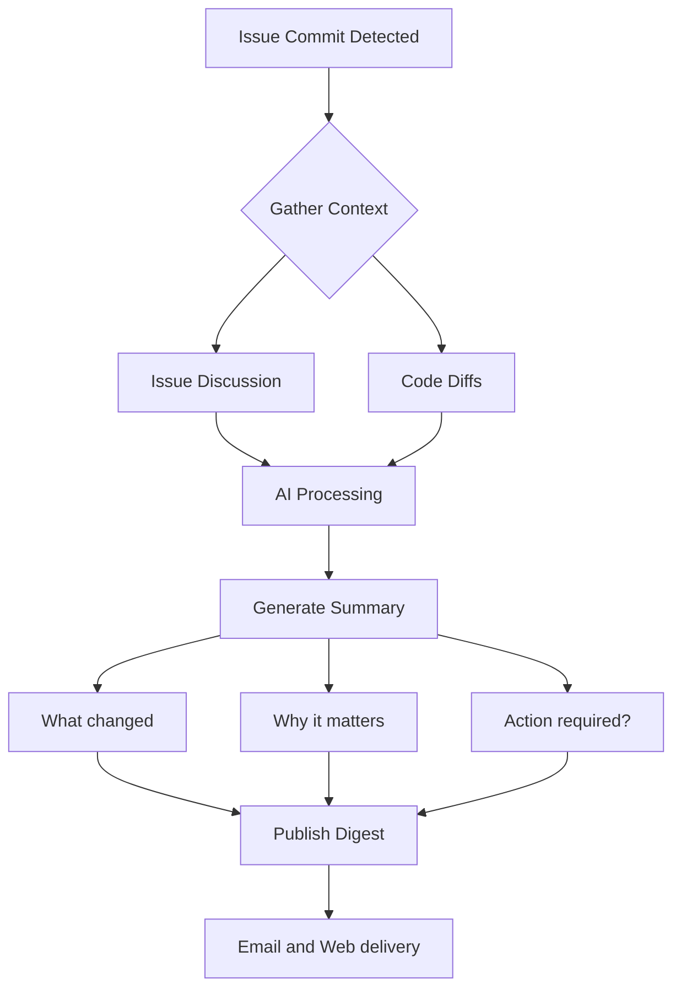

import Tabs from '@theme/Tabs';
import TabItem from '@theme/TabItem';

Dries Buytaert has introduced "Drupal Digests," a new initiative that uses AI to summarize development activity across Drupal Core, Drupal CMS, Canvas, and the AI Initiative. This is one of the most practical uses of AI in open-source project management I have seen.

Instead of building AI *into* Drupal, this is using AI to make the Drupal *project* more navigable. Smart move.

<!-- truncate -->

## The Problem

> "As the Drupal ecosystem expands, with major initiatives running in parallel, the volume of development activity has become immense."

:::info[Context]
Drupal's issue queues on Drupal.org are the primary coordination mechanism for thousands of contributors. But the volume is overwhelming. Major initiatives run in parallel, each with dozens of active issue threads. Missing a critical update leads to duplicated effort or building on outdated assumptions. This is not a tooling problem — it is an information architecture problem.
:::

| Challenge | Impact |
|---|---|
| Multiple parallel initiatives | Drupal CMS, Canvas, AI Initiative, Core |
| Dozens of active issue queues | Impossible to follow manually |
| Long issue threads | Critical updates buried in noise |
| Contributor time | Spent reading instead of coding |

## The Solution: AI-Generated Summaries

```mermaid
flowchart TD
    A[Issue Commit Detected] --> B{Gather Context}
    B --> C[Issue Discussion]
    B --> D[Code Diffs]
    C --> E[AI Processing]
    D --> E
    E --> F[Generate Summary]
    F --> G[What changed]
    F --> H[Why it matters]
    F --> I[Action required?]
    G --> J[Publish Digest]
    H --> J
    I --> J
    J --> K[Email and Web delivery]
```

<Tabs>
<TabItem value="what" label="What Digests Contain">

Each AI-generated summary explains:
- **What** has changed in the issue
- **Why** the change is important for the project
- **If** any action is required from other contributors

This lets developers quickly grasp the essence of a change without reading through long, complex issue threads.

</TabItem>
<TabItem value="projects" label="Tracked Projects">

| Project | Why It Is Tracked |
|---|---|
| Drupal Core | Foundation for everything |
| Drupal CMS | The new out-of-box experience |
| Drupal Canvas | New page building interface |
| Drupal AI Initiative | AI integration across the ecosystem |

</TabItem>
</Tabs>

## AI as a Force Multiplier for Open Source

| Aspect | Traditional Approach | Drupal Digests |
|---|---|---|
| Tracking changes | Manual issue queue monitoring | AI-detected commits trigger summaries |
| Understanding context | Read entire issue thread | Read 3-sentence summary |
| Time investment | Hours per week | Minutes per week |
| Coverage | Miss things constantly | Comprehensive across tracked projects |
| Action clarity | Buried in discussion | Explicit action-required flag |

:::caution[Reality Check]
AI-generated summaries are only as good as the issue data they process. If the issue threads are poorly written, the summaries will be too. And there is always a risk of the AI misinterpreting the significance of a change. This is a useful signal, not a replacement for actual engagement with critical issues that affect your work.
:::

How this compares to other open-source tracking approaches

- **GitHub Release Notes**: Manual, author-curated. High quality but limited to releases.
- **Changelog generators**: Automated from commit messages. Low context.
- **RSS/Planet feeds**: Blog-style updates. Irregular cadence.
- **Drupal Digests**: AI-processed from issue activity. Commit-triggered, context-rich, automated.

The key differentiator is that Digests process the *discussion and code diffs*, not just the commit message. This provides "why" context that other automated approaches miss.

## Why this matters for Drupal and WordPress

Drupal contributors and agency teams can now stay current on Core, CMS, Canvas, and AI Initiative progress without manually monitoring dozens of issue queues. This directly reduces the "upgrade surprise" problem that hits Drupal agencies during major version transitions. The WordPress community faces the same information overload with Gutenberg, Full Site Editing, and the 7.0 transition -- the Drupal Digests approach of AI-processed issue activity is a replicable model that WordPress Make teams could adopt for tracking parallel development tracks.

## What I Learned

- **AI as a force multiplier:** This is a great example of using AI not for code generation, but for improving developer experience and productivity across an entire open-source community.
- **Targeted information:** By focusing on strategic initiatives, the digests provide high-signal, low-noise updates relevant to those most invested in Drupal's future.
- **Scalability:** As Drupal continues to grow, systems like this will become essential for maintaining project velocity and effective collaboration.
- This is the kind of AI application that actually makes sense. Not flashy, not hype-driven. Just making an existing workflow better.

## References

- [The Drop Times: Dries Buytaert Introduces Drupal Digests](https://thedroptimes.com/39321/dries-buytaert-introduces-drupal-digests-ai-powered-tool-track-drupal-development)
- [GitHub: Drupal Digest AI Project](https://github.com/dries/digest)

***
*Need an Enterprise CMS Architect to modernize your legacy PHP platforms? View my case studies at [victorjimenezdev.github.io](https://victorjimenezdev.github.io) or connect with me on LinkedIn.*
