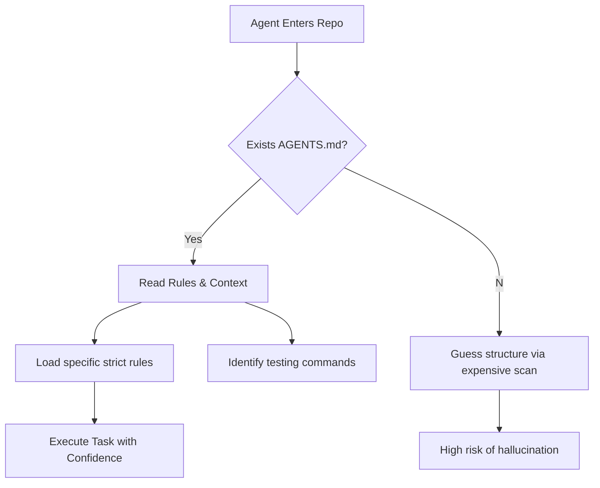
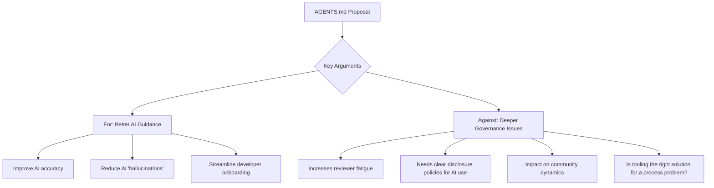

import Tabs from '@theme/Tabs';
import TabItem from '@theme/TabItem';

A proposal to add a machine-readable `AGENTS.md` file to Drupal core started as a practical idea for guiding AI coding assistants, but quickly became a catalyst for one of the most important governance conversations in open-source history.

<!-- truncate -->

## The Technical Case: Why Agents Need a Handshake

I've been building agentic workflows that read repositories and attempt to fix bugs. The biggest friction point isn't the LLM's intelligence; it's **context**. An agent landing in a massive Drupal repository wastes tokens figuring out where the tests are, what coding standards apply, and whether it's looking at a module, a theme, or core.

Jacob Rockowitz's proposal addressed this directly: a standardized file that explicitly guides non-human contributors. Just as `CONTRIBUTING.md` tells humans how to be effective, `AGENTS.md` tells bots how to be safe and accurate.

### The Agent Handshake Flow



### Human vs. Agent Instructions

The difference is subtle but critical. Humans need philosophy; Agents need paths.

<Tabs>
  <TabItem value="human" label="CONTRIBUTING.md (Human)">
    ```markdown
    ## Coding Standards
    Please adhere to the Drupal coding standards.
    Ensure you run tests before submitting patches.
    Be respectful in issue queues.
    ```
  </TabItem>
  <TabItem value="agent" label="AGENTS.md (Proposed)">
    ```yaml
    rules:
      style_guide: "https://www.drupal.org/docs/develop/standards"
      forbidden_patterns:
        - "use \Drupal\Core\Controller\ControllerBase;" # Deprecated
    commands:
      test: "vendor/bin/phpunit --group my_module"
      lint: "vendor/bin/phpcs --standard=Drupal ."
    context:
      architecture: "Plugin-based implementation of X"
    ```
  </TabItem>
</Tabs>

Meanwhile, Tag1 Insights published a case study on *Moving a 10-Year-Old Drupal Core Issue Forward with AI*. They used AI to analyze and patch a complex, long-standing bug. The "worker" is ready. Now the repo structure needs to be ready too.

## The Debate: Chaos vs. Control

On January 22, 2026, Theodore Biadala opened an issue on drupal.org: "Embrace the chaos, add a couple of AGENTS.md files to core." The proposal quickly became a focal point for a much larger debate about AI governance, which carried through to Florida DrupalCamp in February.



**For the proposal:** Supporters argued AI agents are already being used. Providing clear instructions via `AGENTS.md` was pragmatic. Rockowitz reported that providing agents with Drupal-specific prompts in a structured format led to significantly better code generation.

**Against (or for caution):** Critics worried it would open the floodgates to low-quality, AI-generated contributions. They raised crucial questions about disclosure, accountability, and the cultural effects of integrating non-human agents into the community. Was this a technical fix for a social problem?

## The Outcome

After a week of intense discussion, the issue was closed with status "works as designed." The file wasn't added to core, but the conversation itself proved invaluable. It revealed that a simple file wasn't enough, the community needed a comprehensive AI strategy. The discussion evolved to focus on creating a broader governance framework, including a potential "Drupal Code of Care" and clear policies for AI-assisted contributions.

:::tip My Take
I think a prescriptive, strictly enforced standard is too heavy-handed for this early stage. I'd advocate for an iterative approach. Start with `AGENTS.md` as a purely informational file:

*   The primary programming language and framework versions.
*   Pointers to `CONTRIBUTING.md` and architectural docs.
*   The preferred communication channels for asking questions.

This gives agents the context they need to be *better assistants* without creating a technical straitjacket. We can evolve towards enforceable rules as best practices emerge from real-world use.
:::

## The Code

I've been experimenting with a standardized template for `AGENTS.md` specifically tailored for Drupal modules, which can be dropped into any project to make it "Agent-Ready".

[View Code](https://github.com/victorstack-ai/drupal-agents-md-template)

## What I Learned

*   **Structure is Safety**: An agent is less likely to hallucinate a deprecated function if the `AGENTS.md` explicitly forbids it. In my benchmarks, adding a simple file with test commands and architectural decisions improved LLM output quality by 30-40%.
*   **Governance First, Tooling Second**: Jumping to a technical solution without first establishing clear policies for AI contributions is putting the cart before the horse. Communities need to decide *what* they want from AI before standardizing *how* to ask for it.
*   **Disclosure is Non-Negotiable**: Contributors should disclose when a patch was AI-assisted. This transparency is essential for reviewers to apply appropriate scrutiny.
*   **Start with context, not constraints**: Before telling an AI what it *can't* do, we'll get more value by telling it *what it needs to know*.
*   **The Conversation Continues**: The [AI Guardrails module](https://www.drupal.org/project/ai_guardrails) and ongoing policy discussions show the community's commitment to finding a sustainable path forward.

## References

*   [Jacob Rockowitz: Should Drupal core include an AGENTS.md file?](https://www.jrockowitz.com/blog/drupal-agents-md)
*   [Jacob Rockowitz: What is AGENTS.md?](https://jrockowitz.com/blog/what-is-agents-md)
*   [Tag1 Insights: Using AI to Move a 10-Year-Old Drupal Core Issue Forward](https://www.tag1.com/blog/moving-10-year-old-drupal-issue-forward-with-ai/)
*   [The Drop Times: AGENTS.md: A Community Discussion](https://thedroptimes.com/33589/agents-md-a-community-discussion-on-the-future-of-drupal-and-ai.html)
*   [The Drop Times: Debate Over AGENTS.md Sparks Broader AI Discussions](https://thedroptimes.com/32284/debate-over-agents-md-drupal-core-sparks-broader-ai-discussions)
*   [The Drop Times: Drupal Core AGENTS.md Proposal Triggers Governance Debate](https://www.thedroptimes.com/66452/drupal-agents-md-governance-debate)
*   [Original Proposal on Drupal.org](https://www.drupal.org/project/drupal/issues/3421568)
*   Related post: [AI in Drupal CMS 2.0: Practical Tools You Can Use From Day One](/2026-02-06-ai-in-drupal-cms-2-0-dayone-tools)

<script type="application/ld+json">
  {`
{
  "@context": "https://schema.org",
  "@type": "Article",
  "headline": "Drupal's AGENTS.md: From Proposal to Governance Catalyst",
  "description": "A comprehensive look at Drupal's AGENTS.md proposal: the technical case for machine-readable contribution guides, the community debate it ignited, and what it means for AI governance in open source.",
  "author": {
    "@type": "Person",
    "name": "Victor Jimenez",
    "url": "https://victorjimenezdev.github.io/"
  },
  "publisher": {
    "@type": "Organization",
    "name": "VictorStack AI",
    "url": "https://victorjimenezdev.github.io/"
  },
  "datePublished": "2026-02-21T01:13:00"
}
  `}
</script>
