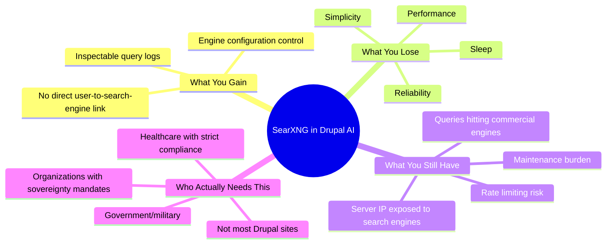

import Tabs from '@theme/Tabs';
import TabItem from '@theme/TabItem';

The Drupal AI initiative has decided the next frontier for AI assistants is... self-hosting a meta-search engine. They are championing SearXNG as a "privacy-first" way for AI agents to search the web. This is a fantastically complicated way to solve a problem most of us do not have.

I have opinions. Strong ones.

<!-- truncate -->

## The Pitch vs The Reality

> "SearXNG provides privacy-first web search for Drupal AI assistants."
>
> — Drupal AI Initiative, [SearXNG Blog Post](https://www.drupal.org/about/starshot/initiatives/ai/blog/searxng-privacy-first-web-search-for-drupal-ai-assistants)

The problem, as framed by the initiative: having an AI assistant call out to a commercial search API is a privacy leak. When your Drupal site's agent queries Google, a piece of your operational data is handed over. Fair enough.

The proposed solution: host SearXNG yourself. Your agent queries your local SearXNG instance. SearXNG queries Google, Bing, DuckDuckGo on your behalf, aggregates results, and returns them. Your server's IP is exposed, but the user's data is not directly tied to the search.

Privacy achieved, right?

:::caution[Reality Check]
What this actually means is you have just signed up to be the full-time administrator of a search engine. Congratulations.
:::

## The Glorious New Problems You Have Created

<Tabs>
  <TabItem value="ops" label="Operational Overhead">

You now have another service to deploy, monitor, secure, and update. It is not a simple PHP library. It is a Python application with its own dependencies and failure modes.

Who is on call when it breaks at 3 AM?

  </TabItem>
  <TabItem value="perf" label="Performance">

You have replaced a highly optimized, globally distributed API endpoint with a single server that has to make multiple outbound requests, parse results, and aggregate them.

It will be slower. There is no universe where this is faster than a direct API call.

  </TabItem>
  <TabItem value="blocking" label="Getting Blocked">

What do you think Google, Bing, and friends do when they see a single IP address firing off thousands of automated queries with a non-browser user-agent?

They block it. You will spend time managing proxy pools, rotating user-agents, and solving CAPTCHAs — all to scrape results you could have gotten through a legitimate API.

  </TabItem>
</Tabs>

## The Real Trade-off

| Claim | Reality |
|---|---|
| "Privacy-first search" | Your server IP is still exposed to search engines |
| "No data leakage" | Your queries still hit commercial search engines via SearXNG |
| "Self-hosted control" | You now operate a Python service with its own failure modes |
| "Better than API calls" | Slower, less reliable, higher maintenance |
| "Production ready" | Requires proxy management, rate-limit handling, CAPTCHA solving |

:::info[Context]
Self-hosting a complex service like a meta-search engine is a valid choice only if digital sovereignty is your absolute top priority and you have the operations team and budget of a small nation to back it up. For everyone else, it is a high-cost, low-reward distraction.
:::

## The Honest Assessment

This is a classic case of architectural overreach. It is a solution that looks great on a whiteboard but is a nightmare in production. It mistakes adding a complex moving part for adding value.

| Who Should Consider This | Who Should Not |
|---|---|
| Government agencies with data sovereignty mandates | Standard Drupal agency sites |
| Healthcare orgs with strict compliance requirements | Content-focused publishers |
| Organizations where "where did this query go" is auditable | E-commerce sites |
| Teams with dedicated DevOps for ancillary services | Teams of 1-5 developers |

The painful question to ask before adding any service

"What is the total, long-term cost of owning this thing?"

- Initial setup time
- Ongoing maintenance hours per month
- On-call burden when it breaks
- Security patching cadence
- Monitoring and alerting setup
- Documentation for team onboarding
- Cost of debugging when search results degrade

The maintenance cost is never zero, and it is often the thing that kills you.

## What I Learned

- Self-hosting a meta-search engine is valid only if digital sovereignty is your absolute top priority and you have the ops team to back it up. For everyone else, it is a distraction.
- "Privacy" is not a feature you bolt on with a single component. If your stack is otherwise leaky, adding a "private" search tool is pure performance art.
- Before adding any new service to your architecture, ask the painful question: "What is the total, long-term cost of owning this thing?"
- For 99% of applications, the "privacy" gained by this Rube Goldberg machine is negligible compared to the massive operational burden. Just use a commercial search API and get on with solving problems that actually affect your users.

## References

- [Drupal AI Initiative: SearXNG - Privacy-First Web Search for Drupal AI Assistants](https://www.drupal.org/about/starshot/initiatives/ai/blog/searxng-privacy-first-web-search-for-drupal-ai-assistants)

