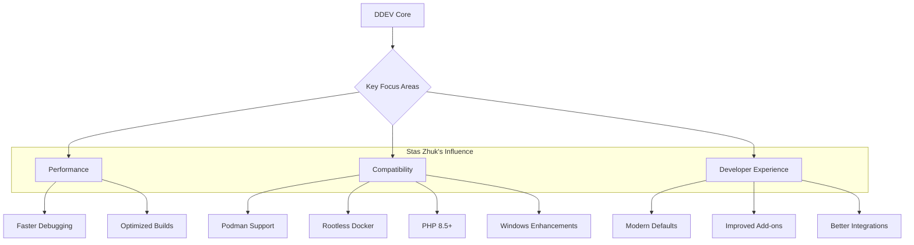

import Tabs from '@theme/Tabs';
import TabItem from '@theme/TabItem';

The local development landscape is constantly shifting, and DDEV remains a cornerstone for PHP developers. With the recent addition of Stas Zhuk as a core maintainer, the project is poised for an exciting future focused on broader compatibility, cutting-edge technology, and an even smoother developer workflow.

<!-- truncate -->

## The Problem: Keeping Pace with a Rapidly Evolving Ecosystem

Developers today face a dizzying array of technologies. New PHP versions, alternative container engines like Podman, and the demand for rootless Docker setups create a challenging environment. A local development tool that doesn't adapt quickly can become a bottleneck, forcing developers into complex manual configurations and hindering productivity. The core challenge for a tool like DDEV is to embrace these new technologies without sacrificing the stability and ease of use that made it popular.

## The Solution: A Maintainer Focused on the Future

Stas Zhuk, who joined the DDEV maintenance team in late 2023, brings a passion for experimentation and a deep understanding of the modern developer's needs. His work is already shaping DDEV's trajectory, with a clear focus on three key areas:

1.  **Cutting-Edge Technology Support:** Stas has been instrumental in integrating support for the latest technologies, including PHP 8.5 and PostgreSQL 18. This ensures developers can test and build on the newest platforms without delay.
2.  **Expanded Platform Compatibility:** A major focus is broadening where and how DDEV can run. This includes experimental support for Podman and rootless Docker, which are critical for enhanced security and flexibility in various environments. You can read more about this in our [review of DDEV with Podman](/2026-02-06-ddev-podman-rootless-review/).
3.  **Enhanced Developer Experience (DX):** Recent releases under his guidance have brought faster debugging, improved Windows support, and modern default configurations, directly addressing common pain points and streamlining the development process. The recent [DDEV v1.25 release](/ddev-v1-25-modular-share-with-cloudflare) is a testament to this commitment.

The roadmap for DDEV is becoming clearer with these priorities. We can visualize the key focus areas with the following diagram:

## What I Learned: Actionable Takeaways

My review of Stas Zhuk's contributions and DDEV's recent direction provides some clear insights for developers:

*   **DDEV is committed to staying ahead of the curve.** If you need to work with the latest PHP versions or container tech, DDEV is a safe bet.
*   **Podman is the future, and DDEV knows it.** The experimental support is a strong signal that DDEV will be a first-class citizen in the world beyond traditional Docker. Now is a good time to start experimenting with it.
*   **The add-on ecosystem is powerful.** The flexibility of DDEV's add-ons and custom Dockerfiles remains a key strength, allowing for highly customized and reproducible environments.
*   **Community involvement drives innovation.** Stas's journey and prolific engagement on GitHub highlight the power of open-source contribution in shaping a tool's future.

## References

*   [DDEV Welcomes Stas Zhuk as a New Maintainer](https://ddev.com/blog/ddev-welcomes-stas-zhuk-as-a-new-maintainer/)
*   [DDEV Socials and Contributions](https://ddev.com/blog/ddev-socials-and-contributions/)
*   [The DropTimes: DDEV v1.24.9 Release](https://thedroptimes.com/39360/ddev-v1-24-9-introduces-support-php-8-5-0-rc3-postgresql-18-and-more)
*   [Review of DDEV with Podman and Rootless Docker](/2026-02-06-ddev-podman-rootless-review/)
*   [DDEV v1.25: Modular 'ddev share' with Cloudflare and More](/ddev-v1-25-modular-share-with-cloudflare)

