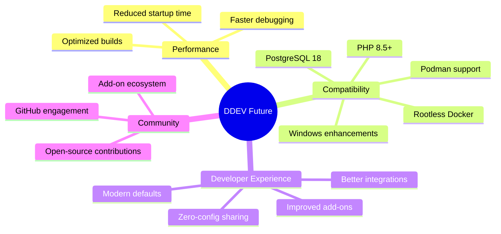

import Tabs from '@theme/Tabs';
import TabItem from '@theme/TabItem';

DDEV is one of the few local dev tools I actually trust for PHP work. Stas Zhuk joined as a core maintainer, and since then the project has been moving faster on the things that matter: broader platform compatibility, newer runtime support, and less friction in day-to-day workflows.

I have been tracking Stas's contributions. The direction is solid.

<!-- truncate -->

## The Problem: Keeping Up

:::info[Context]
A local development tool that does not adapt quickly becomes a bottleneck. New PHP versions, alternative container engines like Podman, rootless Docker setups -- the list of things DDEV has to support keeps growing. The core challenge is embracing these technologies without sacrificing the stability that made DDEV popular. Stas Zhuk, who joined the maintenance team in late 2023, is driving much of this adaptation.
:::

## What Stas Is Focused On

<Tabs>
<TabItem value="tech" label="Latest Runtime Support">

| Technology | Status |
|---|---|
| PHP 8.5 | Integrated |
| PostgreSQL 18 | Integrated |
| Podman (experimental) | In progress |
| Docker rootless | In progress |

Stas has been pushing the latest platforms into DDEV fast. I was running PHP 8.5 locally the week it hit RC, which is exactly the kind of speed that matters.

</TabItem>
<TabItem value="compat" label="Platform Compatibility">

| Platform | Improvement |
|---|---|
| macOS | Podman support, better performance |
| Windows | Improved support and defaults |
| Linux | Rootless Docker, modern defaults |
| Container engines | Modular provider architecture |

A major focus is broadening where and how DDEV can run. See the [review of DDEV with Podman](/2026-02-06-ddev-podman-rootless-review/) for details.

</TabItem>
<TabItem value="dx" label="Developer Experience">

| Improvement | Impact |
|---|---|
| Faster debugging | Reduced iteration time |
| Modern default configs | Less initial setup |
| Improved add-ons | Better extensibility |
| `ddev share` with Cloudflare | Zero-friction project sharing |

The recent [DDEV v1.25 release](/ddev-v1-25-modular-share-with-cloudflare) shows this in practice.

</TabItem>
</Tabs>

## DDEV's Focus Areas Under Stas

```mermaid
mindmap
  root((DDEV Future))
    Performance
      Faster debugging
      Optimized builds
      Reduced startup time
    Compatibility
      Podman support
      Rootless Docker
      PHP 8.5+
      PostgreSQL 18
      Windows enhancements
    Developer Experience
      Modern defaults
      Improved add-ons
      Better integrations
      Zero-config sharing
    Community
      Open-source contributions
      Add-on ecosystem
      GitHub engagement
```

## What Matters vs What Is Noise

| Signal | Real Value | Noise |
|---|---|---|
| PHP 8.5 + PostgreSQL 18 support | Devs can test on latest platforms immediately | "Cutting-edge" marketing |
| Podman experimental support | Corporate-friendly container runtime | "Docker killer" hype |
| Modular `ddev share` | Zero-friction collaboration | "Cloud integration" buzzword |
| Rootless Docker | Security posture improvement | "Enterprise security" umbrella |
| Add-on ecosystem | Customization without forking | "Plugin marketplace" branding |

:::caution[Reality Check]
The DDEV team is clearly tracking where the ecosystem is headed. Podman is the future for a lot of corporate environments, and they know it. But "experimental" still means experimental. I would not bet my CI/CD pipeline on it yet. The add-on ecosystem is powerful, but it also means a DDEV setup can get complex fast without discipline about what gets installed.
:::

Stas Zhuk's contribution profile

- Joined DDEV maintenance team in late 2023
- Key contributor to PHP 8.5 and PostgreSQL 18 integration
- Driving Podman and rootless Docker experimental support
- Active on GitHub with responsive issue triage
- Focused on developer experience improvements
- Engaged with the broader PHP and Drupal communities

His trajectory is a good example of how one prolific contributor can change the direction of a tool.

## What I Learned

- DDEV keeps pace with the PHP ecosystem. I have not had to wait for runtime support since Stas joined, and that matters when clients want to test on the latest PHP or PostgreSQL.
- Podman experimental support is a strong signal. I started experimenting with it, and the direction is right even if it is not production-ready yet.
- The add-on ecosystem gives real flexibility. Custom Dockerfiles and add-ons let me build reproducible environments without forking anything.
- Stas's GitHub engagement shows what happens when one motivated maintainer shows up consistently. The project moves faster, issues get triaged, and the backlog shrinks.

## References

- [DDEV Welcomes Stas Zhuk as a New Maintainer](https://ddev.com/blog/ddev-welcomes-stas-zhuk-as-a-new-maintainer/)
- [DDEV Socials and Contributions](https://ddev.com/blog/ddev-socials-and-contributions/)
- [The DropTimes: DDEV v1.24.9 Release](https://thedroptimes.com/39360/ddev-v1-24-9-introduces-support-php-8-5-0-rc3-postgresql-18-and-more)
- [Review of DDEV with Podman and Rootless Docker](/2026-02-06-ddev-podman-rootless-review/)
- [DDEV v1.25: Modular 'ddev share' with Cloudflare and More](/ddev-v1-25-modular-share-with-cloudflare)

***
*Looking for an Architect who doesn't just write code, but builds the AI systems that multiply your team's output? View my enterprise CMS case studies at [victorjimenezdev.github.io](https://victorjimenezdev.github.io) or connect with me on LinkedIn.*
