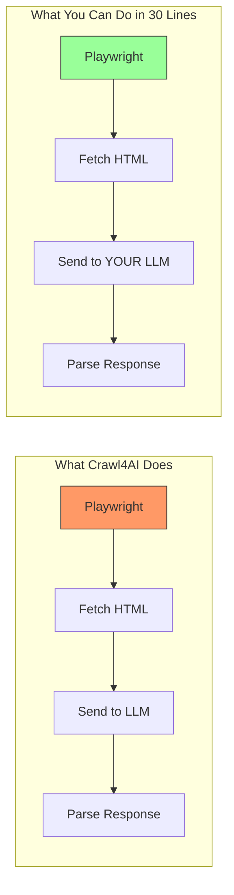

import Tabs from '@theme/Tabs';
import TabItem from '@theme/TabItem';

You're paying $20-200/month for an LLM subscription. You have access to Claude, GPT, or Gemini. You have Playwright. You have Python. So why are you also paying for Crawl4AI, Moltbot, Firecrawl, or whatever the "AI-powered web scraping" flavor of the month is?

Because marketing works. That's why.

<!-- truncate -->

## The Problem: Black Boxes You Don't Need

Let me be blunt. Crawl4AI calls itself an "AI-powered web crawler." Moltbot markets itself as a "browser automation agent." They both sound impressive until you realize what they actually are:

**Crawl4AI** = Playwright + an LLM call to extract structured data from HTML.

**Moltbot** = Puppeteer + GPT to navigate pages and click buttons.

That's it. That's the product. A headless browser you already have, calling an LLM API you already pay for, wrapped in a black box you can't debug, sold back to you at a premium.



The left side costs you money and gives you a dependency you don't control. The right side costs you nothing extra and you own every line.

## The Real Cost of Abstraction

Here's what you actually get when you use these tools:

| What They Promise | What You Actually Get |
|---|---|
| "AI-powered extraction" | An LLM prompt you could write in 2 minutes |
| "Smart navigation" | Playwright's `page.click()` with extra steps |
| "Structured output" | JSON parsing of an LLM response (wow, so hard) |
| "Scalable crawling" | A queue system any junior dev could write |
| "Browser agent" | A while loop that reads a page and calls GPT |

And here's what you lose:

- **Debuggability**: When Crawl4AI breaks on a site, good luck figuring out why. It's their Playwright config, their LLM prompt, their retry logic. You're filing GitHub issues instead of fixing a 3-line bug.
- **Cost transparency**: You're paying for their API *plus* your own LLM API. Double the cost for the privilege of not understanding your own pipeline.
- **Flexibility**: Want to change the extraction prompt? Want to use a different model for different pages? Want to add custom auth? Good luck — you're locked into their abstraction.

## Build Your Own in 30 Lines

Here's how to replicate Crawl4AI's "smart extraction" with tools you already have:

<Tabs>
<TabItem value="extract" label="Smart Extraction (Crawl4AI Replacement)">

```python
from playwright.sync_api import sync_playwright
import anthropic  # or openai, or google.generativeai

def extract_structured_data(url: str, schema: str) -> dict:
    """Crawl4AI's entire value proposition in 20 lines."""
    with sync_playwright() as p:
        browser = p.chromium.launch()
        page = browser.new_page()
        page.goto(url, wait_until="networkidle")
        html = page.content()
        browser.close()

    # Strip to text — no need to send full HTML to the LLM
    from bs4 import BeautifulSoup
    text = BeautifulSoup(html, "html.parser").get_text(separator="\n", strip=True)

    client = anthropic.Anthropic()
    response = client.messages.create(
        model="claude-sonnet-4-20250514",
        max_tokens=2000,
        messages=[{
            "role": "user",
            "content": f"Extract the following from this page:\n{schema}\n\nPage content:\n{text[:8000]}"
        }]
    )
    return response.content[0].text

# Usage: same thing Crawl4AI charges you for
result = extract_structured_data(
    "https://example.com/products",
    "Return JSON: [{name, price, description}]"
)
```

</TabItem>
<TabItem value="agent" label="Browser Agent (Moltbot Replacement)">

```python
from playwright.sync_api import sync_playwright
import anthropic

def browser_agent(task: str, start_url: str, max_steps: int = 10):
    """Moltbot's entire product in a function."""
    client = anthropic.Anthropic()
    with sync_playwright() as p:
        browser = p.chromium.launch(headless=False)
        page = browser.new_page()
        page.goto(start_url)

        for step in range(max_steps):
            # Get page state
            title = page.title()
            text = page.inner_text("body")[:3000]

            # Ask LLM what to do
            response = client.messages.create(
                model="claude-sonnet-4-20250514",
                max_tokens=500,
                messages=[{
                    "role": "user",
                    "content": (
                        f"Task: {task}\n"
                        f"Current page: {title}\n"
                        f"Page text: {text}\n\n"
                        "Reply with ONE action: click 'selector' | type 'selector' 'text' | done 'result'"
                    )
                }]
            )
            action = response.content[0].text.strip()

            if action.startswith("done"):
                return action
            elif action.startswith("click"):
                selector = action.split("'")[1]
                page.click(selector)
                page.wait_for_load_state("networkidle")
            elif action.startswith("type"):
                parts = action.split("'")
                page.fill(parts[1], parts[3])

        browser.close()
    return "Max steps reached"
```

</TabItem>
</Tabs>

That's it. That's what you're paying for. A Playwright instance and an LLM call in a loop.

## "But It's Open Source!"

Yes, Crawl4AI is open source. Great. It's also 15,000+ lines of Python wrapping... Playwright and LLM calls. You could read through all of that, understand their abstractions, learn their config format, deal with their bugs. Or you could write 30 lines that do exactly what you need, that you understand completely, and that you can modify in seconds.

The open-source argument works when the tool does something genuinely complex — like a database engine or a compiler. It doesn't work when the tool is a thin wrapper around two APIs you already have.

## The Pattern

This is a pattern I keep seeing in the "AI tools" space:

1. Take an existing capability (browser automation)
2. Add an LLM call (send page text to GPT/Claude)
3. Wrap it in a nice CLI/API
4. Market it as "AI-powered"
5. Charge money

It's the SaaS equivalent of `left-pad`. The entire product is something you could write during your lunch break. But because it has "AI" in the name and a slick landing page, developers throw money at it instead of spending 20 minutes understanding what's actually happening.

## When These Tools *Might* Make Sense

I'm not saying they're useless for everyone:

- **If you have zero coding ability** and need web scraping, fine, use a tool
- **If you need massive scale** (millions of pages) and don't want to manage infrastructure, maybe
- **If your team is non-technical** and needs a no-code solution, sure

But if you're a developer? If you already write Python? If you already pay for an LLM? You have everything you need. Stop being a consumer of unnecessary abstractions and start being a builder.

## What I Learned

- **Most "AI-powered" tools are just API wrappers.** Before paying for any AI tool, ask yourself: "Could I do this with Playwright + my existing LLM in under an hour?" If yes, do that instead.
- **Black boxes are technical debt.** Every dependency you don't understand is a debugging nightmare waiting to happen. 30 lines you wrote yourself beats 15,000 lines someone else wrote.
- **The LLM subscription IS the tool.** Claude, GPT, Gemini — these are the actual engines. Everything else is just plumbing. Own your plumbing.
- **Marketing creates demand for solutions to problems you don't have.** Before installing that next "AI agent framework," ask: what problem does this actually solve that I can't solve with a function call?

## References

- [Crawl4AI GitHub](https://github.com/unclecode/crawl4ai) — Look at the source. It's Playwright + LLM calls. That's it.
- [Playwright Documentation](https://playwright.dev/python/) — Everything you need to automate a browser
- [Anthropic Claude API](https://docs.anthropic.com/) — The actual brain. You already pay for this.

<script type="application/ld+json">
  {`
{
  "@context": "https://schema.org",
  "@type": "Article",
  "headline": "Stop Paying for Crawl4AI and Moltbot: You Already Have Everything You Need",
  "description": "Why Crawl4AI, Moltbot, and similar AI browser bots are glorified wrappers around tools you already pay for — and how to build your own in 30 lines of Python.",
  "author": {
    "@type": "Person",
    "name": "Victor Jimenez",
    "url": "https://victorjimenezdev.github.io/"
  },
  "publisher": {
    "@type": "Organization",
    "name": "VictorStack AI",
    "url": "https://victorjimenezdev.github.io/"
  },
  "datePublished": "2026-02-21T05:35:00"
}
  `}
</script>
