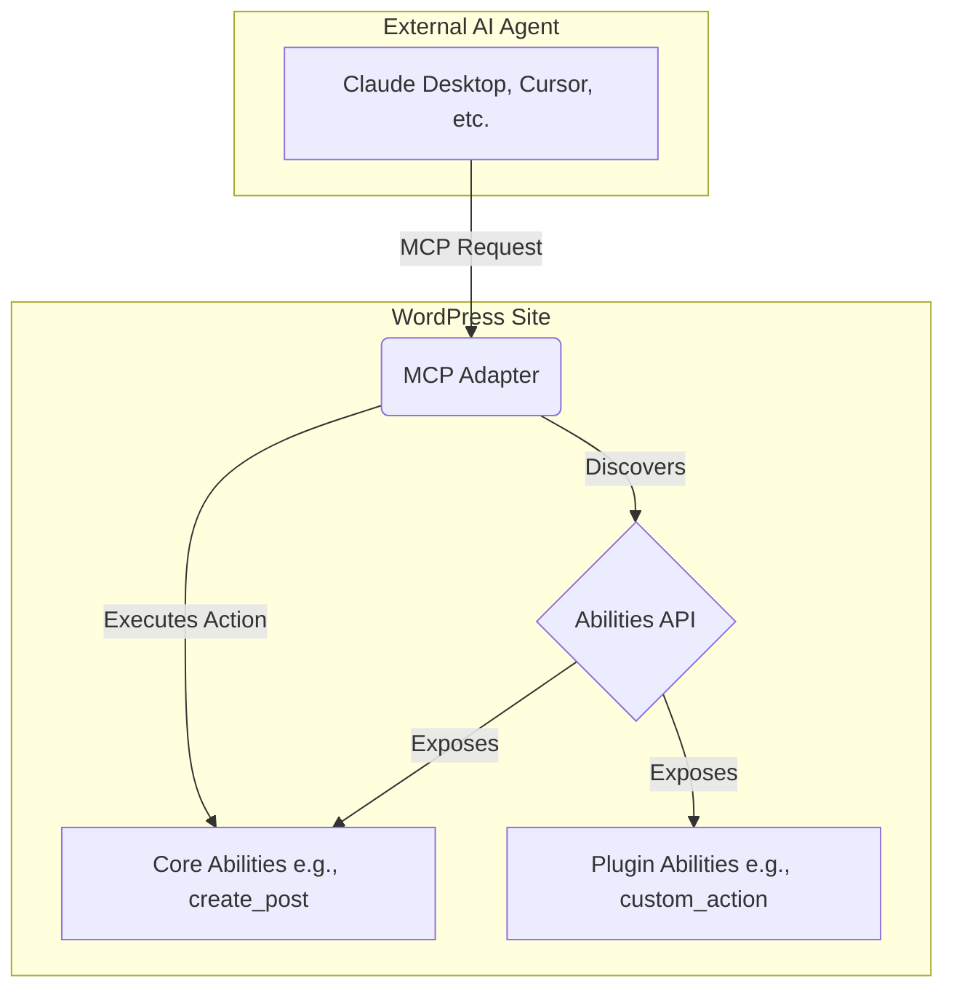

import Tabs from '@theme/Tabs';
import TabItem from '@theme/TabItem';

WordPress 7.0 Beta 1 is here, and it's a massive leap forward for the world's most popular CMS. Released on February 20, 2026, this version is packed with features that promise to redefine content creation, collaboration, and the developer experience. This review covers the most significant updates, from native AI integration to a long-awaited admin UI refresh.

<!-- truncate -->

## The Problem: Modern Demands on a Classic CMS

As web development evolves, users expect more dynamic and collaborative tools. Previous WordPress versions, while powerful, faced challenges in a few key areas:
- **Collaboration:** Real-time co-editing was functional but lacked the seamless experience of platforms like Google Docs.
- **AI Integration:** Integrating modern AI assistants required custom development and often felt disconnected from the core WordPress experience.
- **User Interface:** The admin interface, while familiar, had started to feel dated compared to the modern block editor, with jarring full-page reloads disrupting workflow.
- **Editing Experience:** The block editor, while a huge step forward, still had room for improvement in terms of layout flexibility, responsive controls, and performance.

## The Solution: A Feature-Packed 7.0 Beta

WordPress 7.0 Beta 1 directly addresses these issues with a host of new features and under-the-hood improvements.

### 1. Real-Time Collaboration Gets Serious

Multi-user collaboration is now a first-class citizen. Building on previous efforts, the experience is now much smoother, with live cursors, seamless data syncing, and even offline editing capabilities. This makes it a viable platform for large teams to work on content simultaneously.

### 2. Native AI Agent Support

This is the headline feature: WordPress 7.0 is the first major CMS to ship with built-in AI agent support. It includes the **MCP (Model Context Protocol) Adapter** in core, allowing AI tools to securely interact with a WordPress site.

This opens up incredible possibilities:
- AI agents can read product data or analytics.
- Generate entire content drafts based on a prompt.
- Trigger plugin actions, all while respecting WordPress's permission system.

The expanded Abilities API is the core of this, providing a standardized way for AI to discover and use site functionalities. For more on how AI is changing WordPress, see our [AI Search Optimization Playbook](/wordpress-ai-search-optimization-playbook).

### 3. Block Editor and Site Editing Overhaul

The Gutenberg editor receives its most significant update in years.

#### Key Block Enhancements

<Tabs>
  <TabItem value="grid" label="Grid Block">
    The experimental Grid block is now stable, offering a powerful, responsive way to create complex layouts directly within the editor.
  </TabItem>
  <TabItem value="cover" label="Cover Block Video">
    You can now use video backgrounds in the Cover block, adding a dynamic flair to your page headers and sections.
  </TabItem>
  <TabItem value="responsive" label="Responsive Controls">
    A much-requested feature, you can now show or hide specific blocks based on screen size, giving you granular control over the mobile experience.
  </TabItem>
</Tabs>

#### Always-Iframed Editor

The post editor is now always iframed, a technical change with a huge user impact. This isolates the editor's UI from theme and block styles, preventing style conflicts and creating a more stable, predictable editing environment. We covered this change in more detail in our post on the [WordPress 7.0 Iframed Editor](/wordpress-7-iframed-editor).

#### Font Library

The Font Library is now available to all themes, giving site editors a simple UI to browse, install, and manage fonts for their site, moving this key design task out of `theme.json` and into the admin.

### 4. Refreshed Admin Interface

The WordPress admin area gets a visual refresh for the first time since 2018. The most noticeable change is the implementation of smooth page transitions, which replace full-page reloads for a faster, more modern-feeling single-page application (SPA) experience.

### Architecture: The New AI Abilities Flow

The introduction of the MCP Adapter and Abilities API creates a new architectural layer for AI interaction.

This diagram shows how an external AI agent can now securely connect to a WordPress site, discover available actions (both core and from plugins), and execute them through a standardized protocol.

## What I Learned: Key Takeaways

- **AI is No Longer an Add-On:** With core integration, WordPress is positioning itself as a platform for building AI-powered applications, not just websites.
- **The Future is Collaborative:** The investment in real-time co-editing shows a clear focus on serving larger content teams.
- **Developer Experience Matters:** The iframed editor and the admin refresh are significant quality-of-life improvements that will make building and managing sites much more pleasant.
- **Prepare for 7.0:** With the final release targeted for April 2026, it's time to start testing themes and plugins. Use tools like the [WP 7.0 Compatibility Scanner](/wp-7-compat-scanner-cli) to check for issues.

## References
- [Official WordPress 7.0 Beta 1 Announcement](https://wordpress.org/news/2026/02/wordpress-7-0-beta-1/)
