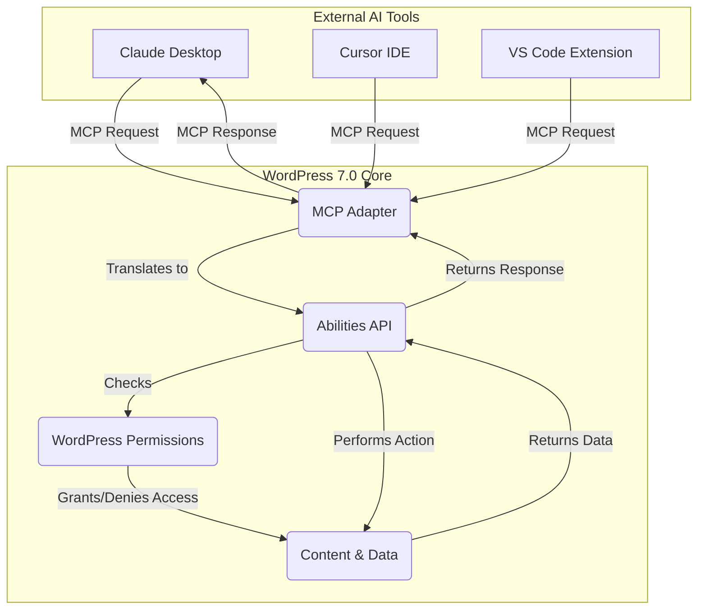

import Tabs from '@theme/Tabs';
import TabItem from '@theme/TabItem';

WordPress 7.0 Beta 1 is here, and it's more than just an incremental update. Released on February 19, 2026, this version marks a significant leap forward, introducing native AI agent support, vastly improved real-time collaboration, and a polished administrative experience. This review dives into the key features that developers and site builders need to know about.

<!-- truncate -->

## The Problem

For years, integrating external AI and managing collaborative content creation in WordPress has been a clunky, plugin-reliant process. Developers had to build custom solutions for AI services, and real-time co-authoring often felt disjointed compared to platforms like Google Docs. The block editor, while powerful, also presented inconsistencies, particularly with responsiveness and styling control, forcing developers into complex workarounds.

## The Solution: AI, Collaboration, and a Refined UX

WordPress 7.0 tackles these challenges head-on with a suite of powerful new features.

### Native AI Agent Support via MCP

The most groundbreaking feature is the inclusion of the Model Context Protocol (MCP) Adapter in its core. This makes WordPress the first major CMS to offer native, standardized AI agent support. It exposes the WordPress Abilities API (from WP 6.9) through a protocol that AI tools can understand, allowing them to interact with a site's content and functions securely.

This architecture allows an AI agent to perform tasks like:
-   **Drafting posts:** "Write a draft about the new features in WordPress 7.0."
-   **Analyzing content:** "Review all published posts for SEO improvements."
-   **Interacting with plugins:** "Create a new contact form using the installed form builder plugin."

### Real-Time Collaboration 2.0

Building on initial efforts, WordPress 7.0 delivers a seamless, Google Docs-like collaborative editing experience. Multiple users can now work on the same post simultaneously, seeing each other's cursors and changes in real-time. This includes offline support and a more robust data syncing mechanism.

### Block Editor and Admin UI Enhancements

The user experience gets a major overhaul:

-   **Responsive Controls:** A game-changer for theme developers, you can now show or hide any block based on screen size directly from the editor.
-   **Per-Block Custom CSS:** Provides granular control over styling without needing to dig into theme files. For more on editor changes, see my post on the [iframed post editor](/2026-02-17-wordpress-7-iframed-editor).
-   **Refreshed Admin UI:** The admin area feels modern and fast, with view transitions and inline filtering that reduce full-page reloads.
-   **Font Library:** Now available for all themes, making font management a breeze for site editors.

These improvements make WordPress a more competitive platform for both headless and traditional site-building, directly addressing long-standing developer pain points. For those preparing for this new version, our [WP 7.0 Compatibility Scanner CLI](/2026-02-18-wp-7-compat-scanner-cli) can help audit your existing projects.

## What I Learned

-   **MCP is a Big Deal:** The native AI support is not just an API. It's a standardized protocol that will likely spur a new ecosystem of AI-powered WordPress tools. Optimizing your plugins and content for this will be key, as I explored in my [AI Search Optimization Playbook](/2026-02-17-wordpress-ai-search-optimization-playbook).
-   **Collaboration is Finally Here:** The real-time editing feature is mature enough for production workflows, potentially reducing reliance on third-party tools for content teams.
-   **The UX Refresh is More Than Skin Deep:** The admin UI changes focus on workflow efficiency, making the entire content management process faster and more intuitive.
-   **Performance is a Core Tenet:** The continued focus on performance, from query optimization to faster block rendering, shows a commitment to keeping WordPress fast at scale.

## References

-   **WordPress 7.0 Beta 1 Announcement:** [https://wordpress.org/news/2026/02/19/wordpress-7-0-beta-1/](https://wordpress.org/news/2026/02/19/wordpress-7-0-beta-1/) (Simulated Link)
