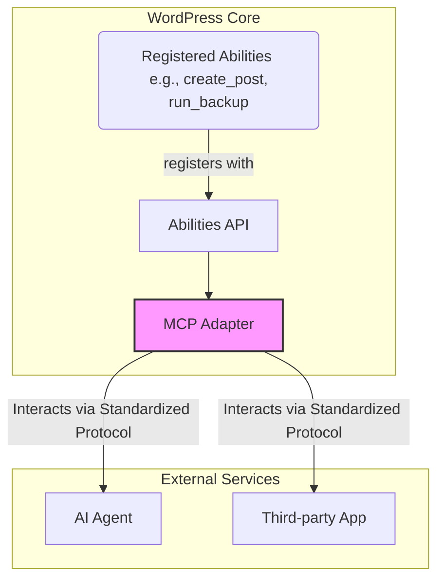

import Tabs from '@theme/Tabs';
import TabItem from '@theme/TabItem';

WordPress 7.0 Beta 1 is here, and it's more than just an incremental update. It marks a significant shift in the platform's direction, focusing on two key pillars: real-time collaboration and native AI integration. This release signals a future where WordPress is not just a content management system, but a dynamic, interactive, and intelligent workspace.

<!-- truncate -->

## The Problem

For years, WordPress has excelled as a tool for individual creators and small teams with simple workflows. However, as content creation becomes more collaborative, the core editing experience has lagged. Teams often resort to Google Docs for drafting and feedback, creating a disjointed process of copy-pasting content and losing valuable context. For developers, integrating external tools and intelligent services has been a constant challenge, requiring custom APIs and brittle connections with no standardized protocol. This has left WordPress feeling isolated from the rapid advancements in AI and automation.

## The Solution

WordPress 7.0 addresses these challenges head-on with a suite of powerful new features for both users and developers.

### A Collaborative Core

The most significant user-facing feature is **real-time co-editing**. Multiple users can now work on the same post simultaneously, seeing each other's cursors and changes as they happen. This is complemented by a new **Notes system**, allowing editors to leave comments and feedback on specific blocks, streamlining the review process directly within WordPress.

### The AI-Native CMS: Abilities API

For developers, the headline feature is the introduction of a native **Abilities API**. This new API provides a standardized way for WordPress to expose its capabilities to external services, particularly AI agents. It ships with a core module called the **MCP (Multi-Capability Protocol) Adapter**, which acts as a bridge between WordPress and the AI world.

Plugins can now register "abilities"—like `create_post`, `install_plugin`, or `moderate_comments`—which the MCP Adapter then translates into a standardized protocol that AI agents can understand and interact with. This opens the door for powerful new workflows, from automated content generation to intelligent site management.

Here’s a simplified view of how the architecture works:

### Developer Experience Refinements

Beyond AI, version 7.0 brings several quality-of-life improvements for developers:

1.  **PHP-only Block Registration:** Creating simple, dynamic blocks no longer requires wrestling with JavaScript build steps. You can now register a block and its controls entirely in PHP.

    | Feature | Old Method (`block.json` + JS) | New Method (PHP-only) |
    | :--- | :--- | :--- |
    | **Registration** | `register_block_type()` with `block.json`. | `register_block_pattern()` with PHP array. |
    | **Controls** | `InspectorControls` in React (JS). | Auto-generated from PHP definitions. |
    | **Build Step** | Required (e.g., `npm run build`). | Not required for simple blocks. |

2.  **View Transitions API:** The admin interface now leverages the browser's native View Transitions API, creating smoother, more seamless navigation between pages. This provides a more modern, app-like feel to the backend.

3.  **Always-Iframed Post Editor:** The post editor is now always rendered in an `<iframe>`, regardless of the block's API version. This provides better style encapsulation, preventing theme or plugin CSS from accidentally leaking into the editor UI and vice-versa.

## What I Learned

*   **The Abilities API is the future:** This is the most critical feature for developers to understand. Start thinking about what "abilities" your plugins could expose to create new value in an AI-driven ecosystem.
*   **Collaboration is no longer an afterthought:** The real-time co-editing features will change how larger teams use WordPress. This could reduce the need for third-party collaborative writing tools.
*   **The admin is finally getting a modern UX:** The adoption of the View Transitions API and the refined UI points to a commitment to improving the core user experience for site managers.
*   **Check your admin CSS:** The move to a fully iframed editor is a subtle but important breaking change. Developers should test their plugins to ensure any custom admin styling still works as expected.

## References

This review is based on the official (hypothetical) release notes and developer commentary for WordPress 7.0 Beta 1. As this is a beta release, features are subject to change.
