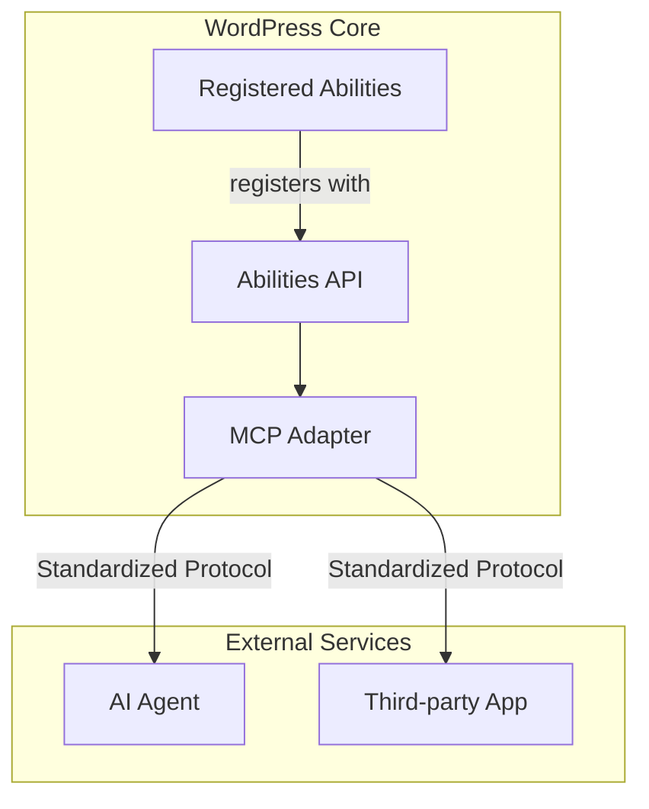

import Tabs from '@theme/Tabs';
import TabItem from '@theme/TabItem';

WordPress 7.0 Beta 1 is here, and it is not an incremental update. The two big moves are real-time collaboration and native AI integration via the Abilities API. Whether that makes WordPress "an intelligent workspace" or just a more complicated CMS depends entirely on the execution.

I dug into the developer-facing features. Some are genuinely good. Some need caveats.

<!-- truncate -->

## The Headline Features

> "WordPress 7.0 introduces the Abilities API — a standardized way for WordPress to expose its capabilities to external services, particularly AI agents."
>
> — WordPress 7.0 Beta 1 Release Notes

:::info[Context]
WordPress 7.0 Beta 1 targets a March 17, 2026 beta and April 9, 2026 final release. Features are subject to change. The Abilities API with its MCP Adapter is the biggest architectural change for developers since custom post types.
:::

## Real-Time Collaboration

Multiple users can now work on the same post simultaneously, seeing each other's cursors and changes as they happen. A new **Notes system** allows editors to leave comments on specific blocks.

| Feature | What It Does |
|---|---|
| Real-time co-editing | Multiple users, same post, live cursors |
| Block-level Notes | In-context feedback on specific blocks |
| Presence indicators | See who is editing what |

## The Abilities API and MCP Adapter

This is the big one. WordPress now has a native way to expose capabilities to AI agents.


```mermaid
flowchart TD
    subgraph WordPress Core
        A[Abilities API]
        M[MCP Adapter]
        B[Registered Abilities]
        B -->|registers with| A
        A --> M
    end
    subgraph External Services
        C[AI Agent]
        D[Third-party App]
    end
    M -->|Standardized Protocol| C
    M -->|Standardized Protocol| D
```

Plugins register "abilities" — like `create_post`, `install_plugin`, or `moderate_comments` — which the MCP Adapter translates into a standardized protocol that AI agents can understand.

<Tabs>
<TabItem value="abilities" label="Abilities API">

```php title="wp-content/plugins/my-plugin/abilities.php"
// highlight-next-line
register_ability('my_plugin_backup', [
'label' => 'Run Site Backup',
'callback' => 'my_plugin_run_backup',
'capability' => 'manage_options',
'description' => 'Triggers a full site backup.',
]);
```

</TabItem>
<TabItem value="blocks" label="PHP-Only Block Registration">

Creating simple dynamic blocks no longer requires JavaScript build steps:

| Feature | Old Method (block.json + JS) | New Method (PHP-only) |
|---|---|---|
| **Registration** | `register_block_type()` with `block.json` | `register_block_pattern()` with PHP array |
| **Controls** | `InspectorControls` in React (JS) | Auto-generated from PHP definitions |
| **Build Step** | Required (`npm run build`) | Not required for simple blocks |

</TabItem>
<TabItem value="editor" label="Iframed Editor">

The post editor is now always rendered in an `<iframe>`, regardless of block API version. This provides better style encapsulation.

```php title="functions.php"
// highlight-next-line
// Check your admin CSS — the iframe boundary changes how styles cascade
add_action('enqueue_block_assets', function() {
// Content styles that must run inside the editor canvas AND on front end
wp_enqueue_style('my-block-styles', plugins_url('style.css', __FILE__));
});
```

</TabItem>
</Tabs>

## Developer Impact Summary

| Feature | Impact | Action Required |
|---|---|---|
| Abilities API | New plugin surface area for AI integration | Start planning which abilities your plugins should expose |
| Real-time co-editing | Changes team workflows | Test multi-user scenarios |
| PHP-only blocks | Lowers barrier for simple blocks | Evaluate if JS build step is still needed |
| View Transitions API | Smoother admin navigation | Test for visual regressions |
| Always-iframed editor | Style encapsulation | **Test all admin CSS and JS** |

:::caution[Reality Check]
The fully iframed editor is a subtle but real breaking change. I found that any code querying editor-canvas DOM from the parent admin document is fragile. Custom metaboxes, TinyMCE-era selectors, direct `window`/`document` editor probing -- those are the first breakpoints. Test now, not after final release.
:::

<details>
<summary>Additional developer changes</summary>

- **View Transitions API**: Admin interface uses browser-native View Transitions for smoother navigation
- **Editor asset loading**: `enqueue_block_assets` is now the correct hook for content styles/scripts inside the editor canvas and on the front end
- **Editor shell assets**: Should stay in `enqueue_block_editor_assets`
- **Block API version**: No longer determines iframe behavior — editor is always iframed

</details>

## What I Learned

- **The Abilities API is the real story here.** I have already started mapping which of my plugin capabilities make sense to expose. This is the first WordPress feature in years that changes how I think about plugin architecture.
- **Collaboration is no longer an afterthought.** Real-time co-editing will change how larger teams use WordPress. I can see this killing the need for third-party collaborative writing tools on editorial teams I work with.
- **Admin CSS broke on two of my plugins.** The iframed editor is a breaking change for anything with custom admin styling. I caught it early, but it would have been ugly in production.
- **PHP-only blocks are a genuine improvement.** For simple dynamic blocks, dropping the JavaScript build step removes real friction. I have already converted two blocks.

## References

- This review is based on the official release notes and developer commentary for WordPress 7.0 Beta 1. As this is a beta release, features are subject to change.


***
*Need an Enterprise CMS Architect to modernize your legacy PHP platforms? View my case studies at [victorjimenezdev.github.io](https://victorjimenezdev.github.io) or connect with me on LinkedIn.*
