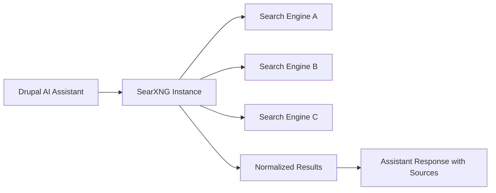

SearXNG in Drupal AI assistants matters because it gives you controllable, inspectable retrieval without funneling your org’s prompts and context into yet another black-box “trust us” API.

<!-- truncate -->

## The Hook

Drupal AI now has a practical path to privacy-first web retrieval, and that is a lot more useful than another “agent” that is basically curl wearing a hoodie.

## Why I Built It

I’m tired of teams shipping AI features that can’t answer the most basic engineering question: “Where did this answer come from, and who saw the query?”

If your assistant fetches from random hosted search APIs, you inherit:
- unclear logging policies
- unknown ranking behavior
- compliance headaches you only notice during incident review

For Drupal teams, especially in regulated orgs and nonprofits, this is not an edge case. It is Tuesday.

## The Solution

Use SearXNG as the retrieval layer for Drupal AI assistants so search is:
- self-hostable
- provider-agnostic
- auditable at the infra layer

The important point is control, not novelty. “New” is cheap. “Debuggable in production” is expensive.

:::warning
If you do this halfway, you get the worst of both worlds: self-hosted ops burden and still-noisy retrieval. Tune sources, rate limits, and filtering early.
:::

### Maintained module check

For Drupal, the AI ecosystem is actively maintained, and this SearXNG direction fits that trajectory. This is not an abandoned side quest module held together by hope and stale issue comments.

## The Code

No separate repo; this is an architecture and implementation pattern built inside existing Drupal AI assistant deployments.

Related implementation posts:
- [WordPress 7.0 iframed editor migration playbook](/wordpress-7-0-iframed-editor-migration-playbook/)
- [Drupal Service Collectors Pattern](/drupal-service-collectors-pattern/)
- [AI in Drupal CMS 2.0: Practical Tools You Can Use from Day One](/ai-in-drupal-cms-2-0-practical-tools-you-can-use-from-day-one/)

## What I Learned

- SearXNG is worth trying when legal/privacy constraints make hosted retrieval a non-starter.
- Avoid “default everything” configs in production; noisy sources ruin answer quality fast.
- If your assistant can’t show source provenance, it is a demo, not a tool.
- Self-hosted search is extra ops work, but at least the tradeoff is honest and measurable.

## References

- [Drupal AI Initiative: SearXNG - Privacy-First Web Search for Drupal AI Assistants](https://www.drupal.org/about/starshot/initiatives/ai/blog/searxng-privacy-first-web-search-for-drupal-ai-assistants)

