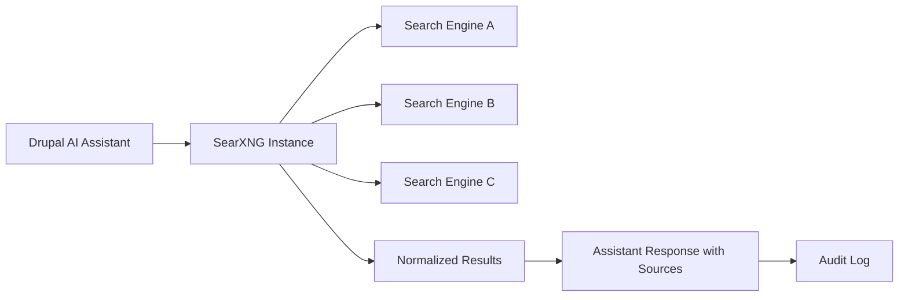

import Tabs from '@theme/Tabs';
import TabItem from '@theme/TabItem';

SearXNG in Drupal AI assistants matters because it gives you controllable, inspectable retrieval without funneling your org's prompts and context into yet another black-box "trust us" API.

<!-- truncate -->

I am tired of teams shipping AI features that cannot answer the most basic engineering question: "Where did this answer come from, and who saw the query?"

## The problem

If your assistant fetches from random hosted search APIs, you inherit:
- unclear logging policies
- unknown ranking behavior
- compliance headaches you only notice during incident review

:::danger[Compliance Risk]
For Drupal teams in regulated orgs and nonprofits, this is not an edge case. It is Tuesday. If your assistant cannot show source provenance, it is a demo, not a tool.
:::

### Hosted vs. self-hosted retrieval

| Aspect | Hosted Search API | SearXNG (Self-Hosted) |
|---|---|---|
| Query logging | Provider-controlled | You control logs |
| Ranking behavior | Opaque | Configurable per source |
| Source provenance | Often hidden | Full URL trail |
| Compliance audit | Depends on vendor | Infrastructure-level |
| Operational cost | API fees | Self-hosted ops |
| Provider lock-in | Yes | No |

## The solution

Use SearXNG as the retrieval layer for Drupal AI assistants so search is:
- self-hostable
- provider-agnostic
- auditable at the infra layer

The important point is control, not novelty. "New" is cheap. "Debuggable in production" is expensive.

### Architecture



:::warning[Half-measures are worse]
If you do this halfway, you get the worst of both worlds: self-hosted ops burden and still-noisy retrieval. Tune sources, rate limits, and filtering early.
:::

### Configuration approach

<Tabs>
<TabItem value="minimal" label="Minimal SearXNG Config" default>

```yaml title="searxng/settings.yml" showLineNumbers
search:
  safe_search: 2
  # highlight-next-line
  default_lang: en
  formats:
- json
- html

engines:
- name: duckduckgo
engine: duckduckgo
shortcut: ddg
- name: wikipedia
engine: wikipedia
shortcut: wp
```

</TabItem>
<TabItem value="drupal" label="Drupal Integration Pattern">

```php title="src/Service/SearxngSearchProvider.php" showLineNumbers
class SearxngSearchProvider implements SearchProviderInterface {

  public function search(string $query, array $options = []): SearchResults {
$response = $this->httpClient->get($this->baseUrl . '/search', [
'query' => [
'q' => $query,
// highlight-next-line
'format' => 'json',
'categories' => $options['categories'] ?? 'general',
],
]);

return $this->normalizeResults($response);
  }
}
```

</TabItem>
</Tabs>

### Maintained module check

For Drupal, the AI ecosystem is actively maintained, and this SearXNG direction fits that trajectory. This is not an abandoned side quest module held together by hope and stale issue comments.

## Deployment checklist

- [ ] Deploy SearXNG instance (Docker recommended)
- [ ] Configure search engines and rate limits
- [ ] Disable unused engines to reduce noise
- [ ] Wire Drupal AI assistant to SearXNG JSON API
- [ ] Add source provenance to assistant responses
- [ ] Set up audit logging for all queries
- [ ] Test with production-like query patterns
- [x] Monitor search quality and source diversity weekly

<details>
<summary>Related implementation posts</summary>

- [WordPress 7.0 iframed editor migration playbook](/wordpress-7-0-iframed-editor-migration-playbook/)
- [Drupal Service Collectors Pattern](/drupal-service-collectors-pattern/)
- [AI in Drupal CMS 2.0: Practical Tools You Can Use from Day One](/ai-in-drupal-cms-2-0-practical-tools-you-can-use-from-day-one/)

</details>

## Why this matters for Drupal and WordPress

Drupal's AI Initiative is actively building search integration patterns, and SearXNG fits directly into the Drupal AI module ecosystem as a privacy-first retrieval backend. For Drupal agencies serving government, healthcare, or nonprofit clients, self-hosted search eliminates the compliance risk of sending user queries to third-party APIs. WordPress developers building AI-powered plugins face the same challenge -- the SearXNG JSON API integration pattern shown here works identically from a WordPress plugin using `wp_remote_get()`, giving WordPress AI tools the same auditable retrieval without vendor lock-in.

## What I learned

- SearXNG is worth trying when legal/privacy constraints make hosted retrieval a non-starter.
- Avoid "default everything" configs in production; noisy sources ruin answer quality fast.
- If your assistant cannot show source provenance, it is a demo, not a tool.
- Self-hosted search is extra ops work, but at least the tradeoff is honest and measurable.

## References

- [Drupal AI Initiative: SearXNG - Privacy-First Web Search for Drupal AI Assistants](https://www.drupal.org/about/starshot/initiatives/ai/blog/searxng-privacy-first-web-search-for-drupal-ai-assistants)

<script type="application/ld+json">
  {`
{
  "@context": "https://schema.org",
  "@type": "Article",
  "headline": "Stop Shipping Blind RAG: SearXNG for Drupal AI Assistants That Respect Privacy",
  "description": "This post explains how to wire SearXNG into Drupal AI assistants so teams get auditable, privacy-first web search instead of opaque SaaS retrieval.",
  "author": {
    "@type": "Person",
    "name": "Victor Jimenez",
    "url": "https://victorjimenezdev.github.io/"
  },
  "publisher": {
    "@type": "Organization",
    "name": "VictorStack AI",
    "url": "https://victorjimenezdev.github.io/"
  },
  "datePublished": "2026-02-24T23:16:00"
}
  `}
</script>


***
*Need an Enterprise CMS Architect to modernize your legacy PHP platforms? View my case studies at [victorjimenezdev.github.io](https://victorjimenezdev.github.io) or connect with me on LinkedIn.*
