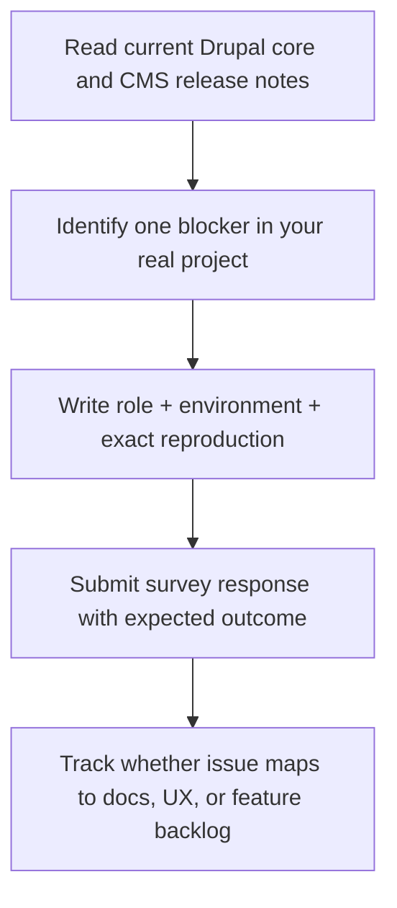

import Tabs from '@theme/Tabs';
import TabItem from '@theme/TabItem';

The Drupal CMS survey callout published on February 23, 2026 is timely and worth acting on. But teams should submit feedback with release context in mind: Drupal core 11.3.0 is current, Drupal 10.5.x is the transitional supported line, and Drupal CMS 2.x is the active stream.

The best use of this survey is to report friction that blocks real launches, not generic wishlist items.

<!-- truncate -->

## The Problem

> "Many survey cycles generate feedback that is too broad to prioritize. In Drupal CMS, that creates delivery risks."

:::info[Context]
Drupal CMS 2.0.1 is the latest CMS release (created February 19, 2026). Drupal core 11.3.0 was released February 5, 2026. Drupal 10.5.4 serves as the support bridge until Drupal 11 adoption is complete. Survey feedback needs to reference these specific versions, not hypothetical future states.
:::

| Risk | What Happens in Practice | Impact on Drupal Teams |
|---|---|---|
| Wishlist overload | Responses ask for large features without constraints | Roadmap noise and delayed fixes |
| Version-context mismatch | Teams request work already covered by current releases | Duplicate effort and missed opportunities |
| Non-reproducible pain reports | Feedback lacks steps, environment, or role context | Maintainers cannot create actionable backlog items |

## The Solution: Constrained Feedback

Use a constrained response model before filling the form: tie each request to a role, a blocker, and a measurable outcome.

<Tabs>
<TabItem value="context" label="Current Release Context">

| Area | Current State (Feb 24, 2026) | Survey Implication |
|---|---|---|
| Drupal core | 11.3.0 (released Feb 5, 2026) | Assume modern core constraints, not 10.4 assumptions |
| Drupal 10 bridge | 10.5.4 support bridge | Distinguish 10.5 bridge issues from 11.x issues |
| Drupal CMS | 2.0.1 (created Feb 19, 2026) | Reference 2.x behavior explicitly |

</TabItem>
<TabItem value="snippets" label="Source Verification">

```html title="Drupal core releases page"
<span class="release-date">Released Feb 05 2026</span>
...
<div class="field-content">Supports Drupal 10 sites until they can be upgraded to Drupal 11.</div>
```

```html title="Drupal CMS 2.0.1 release page"
<h2><a href="/project/cms/releases/2.0.1">cms 2.0.1</a></h2>
...
Created on: 19 Feb 2026 at 18:10 UTC
```

</TabItem>
</Tabs>

## Practical Feedback Workflow



## Good Feedback vs Bad Feedback

| Good Feedback | Bad Feedback |
|---|---|
| Specific blocker in Drupal CMS 2.0.1 with steps to reproduce | "Drupal needs better AI" |
| Role context: "As a content editor using the media library..." | "Users find it confusing" |
| Environment: "Drupal 11.3.0, PHP 8.3, standard install profile" | No version information |
| Expected outcome: "Media library should allow bulk upload of 50+ files" | "Make it faster" |
| References a specific issue queue item if available | Vague feature request with no constraints |

:::caution[Reality Check]
The announcement itself is useful, but execution quality depends on how specific responses are. A short, evidence-backed response is usually more actionable than a long generic feature request. Teams that include role and business outcome in responses give maintainers better prioritization data.
:::

<details>
<summary>Related reading for survey context</summary>

- [Drupal CMS Recipe System and AI Site Building Review](/2026-02-06-drupal-cms-recipe-system-ai-site-building-review/)
- [Drupal 11 Change-Record Impact Map for 10.4.x Teams](/2026-02-17-drupal-11-change-record-impact-map-10-4x-teams/)
- [Drupal 12 Readiness Dashboard](/2026-02-08-drupal-12-readiness-dashboard/)

</details>

## What I Learned

- Survey feedback is most valuable when it maps to one reproducible blocker in a current release line.
- Drupal CMS feedback should now default to 2.x context unless explicitly discussing legacy 1.x behavior.
- Teams that include role and business outcome in responses give maintainers better prioritization data.
- A short, evidence-backed response is usually more actionable than a long generic feature request.

## References

- [The DropTimes: Drupal Invites Community Feedback Through Drupal CMS Survey](https://www.thedroptimes.com/66565/drupal-invites-community-feedback-through-drupal-cms-survey)
- [Drupal CMS Survey Form](https://forms.gle/UrhRgfZpveoEmonp9)
- [Drupal CMS](https://new.drupal.org/drupal-cms)
- [Drupal Core Project](https://www.drupal.org/project/drupal)
- [Drupal Core Releases](https://www.drupal.org/project/drupal/releases)
- [Drupal CMS Releases](https://www.drupal.org/project/cms/releases)
- [Drupal CMS 2.0.1](https://www.drupal.org/project/cms/releases/2.0.1)
