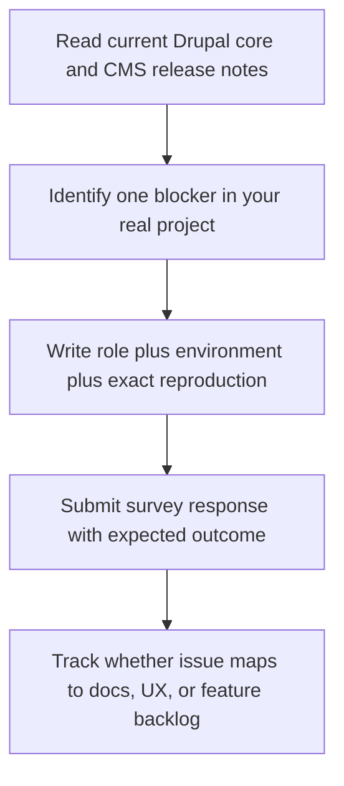

The Drupal CMS survey callout published on February 23, 2026 is timely and worth acting on, but teams should submit feedback with release context in mind: Drupal core 11.3.0 is current, Drupal 10.5.x is the transitional supported line, and Drupal CMS 2.x is now the active stream. The best use of this survey is to report friction that blocks real launches, not generic wishlist items.
<!-- truncate -->

## The Problem

Many survey cycles generate feedback that is too broad to prioritize. In Drupal CMS, that creates two delivery risks:

| Risk | What happens in practice | Impact on Drupal teams |
|---|---|---|
| Wishlist overload | Responses ask for large new features without implementation constraints | Product roadmap noise and delayed fixes for current adopters |
| Version-context mismatch | Teams request work already covered by current releases | Duplicate effort and missed opportunities to improve onboarding/docs |
| Non-reproducible pain reports | Feedback lacks steps, environment, or role context | Maintainers cannot turn it into actionable backlog items |

The announcement itself is useful, but execution quality depends on how specific responses are.

## The Solution

Use a constrained response model before filling the form: tie each request to a role, a blocker, and a measurable outcome.

### Current release context (as of February 24, 2026)

| Area | Observed current state | Why it matters for survey responses |
|---|---|---|
| Drupal core | 11.3.0 release listed (released February 5, 2026) | Feedback should assume modern core constraints, not older 10.4 assumptions |
| Drupal 10 bridge | 10.5.4 listed as support bridge until Drupal 11 adoption | Migration pain points should distinguish 10.5 bridge issues vs 11.x issues |
| Drupal CMS stream | 2.0.1 is the latest listed CMS release (created February 19, 2026) | Requests should reference 2.x behavior explicitly |

### Source-derived snippets

Snippet from Drupal core releases page:

```html
<span class="release-date">Released Feb 05 2026</span>
...
<div class="field-content">Supports Drupal 10 sites until they can be upgraded to Drupal 11.</div>
```

Snippet from Drupal CMS 2.0.1 release page:

```html
<h2><a href="/project/cms/releases/2.0.1">cms 2.0.1</a></h2>
...
Created on: 19 Feb 2026 at 18:10 UTC
```

### Practical feedback workflow



Related reading:
- [Drupal CMS Recipe System and AI Site Building Review](/2026-02-06-drupal-cms-recipe-system-ai-site-building-review/)
- [Drupal 11 Change-Record Impact Map for 10.4.x Teams](/2026-02-17-drupal-11-change-record-impact-map-10-4x-teams/)
- [Drupal 12 Readiness Dashboard](/2026-02-08-drupal-12-readiness-dashboard/)

## What I Learned

- Survey feedback is most valuable when it maps to one reproducible blocker in a current release line.
- Drupal CMS feedback should now default to 2.x context unless explicitly discussing legacy 1.x behavior.
- Teams that include role and business outcome in responses give maintainers better prioritization data.
- A short, evidence-backed response is usually more actionable than a long generic feature request.

## References

- https://www.thedroptimes.com/66565/drupal-invites-community-feedback-through-drupal-cms-survey
- https://forms.gle/UrhRgfZpveoEmonp9
- https://new.drupal.org/drupal-cms
- https://www.drupal.org/project/drupal
- https://www.drupal.org/project/drupal/releases
- https://www.drupal.org/project/cms/releases
- https://www.drupal.org/project/cms/releases/2.0.1
