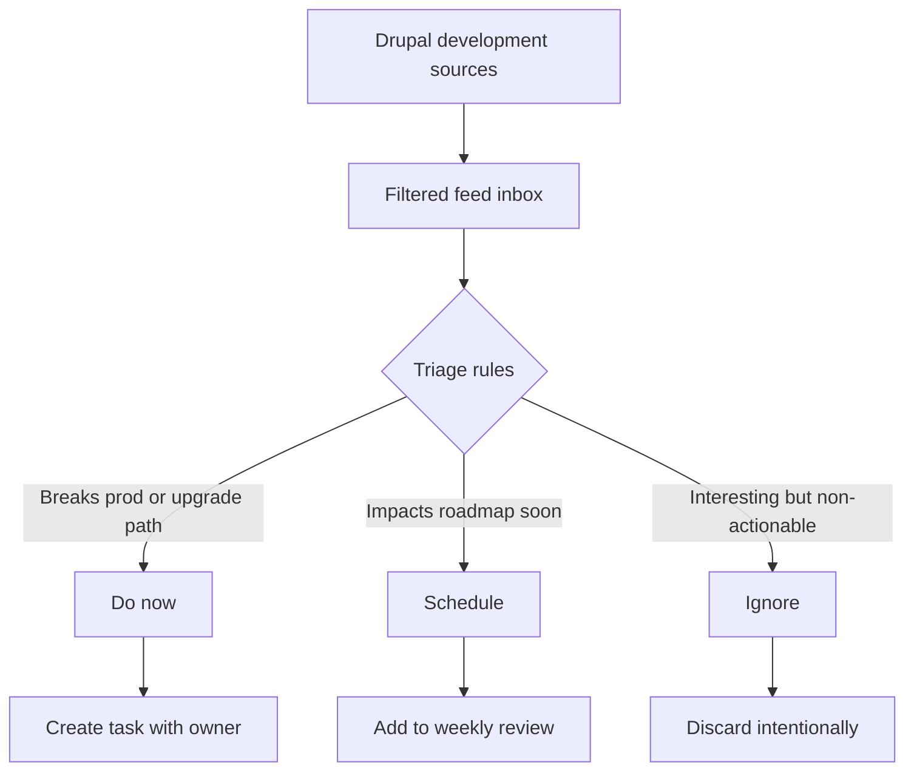

import TOCInline from '@theme/TOCInline';

If you want to actually follow Drupal development instead of drowning in tab soup, build a signal-only feed around commits, issues, and release movement, then kill everything else.

<!-- truncate -->

<TOCInline toc={toc} minHeadingLevel={2} maxHeadingLevel={2} />

<details>
<summary>TL;DR — 30 second version</summary>

- Stop consuming drama, start consuming deltas
- Three-lane intake: core movement, dependency movement, ecosystem risk movement
- Tag each item as `break-risk`, `upgrade-risk`, `perf-opportunity`, or `ignore`
- Review once daily, not continuously -- if everything is "important," nothing is

</details>

## Why I Built It

I got tired of pretending that "I follow Drupal closely" meant anything while important changes still slipped through. The old habit was dumb: check random pages, skim social noise, miss the one issue that later breaks your week.

The goal was simple: stop consuming drama, start consuming deltas.

This fits the same mindset behind [Drupal Service Collectors Pattern](/drupal-service-collectors-pattern/) and [Drupal Core Performance: JSON:API & Array Dumper Optimizations](/drupal-core-performance-jsonapi-array-dumper-optimizations/): less guessing, more deterministic inputs. Also relevant if you are building AI-heavy Drupal workflows like [AI in Drupal CMS 2.0: Practical Tools You Can Use from Day One](/ai-in-drupal-cms-2-0-practical-tools-you-can-use-from-day-one/).

## The Three-Lane Feed

Use a three-lane intake: core movement, dependency movement, and ecosystem risk movement. Then define strict triage rules.



:::tip[Top Takeaway]
The trick is not "more sources." The trick is a ruthless definition of what deserves your attention.
:::

### Practical Setup

```yaml title="signal-feed-config.yml — example triage taxonomy"
triage_tags:
  break-risk: "Can break production or upgrade path"
  upgrade-risk: "Will require code changes before next upgrade"
  perf-opportunity: "Performance improvement worth evaluating"
  ignore: "Interesting but not actionable for our stack"

review_cadence: daily
convert_to_backlog: break-risk, upgrade-risk
```

1. Track only sources tied to change, not commentary.
2. Tag each item as `break-risk`, `upgrade-risk`, `perf-opportunity`, or `ignore`.
3. Review once daily, not continuously.
4. Convert only `break-risk` and near-term `upgrade-risk` into backlog items.

### Caveats and Gotchas

- If your rules are vague, your feed becomes social media with extra steps.
- If everything is "important," nothing is.
- Teams that skip tagging end up re-reading the same links every week.

:::warning[No Magic Module]
There is no magic maintained Drupal module that fully solves this end-to-end workflow for you out of the box; this is mostly process discipline plus lightweight feed tooling.
:::

## The Code

No separate repo, because this is an operating model and triage workflow, not a build artifact.

## What I Learned

- Worth trying when your upgrade cadence keeps getting ambushed: define a fixed triage taxonomy first, then collect feeds.
- Worth trying when your team says "we follow updates" but still gets surprised: require every consumed item to map to an action or be discarded.
- Avoid in prod: "always-on monitoring" without rules. That is just anxiety automation.
- Avoid: black-box alert tools that wrap basic feed filtering and call it "intelligence."

## Signal Summary

| Topic | Signal | Action | Priority |
|---|---|---|---|
| Feed Overload | Random sources = missed real changes | Build three-lane filtered intake | High |
| Triage Taxonomy | No tags = re-reading same links | Define break-risk/upgrade-risk/perf/ignore | High |
| Daily Review | Continuous monitoring = anxiety | Review once daily, convert or discard | Medium |
| Backlog Conversion | "Interesting" items never get done | Convert break-risk + upgrade-risk to tasks | Medium |

## References

- [Dries Buytaert: A better way to follow Drupal development](https://dri.es/a-better-way-to-follow-drupal-development)

<script type="application/ld+json">
  {`
{
  "@context": "https://schema.org",
  "@type": "Article",
  "headline": "Drupal Development Signal Feed Blueprint (Without the Noise)",
  "description": "This post shows how to build a low-noise workflow for tracking real Drupal development signals so you can react faster to meaningful changes and ignore platform chatter.",
  "author": {
    "@type": "Person",
    "name": "Victor Jimenez",
    "url": "https://victorjimenezdev.github.io/"
  },
  "publisher": {
    "@type": "Organization",
    "name": "VictorStack AI",
    "url": "https://victorjimenezdev.github.io/"
  },
  "datePublished": "2026-02-24T23:36:00"
}
  `}
</script>
