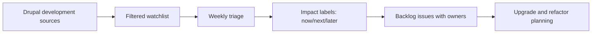

## The Hook
Dries’ “better way to follow Drupal development” matters because most teams are still flying blind until release day, then acting surprised when their build breaks.

## Why I Built It
I got tired of the same ritual: someone notices a change too late, then the team burns a sprint pretending this was “unplanned complexity” instead of bad observability.  
Following Drupal development is not hard, but people keep outsourcing basic reading to random summaries and Slack gossip.

So I wanted a setup that answers one question fast: what changed, why should I care, and what can break next?

There is no maintained Drupal module that magically does this end-to-end for your team context today. If you want signal, you still need a lightweight custom workflow.

## The Solution
I now treat Drupal development tracking like production monitoring: small inputs, clear filters, and zero worship of dashboards.

### What this stack looks like
1. Track upstream signals, not random commentary.
2. Filter by your risk surface: core APIs, contrib dependencies, deployment patterns.
3. Triage weekly with engineering, not monthly after damage is done.
4. Convert “interesting updates” into owned backlog items immediately.

:::warning
If your process ends at “read the post,” you built a content hobby, not an engineering workflow.
:::

Gotchas I hit

- Too many sources with no filtering creates false urgency.
- “We’ll remember this later” means nobody owns it.
- Teams over-index on feature announcements and ignore change mechanics.

## The Code
No separate repo—this is an operating model, not a standalone build artifact.

## What I Learned
- Worth trying when your team misses upgrade implications: treat Drupal news as input to planning, not entertainment.
- Avoid in production orgs: relying on social posts as primary technical source.
- Worth trying when prioritization is messy: tag each upstream change as `now`, `next`, or `later` with an owner.
- Avoid: adding another SaaS wrapper that summarizes links you should have read directly.
- No major deprecation notice was the point here; the value is earlier visibility so deprecations never blindside you later.

## References
- [Dries Buytaert: A better way to follow Drupal development](https://dri.es/a-better-way-to-follow-drupal-development)

