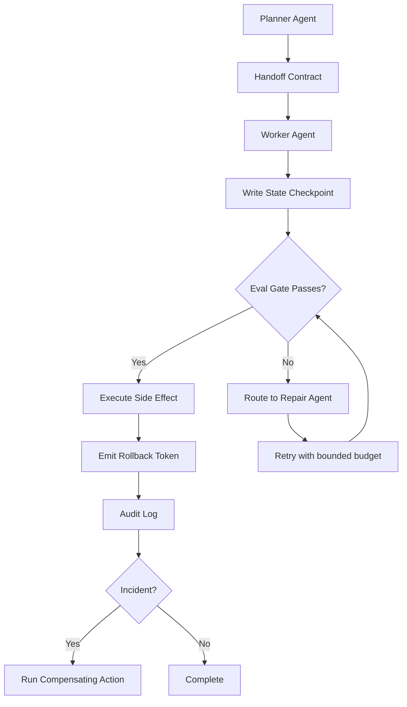

If you are building multi-agent systems, reliability comes from four controls: strict handoff contracts, durable shared state, eval gates before side effects, and deterministic rollback paths. GitHub's February 24, 2026 deep dive shows most failures are not model IQ problems, but coordination and recovery problems, so this post turns those patterns into an implementation playbook you can run in production.

<!-- truncate -->

## The Problem

Multi-agent systems fail in ways that look random until you classify them:

| Failure Pattern | Real Symptom in Production | Root Cause |
| --- | --- | --- |
| Handoff drift | Agent B receives partial context and repeats work | No schema for task transfer |
| State divergence | Two agents "complete" conflicting plans | Ephemeral memory, no canonical ledger |
| Silent quality regressions | Output is valid JSON but wrong decision | No domain eval gates before actions |
| Irreversible side effects | Bad deploy/email/record mutation | No rollback token or compensating action |

When orchestration scales from one agent to many, these failure modes compound and turn into latency spikes, duplicated work, and user-visible incidents.

## The Solution

Treat multi-agent reliability like distributed systems reliability: contracts, checkpoints, gates, and recovery.



### 1) Handoff contracts

Every agent boundary should pass a typed payload, not prose-only context.

```json
{
  "handoff_id": "hf_2026_02_24_001",
  "goal": "Generate patch plan for service outage",
  "inputs": {
    "incident_id": "inc_4482",
    "affected_services": ["billing-api", "worker-sync"]
  },
  "constraints": {
    "max_runtime_seconds": 120,
    "allowed_actions": ["read", "propose_patch"]
  },
  "done_when": [
    "root cause hypothesis ranked",
    "safe patch sequence proposed"
  ]
}
```

### 2) Shared state as a ledger

Use append-only checkpoints so retries are deterministic.

```json
{
  "run_id": "run_9f31",
  "step": 4,
  "agent": "worker_agent",
  "status": "eval_failed",
  "artifacts": ["plan.md", "risk-score.json"],
  "resume_from": "repair_agent",
  "timestamp": "2026-02-24T23:30:22Z"
}
```

### 3) Eval gates before side effects

Separate "looks good" from "safe to execute". A minimum gate set:

| Eval Gate | Pass Condition | Block Condition |
| --- | --- | --- |
| Policy gate | Output uses only allowed tools/data | Unauthorized tool call or scope |
| Correctness gate | Domain checks pass (tests/rules) | Missing invariants or failing tests |
| Risk gate | Blast radius below threshold | Unbounded or irreversible action |

### 4) Rollback by design

Every side effect should emit a rollback token and compensating action map.

```yaml
side_effect: deploy_patch
rollback_token: rbk_inc_4482_v3
compensating_action:
  type: deploy_previous_artifact
  artifact: billing-api@sha256:prev
  timeout_seconds: 90
```

### Reference operating sequence

1. Planner emits contract.
2. Worker executes bounded task and writes checkpoint.
3. Evaluator scores quality and policy compliance.
4. Executor performs side effect only if all gates pass.
5. Recovery agent handles failure using rollback token.

This aligns with reliability patterns discussed in [Agentic AI without vibe coding](/agentic-ai-without-vibe-coding/), [Unprotected AI agents report](/2026-02-19-unprotected-ai-agents-report/), and [Netomi's agentic lessons playbook](/2026-02-06-netomi-agentic-lessons-playbook/).

## What I Learned

- Worth trying when teams are shipping multi-agent features fast: enforce a single handoff schema and reject free-form transfers in production paths.
- Avoid in production: side effects that do not emit rollback tokens.
- Evals should gate execution, not just run as dashboards after the fact.
- Shared state must be durable and append-only if you want deterministic recovery.
- Reliability incidents in agent systems are usually orchestration bugs before they are model bugs.

## References

- [How we built our multi-agent research system](https://github.blog/ai-and-ml/github-copilot/how-we-built-our-multi-agent-research-system/)
- [GitHub Engineering](https://github.blog/engineering/)
