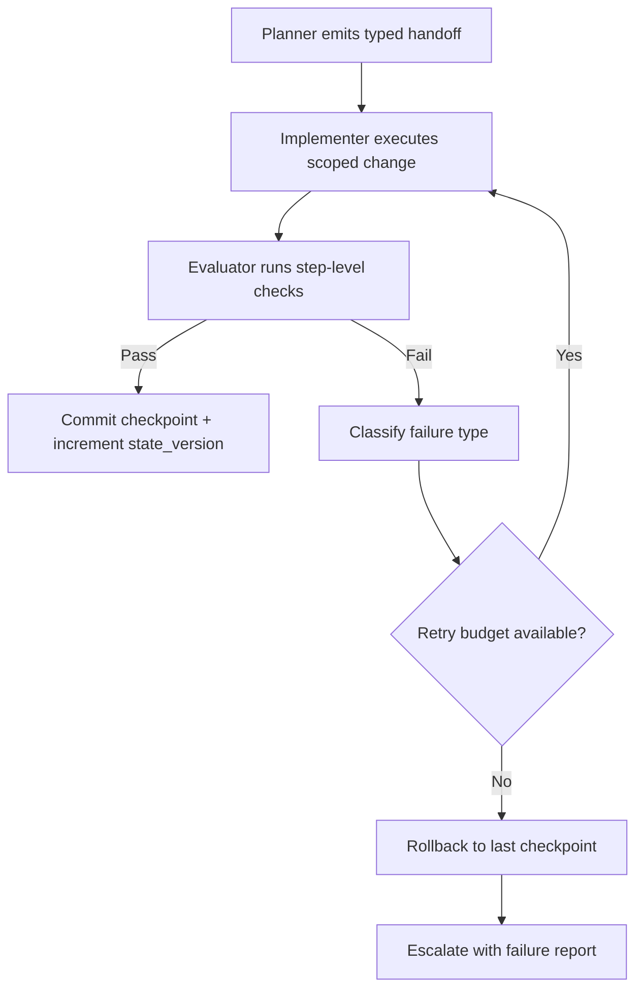
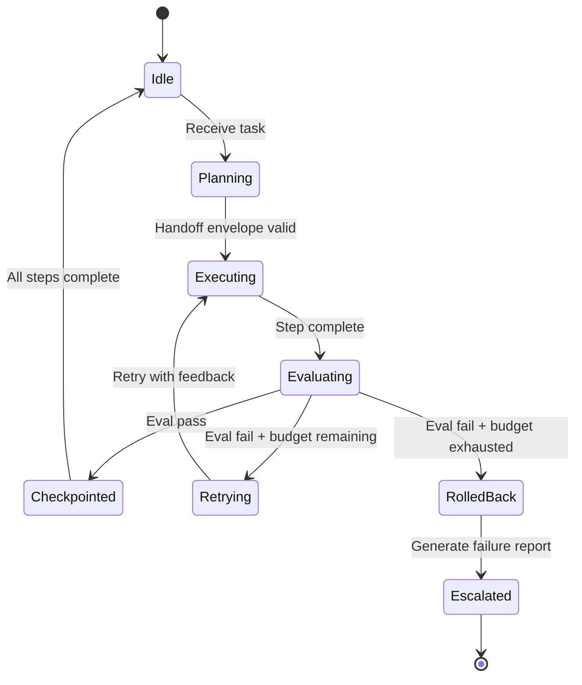

import Tabs from '@theme/Tabs';
import TabItem from '@theme/TabItem';

If your multi-agent workflow keeps failing in unpredictable ways, implement four controls first: typed handoffs, explicit state contracts, task-level evals, and transactional rollback. GitHub's engineering deep dive published on February 24, 2026 shows the same core pattern: most failures are orchestration failures, not model-IQ failures.

<!-- truncate -->

Reliability comes from workflow design before model tuning.

## The problem

GitHub's deep dive highlights where multi-agent systems break when moving from a single coding assistant to multiple specialized agents. The repeated pain points are practical:

1. Handoffs are ambiguous, so downstream agents infer missing context.
2. Shared state mutates without schema discipline, causing drift and duplication.
3. Success checks happen too late (end-of-run), so bad branches accumulate cost.
4. Failed steps are hard to isolate, so recovery is "start over" instead of rollback.

:::danger[Expensive Cascade]
One weak handoff can trigger a cascade of retries across planner, implementer, and verifier roles. That failure profile is expensive in both tokens and time.
:::

## The solution

### Reliability playbook mapped to failure patterns

| Failure pattern from GitHub deep dive | Reliability control | Implementation detail | Rollback trigger |
|---|---|---|---|
| Missing context between agents | Typed handoff envelope | Every agent emits `goal`, `constraints`, `artifacts`, `done_criteria` | Envelope missing required keys |
| Shared memory drift | State contract with versions | Maintain `state_version` and immutable event log per step | State schema validation fails |
| Late quality detection | Step-level eval gates | Run checks after each agent output (not only at the end) | Eval score below threshold |
| Retry storms | Bounded retries + policy routing | Max retries per class (`format`, `tool`, `logic`) | Retry budget exhausted |
| Full restart recovery | Transactional checkpoints | Snapshot repo + plan after each passed gate | Gate fails after side effects |

### Handoff contract (practical baseline)

Use a strict JSON envelope for every inter-agent transfer:

```json title="handoff-envelope.json" showLineNumbers
{
  "handoff_id": "uuid",
  "from_agent": "planner",
  "to_agent": "implementer",
  // highlight-start
  "goal": "Apply fix for flaky checkout test",
  "constraints": ["no schema changes", "keep API stable"],
  "artifacts": ["failing_test_trace.md", "target_file_list.json"],
  "done_criteria": ["tests pass", "diff limited to 2 files"],
  // highlight-end
  "state_version": 12
}
```

> This mirrors GitHub's emphasis on explicit structure in tool inputs/outputs and keeps downstream behavior deterministic.

### State and evaluation loop



### Evals that matter per step

<Tabs>
  <TabItem value="format" label="Format Eval" default>

```json title="eval-format.json" showLineNumbers
{
  "eval_type": "format",
  "check": "Output matches required schema",
  // highlight-next-line
  "why": "Prevents parser/runtime failures in next agent",
  "pass_criteria": "JSON schema validates without errors"
}
```

  </TabItem>
  <TabItem value="tool" label="Tool Eval">

```json title="eval-tool.json" showLineNumbers
{
  "eval_type": "tool",
  "check": "Tool call used allowed inputs only",
  // highlight-next-line
  "why": "Prevents silent side effects and permission drift",
  "pass_criteria": "All tool inputs in allowlist"
}
```

  </TabItem>
  <TabItem value="task" label="Task Eval">

```json title="eval-task.json" showLineNumbers
{
  "eval_type": "task",
  "check": "Unit target passed for scoped files",
  // highlight-next-line
  "why": "Catches regressions before next handoff",
  "pass_criteria": "All targeted tests green"
}
```

  </TabItem>
</Tabs>

| Eval type | Example check | Why it matters |
|---|---|---|
| Format eval | Output matches required schema | Prevents parser/runtime failures in next agent |
| Tool eval | Tool call used allowed inputs only | Prevents silent side effects and permission drift |
| Task eval | Unit target passed for scoped files | Catches regressions before next handoff |
| Policy eval | Constraints respected (`no-depr-api`, `no-secret`) | Keeps compliance and security intact |

:::tip[Deprecation-Safe Rule]
Treat deprecated APIs and deprecated workflow patterns as an immediate eval failure, not a warning. If an agent proposes a deprecated hook, function, or integration path, fail fast and route it back with a replacement hint in the envelope.
:::

### Agent lifecycle states



## Migration checklist

- [ ] Define typed handoff envelope schema
- [ ] Implement state versioning and immutable event log
- [ ] Add step-level eval gates after each agent output
- [ ] Configure bounded retry budgets per failure class
- [ ] Implement transactional checkpoints with rollback
- [ ] Add deprecation check to policy eval
- [x] Wire eval results into monitoring/alerting

<details>
<summary>Related posts</summary>

- [Netomi enterprise lessons playbook](/2026-02-06-netomi-agentic-lessons-playbook/)
- [Flowdrop agents review](/2026-02-05-flowdrop-agents-review/)
- [Agentic AI without vibe coding](/agentic-ai-without-vibe-coding/)

</details>

## What I learned

- Multi-agent reliability is mostly an interface-design problem: handoff contracts beat prompt tweaks.
- State versioning plus event logs makes incident replay and root-cause analysis much faster.
- Step-level evals reduce blast radius and token waste because bad branches are cut early.
- Rollback needs to be first-class; otherwise every failure becomes a full restart.
- A deprecation gate is cheap insurance against subtle breakage during upgrades.

## References

- https://github.blog/ai-and-ml/github-copilot/lessons-from-githubs-multi-agent-system/
- https://github.blog/engineering/how-github-engineering-uses-mcp-github-copilot-to-ship-faster/
- https://docs.github.com/en/github-models/prototyping-with-ai-models
- https://modelcontextprotocol.io/specification/2025-06-18/schema
