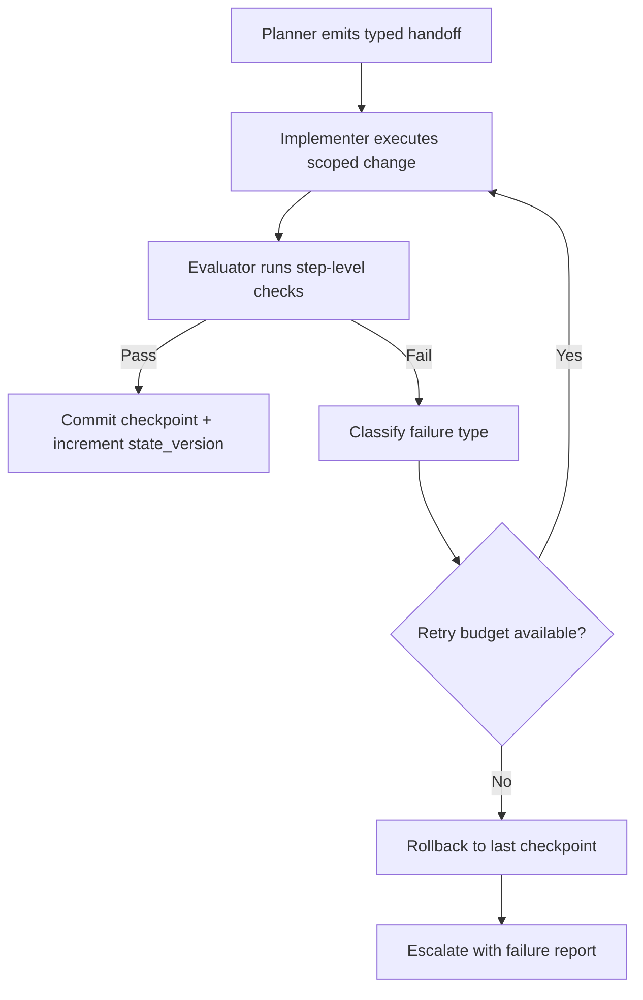
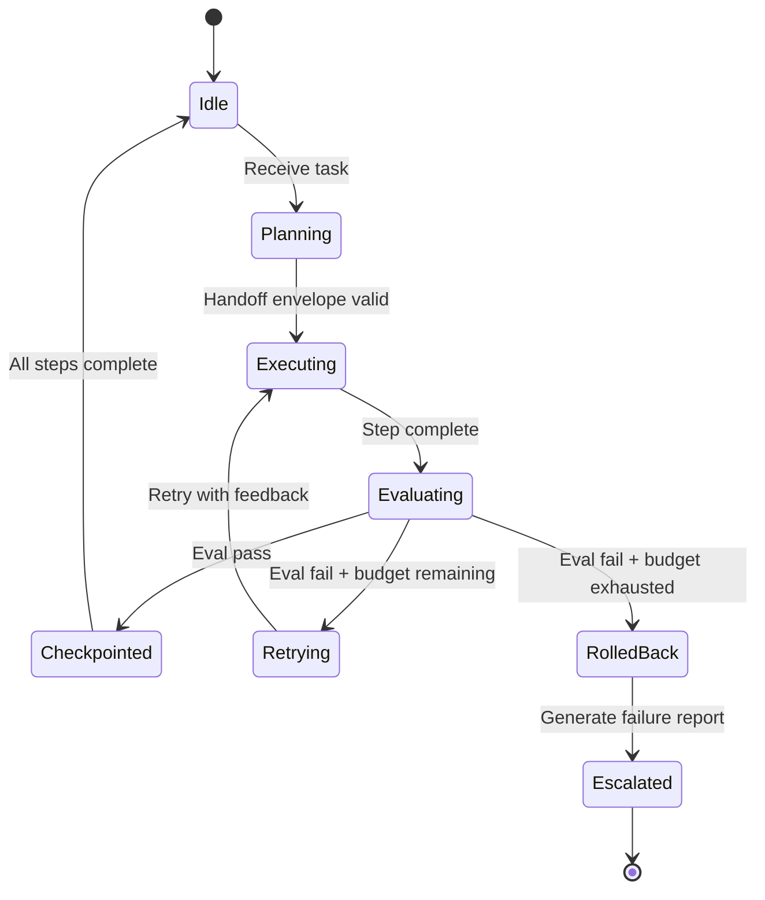

import Tabs from '@theme/Tabs';
import TabItem from '@theme/TabItem';

Most multi-agent failures are orchestration failures, and a smarter model does not repair a handoff that never said what done means. Before I tune any model, I would implement four controls: typed handoffs, explicit state contracts, task-level evals and transactional rollback. GitHub's engineering deep dive, published on February 24, shows the same core pattern.

<!-- truncate -->

## Where multi-agent workflows break

The deep dive covers what happens when a single coding assistant becomes several specialized agents. The pain points are practical, and none of them is about model intelligence:

1. Handoffs are ambiguous, so downstream agents infer missing context.
2. Shared state mutates without schema discipline, causing drift and duplication.
3. Success checks run at the end of the run, so bad branches accumulate cost.
4. Failed steps are hard to isolate, so recovery means "start over" instead of rollback.

The last one is the most expensive. "Start over" has the precision of turning the laptop off and on again, and it pays the full token bill every time. The replacement is a checkpoint after every passed gate, so a failure rolls back one step instead of the whole run.

:::danger[One handoff, many retries]
One weak handoff can trigger a cascade of retries across the planner, implementer and verifier roles. That failure costs both tokens and time.
:::

## Controls mapped to failure patterns

Reliability comes from workflow design before model tuning. Each failure pattern gets one control and one rollback trigger.

| Failure pattern from GitHub deep dive | Reliability control | Implementation detail | Rollback trigger |
|---|---|---|---|
| Missing context between agents | Typed handoff envelope | Every agent emits `goal`, `constraints`, `artifacts`, `done_criteria` | Envelope missing required keys |
| Shared memory drift | State contract with versions | Keep `state_version` and an immutable event log per step | State schema validation fails |
| Late quality detection | Step-level eval gates | Run checks after each agent output, not only at the end | Eval score below threshold |
| Retry storms | Bounded retries + policy routing | Max retries per class (`format`, `tool`, `logic`) | Retry budget exhausted |
| Full restart recovery | Transactional checkpoints | Snapshot repo + plan after each passed gate | Gate fails after side effects |

## The handoff envelope

Every inter-agent transfer uses a strict JSON envelope. An agent that infers missing context is guessing on the token budget, which is the most expensive way to read a ticket. The fix is a set of required keys, `goal`, `constraints`, `artifacts` and `done_criteria`, with the envelope rejected at the boundary when any of them is missing.

```json title="handoff-envelope.json" showLineNumbers
{
  "handoff_id": "uuid",
  "from_agent": "planner",
  "to_agent": "implementer",
  // highlight-start
  "goal": "Apply fix for flaky checkout test",
  "constraints": ["no schema changes", "keep API stable"],
  "artifacts": ["failing_test_trace.md", "target_file_list.json"],
  "done_criteria": ["tests pass", "diff limited to 2 files"],
  // highlight-end
  "state_version": 12
}
```

> This mirrors GitHub's emphasis on explicit structure in tool inputs and outputs, and it keeps downstream behavior deterministic.

## The state and eval loop

Checks run after every agent output, and retries have a budget. A retry loop without a budget is `while (true)` with an invoice attached. A max retry count per failure class (`format`, `tool`, `logic`) turns it into a decision: when the budget runs out, the workflow rolls back to the last checkpoint and escalates with a failure report.


```mermaid
flowchart TD
    A[Planner emits typed handoff] --> B[Implementer executes scoped change]
    B --> C[Evaluator runs step-level checks]
    C -->|Pass| D[Commit checkpoint + increment state_version]
    C -->|Fail| E[Classify failure type]
    E --> F{Retry budget available?}
    F -->|Yes| B
    F -->|No| G[Rollback to last checkpoint]
    G --> H[Escalate with failure report]
```

## Evals that run per step

Each step gets checked before the next agent sees its output. The format, tool and task evals look like this:

<Tabs>
<TabItem value="format" label="Format Eval" default>

```json title="eval-format.json" showLineNumbers
{
  "eval_type": "format",
  "check": "Output matches required schema",
  // highlight-next-line
  "why": "Prevents parser/runtime failures in next agent",
  "pass_criteria": "JSON schema validates without errors"
}
```

</TabItem>
<TabItem value="tool" label="Tool Eval">

```json title="eval-tool.json" showLineNumbers
{
  "eval_type": "tool",
  "check": "Tool call used allowed inputs only",
  // highlight-next-line
  "why": "Prevents silent side effects and permission drift",
  "pass_criteria": "All tool inputs in allowlist"
}
```

</TabItem>
<TabItem value="task" label="Task Eval">

```json title="eval-task.json" showLineNumbers
{
  "eval_type": "task",
  "check": "Unit target passed for scoped files",
  // highlight-next-line
  "why": "Catches regressions before next handoff",
  "pass_criteria": "All targeted tests green"
}
```

</TabItem>
</Tabs>

The policy eval adds constraint checks such as `no-depr-api` and `no-secret` on top of the others.

| Eval type | Example check | Why it matters |
|---|---|---|
| Format eval | Output matches required schema | Prevents parser/runtime failures in the next agent |
| Tool eval | Tool call used allowed inputs only | Prevents silent side effects and permission drift |
| Task eval | Unit target passed for scoped files | Catches regressions before the next handoff |
| Policy eval | Constraints respected (`no-depr-api`, `no-secret`) | Keeps compliance and security intact |

A deprecation warning lets a bad step pass with a note attached. My call is to make it a hard stop.

:::tip[Deprecation is a failure]
Treat deprecated APIs and deprecated workflow patterns as an immediate eval failure, not a warning. When an agent proposes a deprecated hook, function or integration path, fail fast and route it back with a replacement hint in the envelope.
:::

## Agent lifecycle states

Every run ends either checkpointed and back to idle, or rolled back and escalated with a report. No state leads to "start again from scratch".


```mermaid
stateDiagram-v2
    [*] --> Idle
    Idle --> Planning: Receive task
    Planning --> Executing: Handoff envelope valid
    Executing --> Evaluating: Step complete
    Evaluating --> Checkpointed: Eval pass
    Evaluating --> Retrying: Eval fail + budget remaining
    Retrying --> Executing: Retry with feedback
    Evaluating --> RolledBack: Eval fail + budget exhausted
    RolledBack --> Escalated: Generate failure report
    Checkpointed --> Idle: All steps complete
    Escalated --> [*]
```

## Migration checklist

- [ ] Define typed handoff envelope schema
- [ ] Implement state versioning and immutable event log
- [ ] Add step-level eval gates after each agent output
- [ ] Configure bounded retry budgets per failure class
- [ ] Implement transactional checkpoints with rollback
- [ ] Add deprecation check to policy eval
- [x] Wire eval results into monitoring/alerting

## What I learned

- Multi-agent reliability is mostly an interface design problem: handoff contracts beat prompt tweaks.
- State versioning plus event logs makes incident replay and root cause analysis much faster.
- Step-level evals reduce blast radius and token waste because bad branches are cut early.
- Rollback has to be first-class. Without it, every failure becomes a full restart.
- A deprecation gate is cheap insurance against subtle breakage during upgrades.

<details>
<summary>Related posts</summary>

- Netomi enterprise lessons playbook
- Flowdrop agents review
- [Agentic AI without vibe coding](/agentic-ai-without-vibe-coding/)

</details>

## References

- https://github.blog/ai-and-ml/github-copilot/lessons-from-githubs-multi-agent-system/
- https://github.blog/engineering/how-github-engineering-uses-mcp-github-copilot-to-ship-faster/
- https://docs.github.com/en/github-models/prototyping-with-ai-models
- https://modelcontextprotocol.io/specification/2025-06-18/schema
