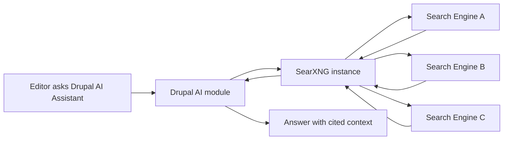

import Tabs from '@theme/Tabs';
import TabItem from '@theme/TabItem';

If your Drupal AI assistant sends every query through someone else's opaque API, you did not build intelligence. You outsourced your context to a black box with a billing page.

This is the practical counterpoint to my [earlier SearXNG critique](/drupal-ai-searxng-privacy-pivot/). When privacy actually matters for your use case, here is how to think about it.

<!-- truncate -->

## The Hook

> "Drupal AI now has a privacy-first path with SearXNG, and it matters because retrieval quality is useless if your search layer leaks sensitive prompts or organizational intent."
>
> — Drupal AI Initiative, [SearXNG Blog Post](https://www.drupal.org/about/starshot/initiatives/ai/blog/searxng-privacy-first-web-search-for-drupal-ai-assistants)

:::info[Context]
For Drupal teams handling donor, nonprofit, education, or government-adjacent data, privacy is not optional. If your assistant is pulling external web context, you need control over where queries go, how logs are handled, and what engines are queried. This is the specific scenario where SearXNG makes sense.
:::

## Architecture

<Tabs>
  <TabItem value="when" label="When to Use SearXNG">

| Scenario | SearXNG Makes Sense |
|---|---|
| Government/public sector data | Yes |
| Healthcare/HIPAA-adjacent queries | Yes |
| Donor/nonprofit sensitive context | Yes |
| Education with student data concerns | Yes |
| Standard content sites | Probably not |
| E-commerce product queries | No |

  </TabItem>
  <TabItem value="gotchas" label="Gotchas">

| Issue | Impact |
|---|---|
| Relevance tuning still matters | Privacy-first does not mean accuracy-first by default |
| Engine configuration can bias results silently | Test with real editorial queries |
| Caching strategy needs intent | Stale context is still wrong context, just cheaper |
| Self-hosting without hardening | Just moved risk from vendor to your infra |

  </TabItem>
</Tabs>

## Honest Comparison

| Approach | Privacy | Performance | Ops Burden | Cost |
|---|---|---|---|---|
| Direct commercial API | Low | High | Zero | Per-query billing |
| SearXNG self-hosted | High | Medium-Low | **High** | Infrastructure + ops time |
| SearXNG managed service | Medium-High | Medium | Medium | Service fees |
| No external search | Perfect | N/A | Zero | No web context |

:::caution[Reality Check]
If you self-host SearXNG and skip hardening, rate limits, or logging policy, you just moved risk from a vendor to your own infrastructure without actually reducing risk. Privacy without operational discipline is just a different flavor of exposure.
:::

:::tip[Use the ecosystem first]
Use the actively maintained Drupal AI ecosystem instead of hand-rolled glue code first. Custom integrations are fine when required, but "we will just script it" becomes technical debt fast if governance and observability are missing.
:::

Related context from this blog

- [Drupal AI SearXNG Critique: Privacy or Performance Art?](/drupal-ai-searxng-privacy-pivot/) — my skeptical take on this for most use cases
- [AI in Drupal CMS 2.0](/2026-02-06-ai-in-drupal-cms-2-0-dayone-tools/) — the practical Drupal AI stack
- [Drupal CMS Recipe System](/2026-02-06-drupal-cms-recipe-system-ai-site-building-review/) — Starshot recipe workflows
- [Drupal CMS Community Feedback Survey](/2026-02-24-drupal-cms-community-feedback-survey-review/) — recent feedback signals

## What I Learned

- Privacy-first retrieval is worth trying when your assistant touches regulated or reputationally sensitive content.
- Avoid black-box "AI search" products in production when they hide routing, logging, and ranking behavior.
- Use maintained Drupal AI tooling first, then customize only where policy or domain logic actually demands it.
- Don't confuse "works in demo" with "safe in operations." Governance is a feature, not paperwork.

## References

- [Drupal AI Initiative: SearXNG - Privacy-First Web Search for Drupal AI Assistants](https://www.drupal.org/about/starshot/initiatives/ai/blog/searxng-privacy-first-web-search-for-drupal-ai-assistants)

