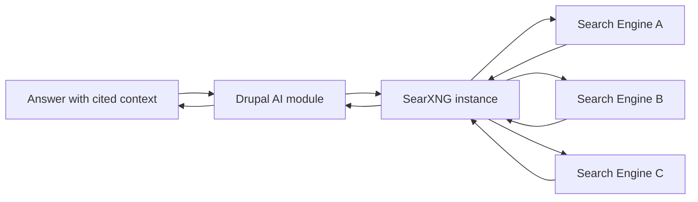

If your Drupal AI assistant sends every query through someone else’s opaque API, you didn’t build intelligence, you outsourced your context to a black box with a billing page.  
<!-- truncate -->

## The Hook

Drupal AI now has a privacy-first path with SearXNG, and it matters because retrieval quality is useless if your search layer leaks sensitive prompts or organizational intent.

## Why I Built It

I keep seeing “AI search integrations” that are just expensive wrappers around endpoints you could hit with `curl` and 20 lines of Python. The Drupal AI Initiative’s SearXNG direction is the opposite: self-hostable, inspectable, and boring in the best way.

For Drupal teams handling donor, nonprofit, education, or government-adjacent data, privacy is not optional. If your assistant is pulling external web context, you need control over where queries go, how logs are handled, and what engines are queried.

Also, this aligns with the practical Drupal AI stack discussion I already covered in [AI in Drupal CMS 2.0](/ai-in-drupal-cms-2-0-practical-tools-you-can-use-from-day-one/), [Starshot recipe workflows](/review-drupal-cms-starshot-recipe-system-for-ai-driven-site-building/), and [recent Drupal CMS feedback signals](/drupal-cms-community-feedback-survey-review/).

## The Solution

Use SearXNG as the retrieval backend for Drupal AI assistants so search stays under your operational control, not inside a vendor mystery box.

:::tip
Use the actively maintained Drupal AI ecosystem instead of hand-rolled glue code first. Custom integrations are fine when required, but “we’ll just script it” becomes technical debt fast if governance and observability are missing.
:::

:::warning
If you self-host SearXNG and skip hardening, rate limits, or logging policy, you just moved risk from a vendor to your own infrastructure without actually reducing risk.
:::

### Gotchas

- Relevance tuning still matters. Privacy-first does not mean accuracy-first by default.
- Engine configuration can bias results silently if you don’t test with real editorial queries.
- Caching strategy needs intent: stale context is still wrong context, just cheaper.

## The Code

No separate repo—this is an architecture and integration pattern review, not a standalone build deliverable.

## What I Learned

- Privacy-first retrieval is worth trying when your assistant touches regulated or reputationally sensitive content.
- Avoid black-box “AI search” products in production when they hide routing, logging, and ranking behavior.
- Use maintained Drupal AI tooling first, then customize only where policy or domain logic actually demands it.
- Don’t confuse “works in demo” with “safe in operations”; governance is a feature, not paperwork.

## References

- [Drupal AI Initiative: SearXNG - Privacy-First Web Search for Drupal AI Assistants](https://www.drupal.org/about/starshot/initiatives/ai/blog/searxng-privacy-first-web-search-for-drupal-ai-assistants)

