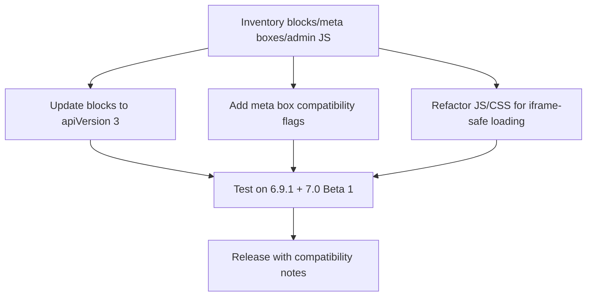

As of February 24, 2026, WordPress 7.0 is in Beta 1 (released February 20, 2026), and the post editor is planned to run inside an iframe regardless of block `apiVersion`. If your plugin still depends on top-window DOM selectors, legacy block registration, or unflagged classic meta boxes, this is the migration window to fix compatibility before the planned 7.0 release on April 9, 2026.

<!-- truncate -->

## The Problem

Teams that still mix classic meta boxes and custom admin scripts into block editing flows usually fail in three places once iframe isolation is always on:

| Area | Legacy pattern | Failure mode in always-iframed editor |
| --- | --- | --- |
| Block registration | `apiVersion` 1/2 | Inconsistent editor context and compatibility warnings in 6.9, higher risk in 7.0 |
| Meta boxes | No compatibility flags | Boxes appear in the wrong context or trigger fallback messaging |
| Admin JS/CSS | `document`/`window` assumptions in top admin context | Selectors and injected behavior miss editor canvas content |

WordPress core has signaled this transition in advance:
- WordPress 6.9 introduced console warnings for legacy blocks when `SCRIPT_DEBUG` is enabled.
- The Block API docs state WordPress 7.0 plans to always iframe the post editor.

## The Solution

Treat migration as a compatibility track with three parallel workstreams: block API, meta boxes, and editor asset loading.



### 1. Block Registration: Move to `apiVersion: 3`

From the Block API Versions handbook:

```json
{
  "apiVersion": 3
}
```

Why this matters:
- In WordPress 6.9, core warns for legacy block API versions in debug mode.
- In WordPress 7.0, post editor iframing is planned regardless of `apiVersion`, so v3 is the forward-safe baseline.

### 2. Classic Meta Boxes: Set Intent Explicitly

From the Meta Boxes handbook, use compatibility flags on `add_meta_box()`:

```php
add_meta_box(
    'my-meta-box',
    'My Meta Box',
    'my_meta_box_callback',
    null,
    'normal',
    'high',
    array(
        '__block_editor_compatible_meta_box' => false,
    )
);
```

And for legacy-only fallback after block migration:

```php
add_meta_box(
    'my-meta-box',
    'My Meta Box',
    'my_meta_box_callback',
    null,
    'normal',
    'high',
    array(
        '__back_compat_meta_box' => true,
    )
);
```

Use this decision table:

| Meta box status | Recommended flagging |
| --- | --- |
| Works in block editor | Keep compatible (default or explicit `__block_editor_compatible_meta_box => true`) |
| Cannot be made block-editor compatible yet | Set `__block_editor_compatible_meta_box => false` and publish migration timeline |
| Replaced by block/sidebar UI but needed for classic editor | Set `__back_compat_meta_box => true` |

### 3. Custom Admin JS/CSS: Load in the Correct Context

From the enqueueing guide:
- `enqueue_block_assets` is the primary path for block content assets.
- Since WordPress 6.3, assets from `enqueue_block_assets` are also enqueued in the iframed editor.

```php
add_action( 'enqueue_block_editor_assets', 'example_enqueue_editor_assets' );
```

Compatibility rule of thumb:
- UI integrations for editor chrome/panels: `enqueue_block_editor_assets`.
- Content-affecting styles/scripts for blocks: `enqueue_block_assets`.
- Avoid top-window-only assumptions for selectors/events; validate behavior inside the editor canvas context.

### 4. Test Matrix Before You Ship

| Environment | What to verify |
| --- | --- |
| WordPress 6.9.1 | Legacy warnings, no regressions for existing editors |
| WordPress 7.0 Beta 1 | Post editor behavior under iframe isolation |
| Plugin combinations | Meta box placement, sidebar integrations, save/update flows |

Related reading:
- [WordPress 7.0 Beta 1 Review](/wordpress-7-0-beta-1-review/)
- [Review: WordPress 7.0 Always-Iframed Post Editor](/2026-02-17-wordpress-7-iframed-editor/)
- [WordPress 7.0 Compatibility Scanner CLI](/2026-02-18-wp-7-compat-scanner-cli/)

## What I Learned

- The migration risk is mostly integration code, not block markup.
- Meta box flags are still critical for predictable user experience in mixed editor environments.
- Asset enqueue strategy now determines whether scripts/styles reach the iframe context correctly.
- Testing on both 6.9.1 and 7.0 Beta 1 catches most upgrade regressions before production users see them.

## References

- https://wordpress.org/news/
- https://make.wordpress.org/core/7-0/
- https://make.wordpress.org/core/2025/11/12/preparing-the-post-editor-for-full-iframe-integration/
- https://developer.wordpress.org/block-editor/reference-guides/block-api/block-api-versions/
- https://developer.wordpress.org/block-editor/how-to-guides/metabox/
- https://developer.wordpress.org/block-editor/how-to-guides/enqueueing-assets-in-the-editor/
- https://make.wordpress.org/core/2018/11/07/meta-box-compatibility-flags/
