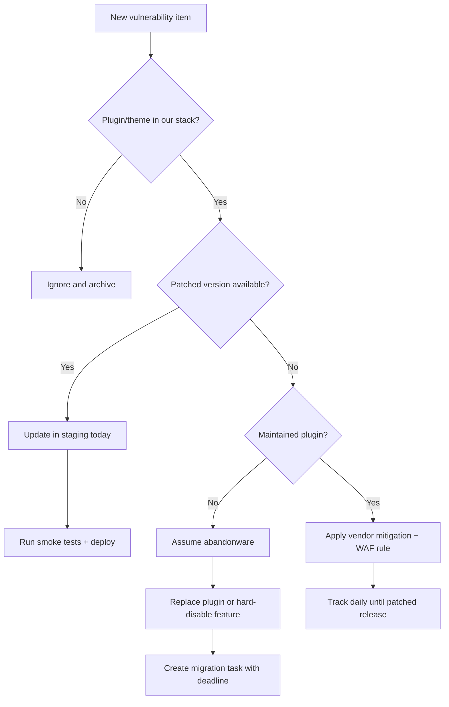

One weekly vulnerability report is enough to ruin your sprint, and the only sane response is a ruthless triage system that patches real risk first instead of panicking over headlines.

<!-- truncate -->

## Why I Built It

I keep seeing the same WordPress security theater: someone drops a scary CVE list in Slack, everyone scrambles, and six days later the actually exploitable plugin is still live in production.

The Wordfence weekly report for February 9-15, 2026 is useful, but a list is not a plan. A plan needs priorities, owner assignments, and deadlines that are shorter than your next status meeting.

So I built a simple playbook mindset: classify, patch, isolate, replace, verify.

## The Solution

Use the report as an input stream, not a reading assignment. Every item gets forced through the same decision path.

### Gotchas that keep biting teams

- “Low severity” still matters when the vulnerable plugin is internet-facing and widely deployed.
- If a plugin is effectively abandoned, waiting for a fix is fantasy. Replace it.
- “We have a firewall” is not a patch strategy.
- Bulk updating without staging is how you trade security risk for outage risk.

### Maintained vs abandoned reality check

For this workflow, a maintained security layer exists and should be part of your baseline: `Wordfence` is actively maintained and useful for detection/mitigation.  
But if the vulnerable extension itself is stale, no scanner saves you from dead code. Treat 12+ months of inactivity as a migration trigger.

## The Code

No separate repo, because this is an operations playbook derived from a security report rather than a new software build.

## What I Learned

- Use weekly vulnerability feeds as tickets, not content.
- Patch windows should be measured in hours for exposed components, not “next sprint.”
- A maintained security plugin helps, but it cannot compensate for abandoned dependencies.
- Worth trying in teams with noisy backlogs: enforce a 4-state label per finding (`Not Affected`, `Patch Available`, `Mitigated`, `Replaced`).
- Avoid in production: “monitor-only” posture when a known vulnerable plugin is active.

## References

- [Wordfence Intelligence Weekly WordPress Vulnerability Report (February 9, 2026 to February 15, 2026)](https://www.wordfence.com/blog/2026/02/wordfence-intelligence-weekly-wordpress-vulnerability-report-february-9-2026-to-february-15-2026/)

