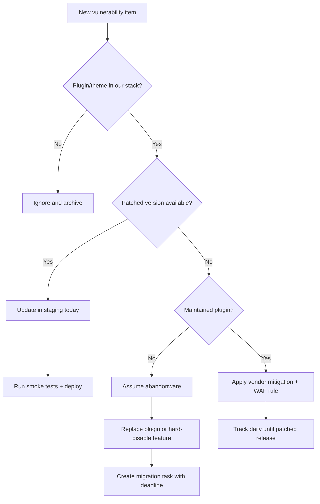

One weekly vulnerability report is enough to ruin a sprint. The only sane response is a ruthless triage system that patches real risk first instead of panicking over headlines.

<!-- truncate -->

:::danger[Stop the Security Theater]
If your team's response to a vulnerability report is alarm emojis in Slack followed by zero patches, you do not have a security process. You have a reading club.
:::

## Why I Built This

I keep seeing the same WordPress security theater: someone drops a scary CVE list in Slack, everyone scrambles, and six days later the actually exploitable plugin is still live in production.

The Wordfence weekly report for February 9-15, 2026 is useful, but a list is not a plan. A plan needs priorities, owner assignments, and deadlines shorter than your next status meeting.

I built a simple playbook: classify, patch, isolate, replace, verify.

## The Decision Tree

Every vulnerability item from the report gets forced through the same path. No exceptions.



:::tip[Fast Stack Check]
Run `wp plugin list --format=json` to dump your entire plugin inventory. Match slugs against the report. Takes 10 seconds and eliminates guessing.
:::

## Triage Priority Matrix

| Condition | Priority | SLA |
|---|---|---|
| Internet-facing + exploitable + no auth required | Critical | Patch within hours |
| Authenticated exploit + contributor/editor level | High | Patch within 24h |
| Admin-only surface + specific conditions | Medium | Patch within 1 week |
| Low severity + defense-in-depth | Low | Next maintenance window |

## Gotchas That Keep Biting Teams

**"Low severity" still matters** when the vulnerable plugin is internet-facing and widely deployed.

**Abandoned plugins do not get fixed.** If a plugin has 12+ months of inactivity, waiting for a fix is fantasy. Replace it.

**"We have a firewall" is not a patch strategy.** A WAF is a seatbelt, not a substitute for fixing the brakes.

**Bulk updating without staging** is how you trade security risk for outage risk.

## Triage Checklist

- [ ] Pull the weekly Wordfence report
- [ ] Run `wp plugin list --format=json` on all managed sites
- [ ] Match installed slugs and versions against the report
- [ ] Tag each finding: `Not Affected` / `Patch Available` / `Mitigated` / `Replaced`
- [ ] Deploy patches to staging, run smoke tests
- [ ] Push to production within SLA
- [x] Document exceptions and closures

## Maintained vs. Abandoned Reality Check

A maintained security layer like Wordfence is useful for detection and virtual patching. But if the vulnerable extension itself is stale, no scanner saves you from dead code.

> "174 vulnerabilities impacting 139 plugins and 28 themes were disclosed in the week of February 9-15, 2026."
>
> — Wordfence Intelligence, [Weekly WordPress Vulnerability Report](https://www.wordfence.com/blog/2026/02/wordfence-intelligence-weekly-wordpress-vulnerability-report-february-9-2026-to-february-15-2026/)

<details>
<summary>Labeling system for team backlogs</summary>

For teams with noisy backlogs, enforce a 4-state label per finding:

- **Not Affected** — Plugin/theme not installed. Archive.
- **Patch Available** — Update exists. Apply within SLA.
- **Mitigated** — WAF rule or config workaround in place. Track until patched.
- **Replaced** — Vulnerable component removed, replacement deployed.

This prevents findings from sitting in limbo. Every item gets a terminal state.

</details>

```bash title="Terminal — inventory all plugins"
wp plugin list --format=json > /tmp/wp-plugins.json
```

```bash title="Terminal — check for pending updates"
wp plugin list --update=available --format=table
```

## What I Learned

- Use weekly vulnerability feeds as tickets, not content.
- Patch windows should be measured in hours for exposed components, not "next sprint."
- A maintained security plugin helps, but it cannot compensate for abandoned dependencies.
- "Monitor-only" posture on a known vulnerable plugin is not mitigation — it is hope.

## References

- [Wordfence Intelligence Weekly WordPress Vulnerability Report (February 9, 2026 to February 15, 2026)](https://www.wordfence.com/blog/2026/02/wordfence-intelligence-weekly-wordpress-vulnerability-report-february-9-2026-to-february-15-2026/)
