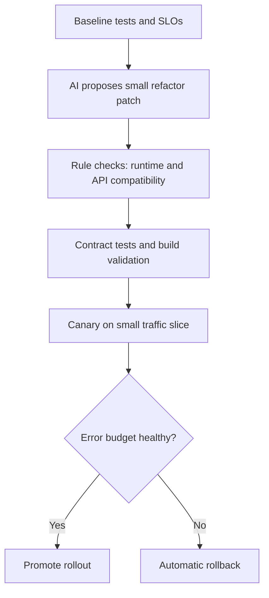

import Tabs from '@theme/Tabs';
import TabItem from '@theme/TabItem';

Cloudflare viNext is the fastest path today to run modern Next.js apps on Workers with less adapter glue. But the safe adoption pattern is not "AI rewrites everything." The practical pattern is AI for scoped transforms, deterministic checks for every change set, and a canary rollback plan.

That combination gives speed without losing production stability.

<!-- truncate -->

## The Problem

> "Most teams migrating Next.js workloads to Workers hit three risks at the same time: runtime assumptions from Node-first code, framework feature mismatches, and over-aggressive AI edits that bundle unrelated refactors."
>
> — Cloudflare, [Introducing viNext](https://blog.cloudflare.com/viNext/)

:::info[Context]
Cloudflare positions viNext as an improved path over older adapter-heavy approaches. The project is still evolving quickly. Treat this as a progressive migration, not a one-shot rewrite.
:::

| Risk | Failure Mode in Production | Safe Control |
|---|---|---|
| Runtime mismatch | Node-only APIs fail at edge runtime | Static scan + allowlist for APIs per route |
| Large AI diffs | Hidden behavior regressions | Refactor in small PRs with contract tests |
| Unclear rollout | Incidents during traffic cutover | Canary + instant rollback to previous deploy |

## The Safe Migration Pattern

<Tabs>
<TabItem value="patterns" label="Refactor Patterns Worth Adopting">

1. **Route-by-route runtime isolation**: Ask AI to split edge-safe routes from Node-dependent routes first, then migrate only the edge-safe set.
2. **Compatibility shims behind feature flags**: AI can generate wrappers, but ship them disabled by default and enable per route.
3. **Contract-first edits**: Require AI patches to keep request/response snapshots identical before performance tuning.
4. **Diff budget policy**: Reject AI patches touching files outside an explicit migration scope.
5. **Reversible deployment units**: Every migration PR must be independently rollbackable.

</TabItem>
<TabItem value="antipatterns" label="Anti-Patterns to Avoid">

| Anti-Pattern | Why It Fails |
|---|---|
| "Big-bang" AI rewrite | Hides unrelated behavior changes |
| AI migrates all routes at once | Impossible to isolate failures |
| No contract tests | Cannot detect silent regressions |
| Rollback as afterthought | Cannot recover when canary fails |
| Unbounded AI diff scope | Changes leak outside migration boundary |

</TabItem>
</Tabs>

## AI-Assisted Migration: Effort vs Safety

| Approach | Migration Speed | Safety | Rollback Confidence |
|---|---|---|---|
| Full manual migration | Slow | High | High |
| AI rewrites everything | Fast | **Very Low** | **Very Low** |
| AI scoped + deterministic checks | Medium-Fast | **High** | **High** |
| AI scoped + no checks | Medium-Fast | Low | Low |

:::caution[Reality Check]
AI-assisted refactors are safest when the model is constrained to one migration objective per PR. Canary-first rollout is non-negotiable when framework/runtime boundaries are changing. "Let the AI handle it" is not a migration strategy. "Let the AI propose, then verify" is.
:::

Implementation checklist for AI-assisted viNext migration

1. Establish baseline tests and SLOs before any migration
2. Configure AI to propose patches scoped to one route or module at a time
3. Run static analysis for Node-only API usage per route
4. Require contract tests (request/response snapshots) for every PR
5. Deploy to canary with small traffic slice
6. Monitor error budget for canary window
7. Auto-rollback if budget exceeded
8. Promote only after canary passes
9. Document rollback path for each deployment unit
10. Review AI diffs for scope leakage before merge

## Why this matters for Drupal and WordPress

Headless Drupal and WordPress architectures using Next.js as a frontend are a growing pattern, and viNext is the new deployment path for those frontends on Cloudflare Workers. Teams running Next.js with Drupal's JSON:API or the WordPress REST API need the safe migration patterns described here -- route-by-route isolation, contract tests against API responses, and canary rollout. An AI-assisted "big-bang" rewrite of a decoupled Drupal/WordPress frontend risks breaking API integration points that are invisible to the refactoring model.

## What I Learned

- AI-assisted refactors are safest when the model is constrained to one migration objective per PR.
- Canary-first rollout is worth it when framework/runtime boundaries are changing.
- Avoid "big-bang" AI rewrites in production systems. They hide unrelated behavior changes.
- Keep rollback as a first-class deliverable, not an afterthought.

## References

- [Cloudflare: Introducing viNext](https://blog.cloudflare.com/viNext/)
- [Cloudflare Docs: Next.js on Workers](https://developers.cloudflare.com/workers/frameworks/framework-guides/nextjs/)
- [viNext Repository](https://github.com/cloudflare/vinext)
- [OpenNext](https://opennext.js.org/)
- [A Reproducible Next.js Rebuild Benchmark](/2026-02-25-nextjs-ai-rebuild-benchmark/)
- [DDEV v1.25 Modular Share with Cloudflare](/ddev-v1-25-modular-share-with-cloudflare/)

***
*Need an Enterprise CMS Architect to modernize your legacy PHP platforms? View my case studies at [victorjimenezdev.github.io](https://victorjimenezdev.github.io) or connect with me on LinkedIn.*
