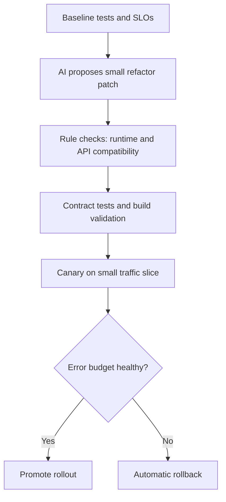

Cloudflare viNext is the fastest path today to run modern Next.js apps on Workers with less adapter glue, but the safe adoption pattern is not "AI rewrites everything." The practical pattern is AI for scoped transforms, deterministic checks for every change set, and a canary rollback plan. That combination gives speed without losing production stability.
<!-- truncate -->

## The Problem

Most teams migrating Next.js workloads to Workers hit three risks at the same time: runtime assumptions from Node-first code, framework feature mismatches, and over-aggressive AI edits that bundle unrelated refactors.

| Risk | Failure mode in production | Safe control |
| --- | --- | --- |
| Runtime mismatch | Node-only APIs fail at edge runtime | Static scan plus allowlist for APIs per route |
| Large AI diffs | Hidden behavior regressions | Refactor in small PRs with contract tests |
| Unclear rollout | Incidents during traffic cutover | Canary + instant rollback to previous deploy |

## The Solution

Use AI as a constrained codemod assistant, not an autonomous migrator.

Refactor patterns that are worth adopting now:

1. Route-by-route runtime isolation: ask AI to split edge-safe routes from Node-dependent routes first, then migrate only the edge-safe set.
2. Compatibility shims behind feature flags: AI can generate wrappers, but ship them disabled by default and enable per route.
3. Contract-first edits: require AI patches to keep request/response snapshots identical before performance tuning.
4. Diff budget policy: reject AI patches touching files outside an explicit migration scope.
5. Reversible deployment units: every migration PR must be independently rollbackable.

Cloudflare positions viNext as an improved path over older adapter-heavy approaches, and the project itself is still evolving quickly. Treat this as a progressive migration, not a one-shot rewrite.

## What I Learned

- AI-assisted refactors are safest when the model is constrained to one migration objective per PR.
- Canary-first rollout is worth trying when framework/runtime boundaries are changing.
- Avoid "big-bang" AI rewrites in prod systems; they hide unrelated behavior changes.
- Keep rollback as a first-class deliverable, not an afterthought.

## References

- [Cloudflare: Introducing viNext](https://blog.cloudflare.com/viNext/)
- [Cloudflare Docs: Next.js on Workers](https://developers.cloudflare.com/workers/frameworks/framework-guides/nextjs/)
- [viNext repository](https://github.com/cloudflare/vinext)
- [OpenNext](https://opennext.js.org/)
- [A Reproducible Next.js Rebuild Benchmark](/2026-02-25-nextjs-ai-rebuild-benchmark/)
- [DDEV v1.25 Modular Share with Cloudflare](/ddev-v1-25-modular-share-with-cloudflare/)
