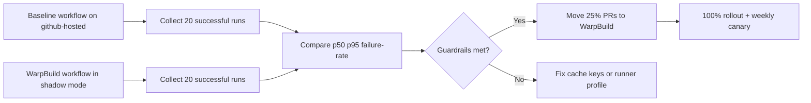

Use WarpBuild runners for the compute-heavy parts of your DDEV Drupal pipeline, keep cache keys deterministic, and gate rollout by p95 runtime and failure-rate SLOs. This gives you faster CI without turning your pipeline into a probabilistic black box. I verified this playbook against DDEV `v1.25.1` (released February 23, 2026) and current WarpBuild runner/cache docs.

<!-- truncate -->

## The Problem

Drupal CI pipelines that boot DDEV, run Composer, and execute tests typically lose time in three places:

| Bottleneck | Typical symptom | Why it hurts |
| --- | --- | --- |
| Cold VM startup | Slow first job on each PR | Adds fixed latency to every run |
| Dependency re-download | Composer cache misses | Repeats network + unzip work |
| Unsafe rollout | Team flips all jobs at once | Outages hide whether speed gains are real |

Without a reproducible benchmark method, "CI feels faster" is not a decision signal.

## The Solution

I use one workflow template and one benchmark script as the source of truth:

- Workflow template: `examples/devops/ddev-warpbuild-drupal-ci.yml`
- Benchmark script: `examples/devops/benchmark-ddev-ci.sh`

```yaml
# from examples/devops/ddev-warpbuild-drupal-ci.yml
jobs:
  test:
    runs-on: warp-ubuntu-latest-x64-4x
    steps:
      - uses: actions/checkout@v4
      - uses: actions/cache@v4
        with:
          path: ~/.cache/composer
          key: composer-${{ runner.os }}-${{ hashFiles('**/composer.lock') }}
      - uses: ddev/github-action-setup-ddev@v1
      - run: ddev start
      - run: ddev composer install --no-interaction --prefer-dist
      - run: ddev exec phpunit -c web/core
```

```bash
# from examples/devops/benchmark-ddev-ci.sh
./examples/devops/benchmark-ddev-ci.sh \
  acme/drupal-platform \
  drupal-ci-github-hosted.yml \
  drupal-ci-warpbuild.yml \
  20
```

### Cache strategy

| Layer | Key strategy | Eviction/limit concern | Guardrail |
| --- | --- | --- | --- |
| Composer (`actions/cache`) | `hashFiles('**/composer.lock')` | GitHub cache quotas and eviction policy | Keep caches lockfile-scoped; do not share mutable keys |
| DDEV runtime warmup | Warm via `ddev start` + smoke command | Cold starts still happen on new runners | Track cold vs warm p95 separately |
| WarpBuild runner cache/snapshots | Prewarm common toolchain paths | Snapshot drift can hide breakages | Weekly cold-run canary with snapshots disabled |



### Rollout guardrails for Drupal teams

1. Shadow mode first: run WarpBuild workflow in parallel, but do not block merges for one week.
2. Promote only if p95 runtime improves by at least 20% and failure rate does not regress.
3. Keep one baseline GitHub-hosted workflow as a canary for two release cycles.

Related reading: [DDEV v1.25 modular share architecture](/ddev-v1-25-modular-share-with-cloudflare/), [DDEV Podman/rootless constraints](/2026-02-06-ddev-podman-rootless-review/), and [Composer path repo workflow for Drupal](/2026-02-05-composer-path-repos-drupal/).

## What I Learned

- WarpBuild acceleration works best when compute and cache are tuned together; compute alone is not enough.
- Deterministic cache keys beat "mega-cache" strategies for Drupal reliability.
- A permanent baseline lane prevents overfitting CI to one runner platform.

## References

- https://github.com/ddev/ddev/releases/tag/v1.25.1
- https://docs.ddev.com/
- https://docs.warpbuild.com/ci/runners/github-hosted-runners
- https://docs.warpbuild.com/ci/cache/github-actions-cache
- https://docs.github.com/en/actions/using-workflows/caching-dependencies-to-speed-up-workflows
