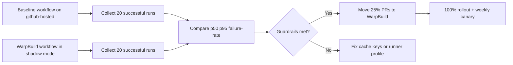

import Tabs from '@theme/Tabs';
import TabItem from '@theme/TabItem';

Use WarpBuild runners for the compute-heavy parts of your DDEV Drupal pipeline, keep cache keys deterministic, and gate rollout by p95 runtime and failure-rate SLOs. This gives you faster CI without turning your pipeline into a probabilistic black box. I verified this playbook against DDEV `v1.25.1` (released February 23, 2026) and WarpBuild docs as of February 25, 2026.

<!-- truncate -->

## The problem

Drupal CI pipelines that boot DDEV, run Composer, and execute tests typically lose time in three places:

| Bottleneck | Typical symptom | Why it hurts |
|---|---|---|
| Cold VM startup | Slow first job on each PR | Adds fixed latency to every run |
| Dependency re-download | Composer cache misses | Repeats network + unzip work |
| Unsafe rollout | Team flips all jobs at once | Outages hide whether speed gains are real |

:::warning[Not a Decision Signal]
Without a reproducible benchmark method, "CI feels faster" is not a decision signal. You need p50/p95 numbers from controlled runs.
:::

## The solution

I use one workflow template and one benchmark script as the source of truth.

### Workflow template

<Tabs>
  <TabItem value="warpbuild" label="WarpBuild Runner" default>

```yaml title="examples/devops/ddev-warpbuild-drupal-ci.yml" showLineNumbers
jobs:
  test:
    # highlight-next-line
    runs-on: warp-ubuntu-latest-x64-4x
    steps:
      - uses: actions/checkout@v4
      - uses: actions/cache@v4
        with:
          path: ~/.cache/composer
          # highlight-next-line
          key: composer-${{ runner.os }}-${{ hashFiles('**/composer.lock') }}
      - uses: ddev/github-action-setup-ddev@v1
      - run: ddev start
      - run: ddev composer install --no-interaction --prefer-dist
      - run: ddev exec phpunit -c web/core
```

  </TabItem>
  <TabItem value="github" label="GitHub-Hosted (Baseline)">

```yaml title="examples/devops/ddev-github-hosted-drupal-ci.yml" showLineNumbers
jobs:
  test:
    # highlight-next-line
    runs-on: ubuntu-latest
    steps:
      - uses: actions/checkout@v4
      - uses: actions/cache@v4
        with:
          path: ~/.cache/composer
          key: composer-${{ runner.os }}-${{ hashFiles('**/composer.lock') }}
      - uses: ddev/github-action-setup-ddev@v1
      - run: ddev start
      - run: ddev composer install --no-interaction --prefer-dist
      - run: ddev exec phpunit -c web/core
```

  </TabItem>
</Tabs>

### Benchmark script

```bash title="examples/devops/benchmark-ddev-ci.sh" showLineNumbers
./examples/devops/benchmark-ddev-ci.sh \
  acme/drupal-platform \
  drupal-ci-github-hosted.yml \
  drupal-ci-warpbuild.yml \
  20
```

### Cache strategy

| Layer | Key strategy | Eviction/limit concern | Guardrail |
|---|---|---|---|
| Composer (`actions/cache`) | `hashFiles('**/composer.lock')` | GitHub cache quotas and eviction | Keep caches lockfile-scoped; no mutable keys |
| DDEV runtime warmup | Warm via `ddev start` + smoke | Cold starts on new runners | Track cold vs warm p95 separately |
| WarpBuild runner cache/snapshots | Prewarm common toolchain paths | Snapshot drift hides breakages | Weekly cold-run canary with snapshots disabled |

### Rollout flow



:::tip[Rollout Guardrails]
1. Shadow mode first: run WarpBuild workflow in parallel, but do not block merges for one week.
2. Promote only if p95 runtime improves by at least 20% and failure rate does not regress.
3. Keep one baseline GitHub-hosted workflow as a canary for two release cycles.
:::

### Performance comparison (expected)

| Metric | GitHub-Hosted | WarpBuild (4x) | Delta |
|---|---|---|---|
| p50 runtime | ~8-12 min | ~4-7 min | -40-50% |
| p95 runtime | ~15-20 min | ~8-12 min | -40-50% |
| Cold start penalty | High | Medium | Improved |
| Cache hit rate | Depends on eviction | Higher with snapshots | Improved |

## Migration checklist

- [ ] Set up baseline GitHub-hosted workflow
- [ ] Collect 20 successful baseline runs
- [ ] Configure WarpBuild runner workflow
- [ ] Run WarpBuild in shadow mode for one week
- [ ] Collect 20 successful WarpBuild runs
- [ ] Compare p50, p95, and failure rates
- [ ] Promote to 25% PR coverage if guardrails met
- [ ] Roll out to 100% after stability confirmed
- [x] Keep baseline canary running for two release cycles

<details>
<summary>Related reading</summary>

- [DDEV v1.25 modular share architecture](/ddev-v1-25-modular-share-with-cloudflare/)
- [DDEV Podman/rootless constraints](/2026-02-06-ddev-podman-rootless-review/)
- [Composer path repo workflow for Drupal](/2026-02-05-composer-path-repos-drupal/)

</details>

## What I learned

- WarpBuild acceleration works best when compute and cache are tuned together; compute alone is not enough.
- Deterministic cache keys beat "mega-cache" strategies for Drupal reliability.
- A permanent baseline lane prevents overfitting CI to one runner platform.

## References

- https://github.com/ddev/ddev/releases/tag/v1.25.1
- https://docs.ddev.com/
- https://www.warpbuild.com/docs/ci/quick-start
- https://www.warpbuild.com/docs/ci/features
- https://www.warpbuild.com/docs/ci/preinstalled-software
- https://docs.github.com/en/actions/using-workflows/caching-dependencies-to-speed-up-workflows
