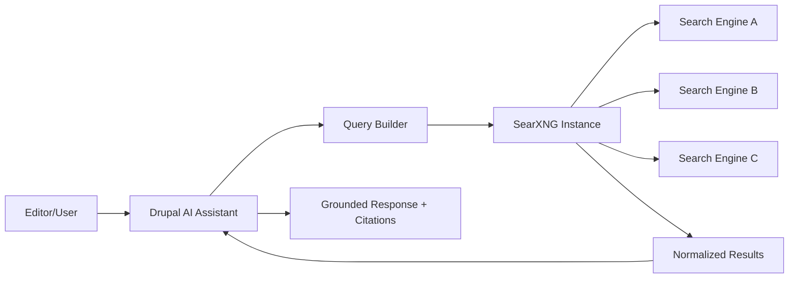

If your Drupal AI assistant depends on a black-box hosted search API, you didn’t build an assistant, you rented one with a hidden bill and unknown data exhaust. The SearXNG direction in Drupal AI is the practical fix: self-hosted metasearch, explicit control over engines, and fewer surprises when pricing, quotas, or terms change. So what? You get privacy and operational control without pretending search is “magic.”

## 1) The Hook

Drupal AI assistants are getting a sane search layer, and it matters because “just use vendor search” is how teams accidentally leak context and budget.

## 2) Why I Built It

I keep seeing the same pattern: teams add AI features, then bolt on whatever search API has the nicest landing page gradient and the worst long-term constraints. Three months later, they’re rate-limited, blind to ranking behavior, and arguing with finance.

For Drupal, this hurts more because we usually care about governance, auditability, and owning our stack. If your content workflow is open and structured but your retrieval layer is an opaque SaaS box, that’s architectural cosplay.

SearXNG is interesting here because it gives you a privacy-first metasearch layer you can run yourself and tune for your use case. Not flashy. Not trendy. Just the boring control plane most AI “RAG” demos skip.

## 3) The Solution

Use SearXNG as the retrieval gateway for Drupal AI assistants instead of wiring every query directly to third-party search vendors.

### Why this architecture is better

- You decide which engines are queried and how.
- You can remove or swap engines without rewriting assistant logic.
- You control logs, retention, and exposure of query metadata.
- You reduce lock-in to a single provider’s ranking and pricing behavior.

:::warning
SearXNG is not a silver bullet. It gives control, not automatic relevance. You still need query shaping, source filtering, and evaluation loops.
:::

Gotchas you will hit if you skip implementation discipline

- Default settings can produce noisy results for niche Drupal queries.
- If you don’t enforce allowlists, assistants will cite junk.
- Latency can spike when you fan out to too many engines.
- Without caching, you’ll pay in response time even if cash cost looks lower.
- Privacy claims are fake if your deployment logs everything forever.

### Module/plugin reality check

- Drupal AI ecosystem components discussed by the initiative are actively maintained.
- SearXNG itself is actively maintained.
- A perfect “drop-in” connector for every assistant workflow may not exist yet, so expect some custom integration glue. That’s fine; glue code beats permanent dependency theater.

## 4) The Code

No separate repo for this post because this is an architecture and implementation strategy review, not a standalone build artifact.

## 5) What I Learned

- SearXNG is worth trying when your assistant needs web retrieval but your org has privacy constraints.
- Avoid direct coupling between assistant prompts and one external search API in production.
- Treat retrieval as infrastructure: tune it, test it, monitor it, and version config changes.
- If relevance matters, build evaluation fixtures early; otherwise you’ll optimize vibes instead of outcomes.
- “Managed convenience” is often just “outsourced uncertainty” with a monthly invoice.

## References

- [Drupal AI Initiative: SearXNG - Privacy-First Web Search for Drupal AI Assistants](https://www.drupal.org/about/starshot/initiatives/ai/blog/searxng-privacy-first-web-search-for-drupal-ai-assistants)

