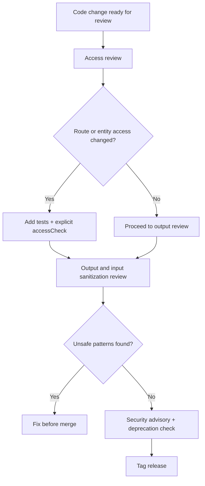

If you maintain a Drupal 10/11 contrib module, the biggest security misses are still predictable: missing access checks, weak route protection, unsafe output, and incomplete release hygiene. The fastest hardening path is to enforce explicit access decisions, protect state-changing routes with CSRF requirements, ban unsafe rendering patterns, and ship every release with a repeatable security gate.

<!-- truncate -->

:::danger[These Are Not Edge Cases]
Contrib maintainers do not get breached by exotic 0-days. They get burned by small, repeatable mistakes under release pressure — missing `accessCheck()`, unprotected routes, `|raw` in templates. Every advisory batch confirms this pattern.
:::

## The Problem

The same mistakes keep showing up in Drupal security advisories. Not because maintainers are careless, but because the checklist is not explicit and not enforced.

Under release pressure, these gaps slip through:

- Querying entities without explicit access intent
- Exposing privileged routes with weak permission or CSRF coverage
- Letting untrusted data hit output without strict escaping/sanitization
- Shipping releases without a structured security review checkpoint

On modern Drupal, these are all avoidable. But only if the checklist is explicit and enforced in CI/review.

## The Hardening Checklist

Use this before every tagged release.

| Pitfall | Hardening Action (D10/D11) | Quick Verification |
|---|---|---|
| Implicit access in entity queries | Always call `->accessCheck(TRUE)` (or `FALSE` only with documented reason) | `rg "entityQuery\("` and confirm paired `accessCheck(...)` |
| Weak route protection | Require route permissions + CSRF for state-changing routes | Review `*.routing.yml` for `_permission` and CSRF requirements |
| XSS through rendering shortcuts | Prefer render arrays/Twig auto-escaping; ban casual `\|raw` | `rg "\|raw\|#markup\|Markup::create"` and review trust boundaries |
| SQL injection in custom queries | Use DB API placeholders; never concatenate untrusted input | `rg "->query\(\|db_query\("` and confirm parameterization |
| Upload/extension abuse | Restrict extensions/MIME, validate uploads, enforce access rules | Review upload validators and file field constraints |
| Missing release security gate | Add pre-release checklist for advisories, access regressions, deprecations | Gate release tags on checklist completion in CI |



:::tip[Fastest Audit Command]
Run `rg "entityQuery\(" --type php` across your module directory. Every result that is not paired with `->accessCheck(TRUE)` or `->accessCheck(FALSE)` is a potential access bypass waiting to happen.
:::

## Verification Commands

```bash title="Terminal — find entity queries without access checks"
rg "entityQuery\(" --type php -l
```

```bash title="Terminal — find unsafe rendering patterns"
rg "\|raw|#markup|Markup::create" --type php --type twig -l
```

```bash title="Terminal — find custom SQL queries"
rg "->query\(|db_query\(" --type php -l
```

## Triage Checklist for Maintainers

- [ ] Every `entityQuery()` has explicit `accessCheck()` call
- [ ] All state-changing routes require POST + CSRF token
- [ ] No `|raw` in Twig templates without documented trust boundary
- [ ] No direct SQL concatenation with untrusted input
- [ ] Upload handlers validate extensions, MIME types, and destinations
- [ ] Pre-release security gate is documented and enforced in CI
- [x] Deprecated/legacy patterns flagged for migration

> "Do not mark a release 'security reviewed' unless you can point to concrete checks in code or CI. Checklist theater is not hardening."

<details>
<summary>Deprecation-aware security notes for D10 to D11 transitions</summary>

- Older code paths that relied on implicit entity query behavior are now unsafe from a maintenance perspective. Modern Drupal requires explicit access intent.
- Legacy patterns from older Drupal generations (for example raw SQL string building) should be treated as migration debt, not "good enough" compatibility code.
- Keep dependency and API usage current to avoid silent drift into unsupported patterns during D10 to D11 transitions.
- The `SafeMarkup` class is deprecated. Any usage is both a deprecation issue and a security risk — fix both at once.

</details>

## Related Resources

For adjacent upgrade planning and change tracking:
- [Drupal 11 Change Record Impact Map](/2026-02-17-drupal-11-change-record-impact-map-10-4x-teams/)
- [Drupal 12 Readiness Dashboard](/2026-02-08-drupal-12-readiness-dashboard/)
- [Drupal Maintainer Shield](/drupal-maintainer-shield/)

## Why this matters for Drupal and WordPress

Every pitfall on this checklist has a direct WordPress equivalent: missing capability checks in plugin REST routes, unsanitized output via `echo` instead of `esc_html()`, and nonce-less state-changing AJAX handlers. WordPress plugin reviewers enforce many of the same gates before directory listing. Drupal agencies maintaining contrib modules and WordPress shops shipping plugins to wp.org both benefit from a pre-release security gate that catches access bypasses, XSS, and CSRF before an advisory forces the fix.

## What I Learned

- Enforcing explicit access intent is the single highest ROI safeguard for contrib maintainers.
- Route-level permission and CSRF checks catch many "small" mistakes before they become advisories.
- Security hardening is most reliable when embedded in release operations, not left as ad hoc reviewer memory.
- Deprecated and legacy coding patterns are not just upgrade problems — they are security risk multipliers over time.

:::warning[No Checklist Theater]
If your release process has a "security reviewed" checkbox but no concrete verification steps, you are doing theater, not hardening. Every check must be verifiable in code or CI output.
:::

## References

- [Drupal change record: entity queries must explicitly set access checking](https://www.drupal.org/node/3201242)
- [Drupal docs: Access checking on routes](https://www.drupal.org/docs/8/api/routing-system/access-checking-on-routes)
- [Drupal docs: Writing secure code](https://www.drupal.org/docs/7/modules/securesite/writing-secure-code-for-drupal)
- [Drupal 10 release cycle and EOL policy](https://www.drupal.org/about/core/policies/core-release-cycles/schedule)
- [Drupal core project page (current stable stream)](https://www.drupal.org/project/drupal)


***
*Looking for an Architect who doesn't just write code, but builds the AI systems that multiply your team's output? View my enterprise CMS case studies at [victorjimenezdev.github.io](https://victorjimenezdev.github.io) or connect with me on LinkedIn.*
