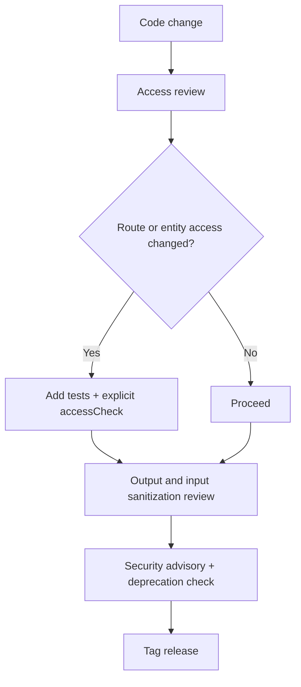

If you maintain a Drupal 10/11 contrib module, the biggest security misses are still predictable: missing access checks, weak route protection, unsafe output, and incomplete release hygiene. The fastest hardening path is to enforce explicit access decisions (`entityQuery()->accessCheck()`), protect state-changing routes with CSRF requirements, ban unsafe rendering patterns, and ship every release with a repeatable security gate.
<!-- truncate -->

## The Problem

Contrib maintainers usually do not get breached by exotic 0-days. They get burned by small, repeatable mistakes under release pressure:

- Querying entities without explicit access intent.
- Exposing privileged routes with weak permission or CSRF coverage.
- Letting untrusted data hit output without strict escaping/sanitization.
- Shipping releases without a structured security review checkpoint.

On modern Drupal, these gaps are avoidable, but only if the checklist is explicit and enforced in CI/review.

## The Solution

Use this hardening checklist before every tagged release.

| Pitfall | Hardening action for D10/D11 | How to verify quickly |
|---|---|---|
| Implicit access behavior in entity queries | Always call `->accessCheck(TRUE)` (or `FALSE` only with a documented reason) on entity queries. | `rg "entityQuery\\("` and confirm paired `accessCheck(...)` in each path. |
| Weak route protection | Require route permissions and add CSRF protection for state-changing routes. | Review `*.routing.yml` for `_permission` and CSRF requirements where applicable. |
| XSS through rendering shortcuts | Prefer render arrays/Twig auto-escaping; do not output untrusted HTML directly. Avoid casual `|raw` usage in templates. | `rg "\\|raw|#markup|Markup::create"` and review each use for strict trust boundaries. |
| SQL injection risk in custom queries | Use Drupal DB API placeholders and never concatenate untrusted input into SQL. | `rg "->query\\(|db_query\\("` and confirm parameterization everywhere. |
| Upload/extension abuse | Restrict allowed extensions/MIME, validate uploads, and enforce destination/access rules. | Review upload validators and file field constraints in form/entity handlers. |
| Missing release-time security gate | Add a pre-release checklist item for security advisories, access regressions, and deprecation impact. | Gate release tags on checklist completion in issue template/CI workflow. |

### Deprecation-Aware Security Notes

- Older code paths that relied on implicit entity query behavior are now unsafe from a maintenance perspective; modern Drupal requires explicit access intent.
- Legacy patterns from older Drupal generations (for example raw SQL string building) should be treated as migration debt, not "good enough" compatibility code.
- Keep dependency and API usage current to avoid silent drift into unsupported patterns during D10 to D11 transitions.

:::warning
Do not mark a release "security reviewed" unless you can point to concrete checks in code or CI. Checklist theater is not hardening.
:::

For adjacent upgrade planning and change tracking, see:
- [Drupal 11 Change Record Impact Map](/2026-02-17-drupal-11-change-record-impact-map-10-4x-teams/)
- [Drupal 12 Readiness Dashboard](/2026-02-08-drupal-12-readiness-dashboard/)
- [Drupal Maintainer Shield](/drupal-maintainer-shield/)

## What I Learned

- Enforcing explicit access intent is one of the highest ROI safeguards for contrib maintainers.
- Route-level permission and CSRF checks catch many "small" mistakes before they become advisories.
- Security hardening is most reliable when embedded in release operations, not left as ad hoc reviewer memory.
- Deprecated and legacy coding patterns are not just upgrade problems; they are security risk multipliers over time.

## References

- [Drupal change record: entity queries must explicitly set access checking](https://www.drupal.org/node/3201242)
- [Drupal docs: Access checking on routes](https://www.drupal.org/docs/8/api/routing-system/access-checking-on-routes)
- [Drupal docs: Writing secure code](https://www.drupal.org/docs/7/modules/securesite/writing-secure-code-for-drupal)
- [Drupal 10 release cycle and EOL policy](https://www.drupal.org/about/core/policies/core-release-cycles/schedule)
- [Drupal core project page (current stable stream)](https://www.drupal.org/project/drupal)
