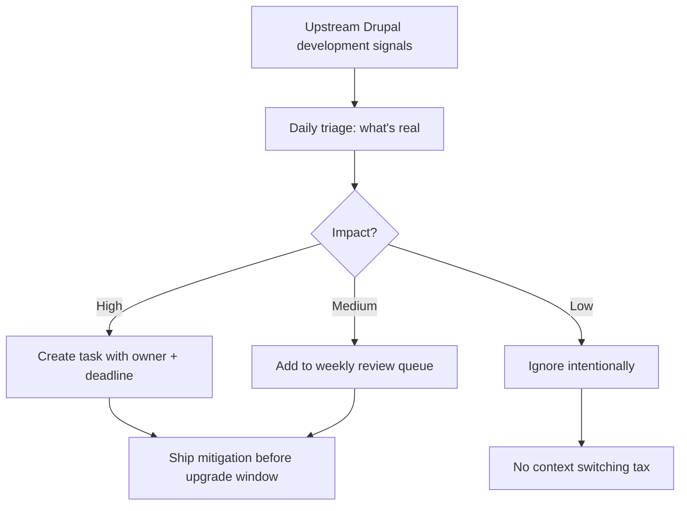

import TOCInline from '@theme/TOCInline';

Drupal does not need more hot takes; it needs a cleaner signal path so you can see what changed, what might break, and what to do next before release day punches you in the face.

<!-- truncate -->

<TOCInline toc={toc} minHeadingLevel={2} maxHeadingLevel={2} />

<details>
<summary>TL;DR — 30 second version</summary>

- "Following Drupal" by osmosis is fake productivity that delivers surprise regressions
- Switch to a signal-first loop: track where development actually happens, then turn it into team actions
- Classify each upstream item as `act now`, `queue`, or `ignore` with an owner and a date
- If you can't map a signal to an owner and a date, you don't have a plan -- you have vibes

</details>

## Why I Built It

I got tired of "following Drupal" by osmosis: random social posts, half-remembered Slack threads, and one person on the team saying, "I think core changed something."

That workflow is fake productivity. It feels informed and delivers surprise regressions anyway.

The core problem is simple:
- Noise beats signal in most dev news channels.
- Teams overreact to chatter and underreact to actual upstream movement.
- Nobody owns the translation layer from "something changed" to "we should do X this week."

I wanted a method that is boring, repeatable, and aggressively practical.

## The Signal-First Loop

I switched to a signal-first loop inspired by Dries' framing: track development where development actually happens, then turn it into explicit team actions.



### Weekly Triage Example

```bash title="Terminal — weekly upstream triage" showLineNumbers
# Check for Drupal core updates
composer outdated "drupal/core*"

# Scan for deprecated API usage
drupal-check --deprecations web/modules/custom/

# Review security advisories
drush pm:security

# Check contrib updates against your lockfile
composer outdated "drupal/*" --direct
```

:::tip[Top Takeaway]
If a signal does not produce a concrete action, it is just entertainment. Classify each upstream item as `act now`, `queue`, or `ignore` -- and assign an owner.
:::

:::info[Context]
This is a workflow problem, not a missing Drupal module problem. There is no maintained module that replaces disciplined triage and ownership here; custom process beats another dashboard.
:::

### Gotchas

- "Read everything" is not a strategy; it is a procrastination costume.
- Team-wide awareness without ownership still fails in production.
- If you can't answer "so what for our stack?" within 5 minutes, park it.

## The Code

No separate repo; this is an operating workflow, not a software artifact.

## What I Learned

- Worth trying when your team keeps missing upstream shifts: define one owner for weekly upstream triage.
- Worth trying when upgrades feel risky: classify each upstream item as `act now`, `queue`, or `ignore`.
- Avoid in production teams: "ambient awareness" as your only tracking model.
- Avoid this anti-pattern: treating social chatter as equal to actual development movement.
- If you can't map a signal to an owner and a date, you don't have a plan; you have vibes.

## Why this matters for Drupal and WordPress

Drupal teams can wire this loop into `composer outdated` and `drush pm:security` checks, while WordPress teams can run `wp plugin list --update=available` and diff against Wordfence weekly reports. Both ecosystems suffer from the same failure mode: ambient awareness without ownership. Agencies managing mixed Drupal and WordPress portfolios benefit most because the triage taxonomy (act now / queue / ignore) works identically across both platforms.

## Signal Summary

| Topic | Signal | Action | Priority |
|---|---|---|---|
| Upstream Triage | Nobody owns the translation layer | Assign one owner for weekly triage | High |
| Signal Classification | Overreaction to chatter, underreaction to real changes | Use act-now/queue/ignore taxonomy | High |
| Ownership | Awareness without owners = failure | Every converted item needs owner + date | Medium |
| Process Discipline | No module solves this | Build boring, repeatable workflow | Medium |

## References

- [Dries Buytaert: A better way to follow Drupal development](https://dri.es/a-better-way-to-follow-drupal-development)


***
*Looking for an Architect who doesn't just write code, but builds the AI systems that multiply your team's output? View my enterprise CMS case studies at [victorjimenezdev.github.io](https://victorjimenezdev.github.io) or connect with me on LinkedIn.*
