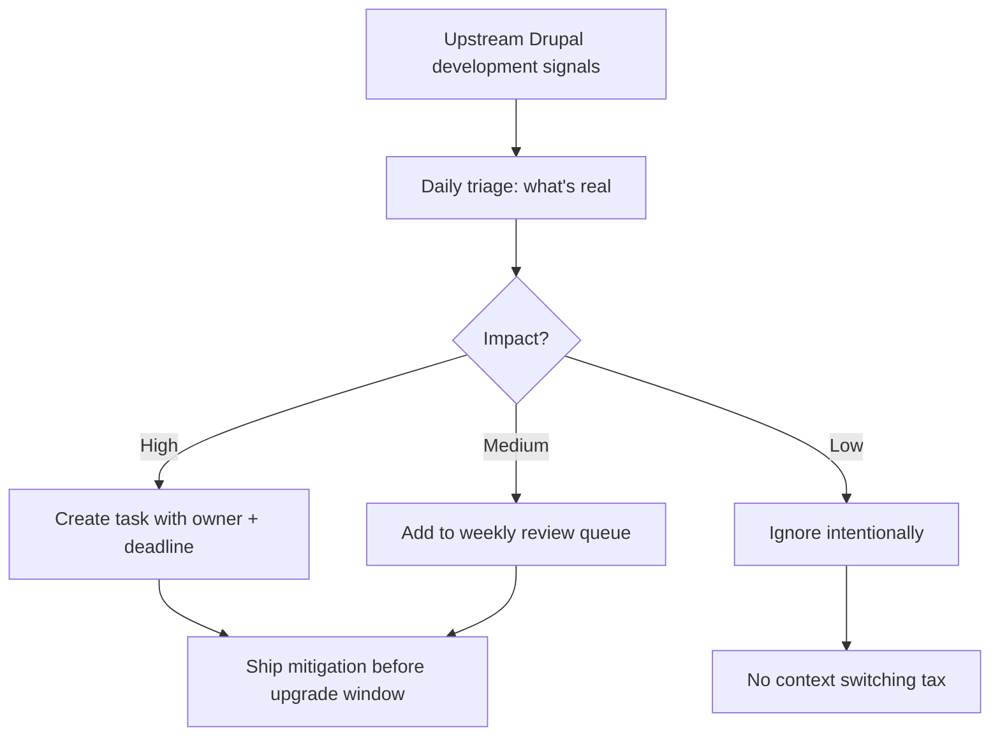

## The Hook
Drupal doesn’t need more hot takes; it needs a cleaner signal path so you can see what changed, what might break, and what to do next before release day punches you in the face.

## Why I Built It
I got tired of “following Drupal” by osmosis: random social posts, half-remembered Slack threads, and one person on the team saying, “I think core changed something.”

That workflow is fake productivity. It feels informed and delivers surprise regressions anyway.

The core problem is simple:
- Noise beats signal in most dev news channels.
- Teams overreact to chatter and underreact to actual upstream movement.
- Nobody owns the translation layer from “something changed” to “we should do X this week.”

So I wanted a method that is boring, repeatable, and aggressively practical.

## The Solution
I switched to a signal-first loop inspired by Dries’ framing: track development where development actually happens, then turn it into explicit team actions.

:::tip
If a signal does not produce a concrete action, it is just entertainment.
:::

### Gotchas
- “Read everything” is not a strategy; it is a procrastination costume.
- Team-wide awareness without ownership still fails in production.
- If you can’t answer “so what for our stack?” within 5 minutes, park it.

### Module/Plugin Check
This is a workflow problem, not a missing Drupal module problem.  
There is no maintained module that replaces disciplined triage and ownership here; custom process beats another dashboard.

## The Code
No separate repo; this is an operating workflow, not a software artifact.

## What I Learned
- Worth trying when your team keeps missing upstream shifts: define one owner for weekly upstream triage.
- Worth trying when upgrades feel risky: classify each upstream item as `act now`, `queue`, or `ignore`.
- Avoid in production teams: “ambient awareness” as your only tracking model.
- Avoid this anti-pattern: treating social chatter as equal to actual development movement.
- If you can’t map a signal to an owner and a date, you don’t have a plan; you have vibes.

## References
- [Dries Buytaert: A better way to follow Drupal development](https://dri.es/a-better-way-to-follow-drupal-development)

