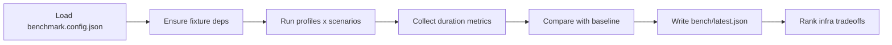

import Tabs from '@theme/Tabs';
import TabItem from '@theme/TabItem';

I built a reproducible Next.js rebuild benchmark to answer one question quickly: which build profile is fastest, and did we just introduce a regression? It targets `next@16.1.6`, runs cold and warm cache scenarios, and produces JSON you can diff in CI.

Teams notice build regressions late. This tool makes them visible immediately.

<!-- truncate -->

## The Problem

> "Without a pinned fixture, repeatable scenarios, and a baseline comparison, build time data is noisy and hard to trust."

:::info[Context]
Teams usually notice build regressions after CI gets slower or delivery cadence drops. By then, the cause is buried under dozens of commits. A proper benchmark needs pinned fixture versions, controlled scenarios, and automated regression detection.
:::

| Pain Point | What Breaks |
|---|---|
| No baseline | Regressions are subjective ("it feels slower") |
| One-off local tests | Results are not reproducible in CI |
| No scenario split | Cold-cache vs warm-cache tradeoffs stay hidden |
| Infra change without benchmark | Runtime/runner choices are hard to justify |

## The Solution

The project is a small Node CLI that runs controlled Next.js builds and emits a report with scenario stats, regression checks, and infrastructure rankings.



<Tabs>
<TabItem value="config" label="Configuration">

```json title="benchmark.config.json" showLineNumbers
{
  "runs": 3,
  "regressionThresholdPct": 15,
  "profiles": [
{ "name": "default", "command": "npm run build" },
{ "name": "turbopack", "command": "npm run build:turbopack" }
  ],
  "scenarios": [
{ "name": "cold-cache", "clearCacheBeforeRun": true },
{ "name": "warm-cache", "clearCacheBeforeRun": false }
  ]
}
```

</TabItem>
<TabItem value="loop" label="Benchmark Loop">

```js title="src/lib/benchmark.js" showLineNumbers
for (const profile of config.profiles) {
  for (const scenario of config.scenarios) {
const durations = [];
for (let runNumber = 1; runNumber <= runs; runNumber += 1) {
// highlight-next-line
if (scenario.clearCacheBeforeRun) await clearNextCache(projectDir);
const durationMs = await timedRun(profile.command, projectDir);
durations.push(durationMs);
}
const summary = summarizeDurations(durations);
// optional baseline regression check and ranking aggregation
  }
}
```

</TabItem>
<TabItem value="regression" label="Regression Detection">

```js title="src/lib/stats.js"
// highlight-next-line
export function compareRegression(currentMean, baselineMean, thresholdPct) {
  const pctChange = Number(
(((currentMean - baselineMean) / baselineMean) * 100).toFixed(2)
  );
  return { pctChange, regression: pctChange > thresholdPct };
}
```

</TabItem>
</Tabs>

## Build Profile Comparison

| Scenario | Default Build | Turbopack Build | Key Difference |
|---|---|---|---|
| Cold cache | Slower (full rebuild) | Faster (parallel compilation) | Turbopack advantage shows here |
| Warm cache | Fast (incremental) | Fast (incremental) | Difference is smaller |
| Regression detection | Baseline JSON comparison | Baseline JSON comparison | Same mechanism, different baselines |

:::caution[Reality Check]
Cold and warm cache numbers can invert assumptions about "faster" infrastructure paths. A runtime that is fast on warm cache but slow on cold cache will surprise you in CI where caches are frequently purged. Pin your benchmarks to both scenarios or you are measuring fiction.
:::

<details>
<summary>Next.js 16 deprecation note</summary>

During implementation, `next.config.js` warnings showed that `eslint` config in Next config is no longer supported in Next 16. The fixture was migrated to use only supported config and explicit Turbopack root:

```js title="next.config.js"
const nextConfig = {
  turbopack: {
    root: currentDir
  }
};
```

That removes deprecated config usage and keeps benchmark output cleaner. Watch for deprecation warnings in your own benchmarks — they pollute logs and can affect timing.

</details>

## What I Learned

- Rebuild benchmarking is only useful when fixture version and scenario controls are pinned.
- Cold and warm cache numbers can invert assumptions about "faster" infra paths.
- Baseline JSON + threshold gating is worth it when CI build time is a release bottleneck.
- Avoid unsupported Next config keys in performance tooling — warnings pollute benchmark logs and skew results.

## Why this matters for Drupal and WordPress

Decoupled and headless setups are common in the Drupal and WordPress world: Next.js (and similar) frontends consume Drupal JSON:API or WordPress REST, and build times directly affect deploy cadence and CI. Agencies and product teams running headless CMS + React/Next frontends need reproducible build benchmarks so that regressions show up in CI before production, and so cold vs warm cache behavior is visible when runners or cache layers change. The same pattern (pinned fixture, baseline JSON, scenario split) applies to any frontend build that backs a Drupal or WordPress site — not just Next. If your stack is "Drupal/WordPress API + Node frontend," treat frontend build time as a first-class metric and gate merges on it.

## References

- [View Code](https://github.com/victorstack-ai/nextjs-ai-rebuild-benchmark)
- [WordPress AI Search Optimization Playbook](/2026-02-17-wordpress-ai-search-optimization-playbook/)
- [Drupal 12 Readiness Dashboard](/2026-02-08-drupal-12-readiness-dashboard/)
- [Pydantic + Monty + WebAssembly](/2026-02-07-pydantic-monty-wasm/)


***
*Looking for an Architect who doesn't just write code, but builds the AI systems that multiply your team's output? View my enterprise CMS case studies at [victorjimenezdev.github.io](https://victorjimenezdev.github.io) or connect with me on LinkedIn.*
