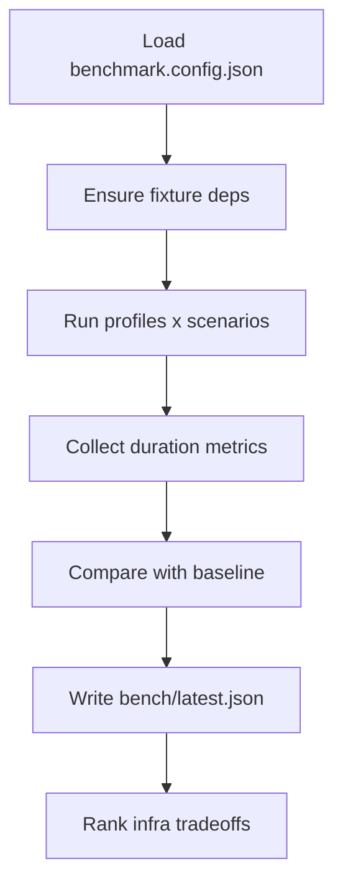
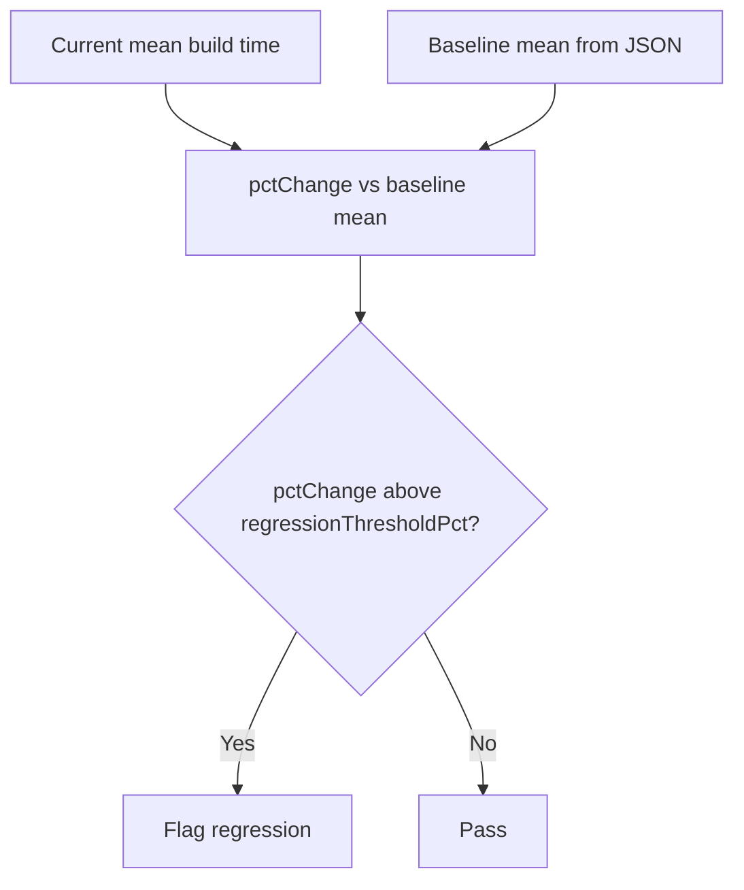

import Tabs from '@theme/Tabs';
import TabItem from '@theme/TabItem';

Most build regressions get reported as "it feels slower", long after the commit that caused them. I built a small Node CLI that benchmarks `next@16.1.6` builds under cold and warm cache, compares the result with a baseline, and writes JSON that CI can diff. A run is flagged when its mean build time rises past a threshold you set.

<!-- truncate -->

<details>
<summary>TL;DR</summary>

- Pin the fixture version, split cold and warm cache, and compare every run against a baseline JSON.
- A regression is a mean build time that rises past the threshold set in `benchmark.config.json`.
- Clean up deprecated Next config before you trust any timing.

</details>

## Build time without a baseline is noise

A single local build measures one machine on one afternoon. It cannot tell you whether the last merge made the build slower.

Three controls make build timing data trustworthy. The first is a pinned fixture, which is the sample Next.js app the tool builds, locked to one Next.js version. The second is a set of repeatable scenarios, and the third is a comparison against a baseline, which is the JSON result of an earlier run.

:::info[Context]
Teams usually notice build regressions after CI gets slower or delivery cadence drops. By then, the cause is buried under dozens of commits. A benchmark you can trust needs pinned fixture versions, controlled scenarios and automated regression detection.
:::

| Missing control | What breaks |
|---|---|
| No baseline | Regressions are subjective ("it feels slower") |
| One-off local tests | Results are not reproducible in CI |
| No scenario split | Cold-cache vs warm-cache tradeoffs stay hidden |
| Infra change without benchmark | Runtime and runner choices are hard to justify |

## The CLI writes one JSON file

The tool runs every build profile against every cache scenario and repeats each pair. A profile is a build command, such as `npm run build` or `npm run build:turbopack`. The results go to `bench/latest.json`: scenario stats, regression checks and infrastructure rankings.

There is no dashboard and no service. A CI job compares a file.

Cold cache means the tool clears the Next.js cache before each run (`clearCacheBeforeRun: true`), so every build starts from nothing. Warm cache keeps the cache from the previous run (`clearCacheBeforeRun: false`).


```mermaid
flowchart TD
    A[Load benchmark.config.json] --> B[Ensure fixture deps]
    B --> C[Run profiles x scenarios]
    C --> D[Collect duration metrics]
    D --> E[Compare with baseline]
    E --> F[Write bench/latest.json]
    F --> G[Rank infra tradeoffs]
```

<Tabs>
<TabItem value="config" label="Configuration">

```json title="benchmark.config.json" showLineNumbers
{
  "runs": 3,
  "regressionThresholdPct": 15,
  "profiles": [
{ "name": "default", "command": "npm run build" },
{ "name": "turbopack", "command": "npm run build:turbopack" }
  ],
  "scenarios": [
{ "name": "cold-cache", "clearCacheBeforeRun": true },
{ "name": "warm-cache", "clearCacheBeforeRun": false }
  ]
}
```

</TabItem>
<TabItem value="loop" label="Benchmark Loop">

```js title="src/lib/benchmark.js" showLineNumbers
for (const profile of config.profiles) {
  for (const scenario of config.scenarios) {
const durations = [];
for (let runNumber = 1; runNumber <= runs; runNumber += 1) {
// highlight-next-line
if (scenario.clearCacheBeforeRun) await clearNextCache(projectDir);
const durationMs = await timedRun(profile.command, projectDir);
durations.push(durationMs);
}
const summary = summarizeDurations(durations);
// optional baseline regression check and ranking aggregation
  }
}
```

</TabItem>
<TabItem value="regression" label="Regression Detection">

```js title="src/lib/stats.js"
// highlight-next-line
export function compareRegression(currentMean, baselineMean, thresholdPct) {
  const pctChange = Number(
(((currentMean - baselineMean) / baselineMean) * 100).toFixed(2)
  );
  return { pctChange, regression: pctChange > thresholdPct };
}
```

</TabItem>
</Tabs>

## The regression gate is a subtraction

`compareRegression` takes the current mean, subtracts the baseline mean, and turns the difference into a percent change. If that number is above `regressionThresholdPct`, the run is a regression. The whole gate is a subtraction, a division and a comparison, which is a smaller budget than one meeting about why CI feels slow.

The comparison is strictly greater than the threshold. A run whose mean change lands exactly on `regressionThresholdPct` passes, and anything above it is flagged.

The `runs` setting repeats each pair a small number of times, and the gate compares means. My caveat: one noisy run can move a mean built from so few runs. Before you pick the threshold, I would check how much reruns of the same commit vary.


```mermaid
flowchart TD
    A[Current mean build time] --> C[pctChange vs baseline mean]
    B[Baseline mean from JSON] --> C
    C --> D{pctChange above regressionThresholdPct?}
    D -->|Yes| E[Flag regression]
    D -->|No| F[Pass]
```

:::tip[When to gate merges on it]
My call: baseline JSON plus threshold gating is worth the setup when CI build time is a release bottleneck. To check that the gate works, confirm that a known slow change trips the flag.
:::

## Cold cache and warm cache disagree

A warm-cache number from a runner that purges its cache is a benchmark of a machine CI does not have. Measure both scenarios. If you measure only one, the ranking of "faster" options can be upside down.

| Scenario | Default build | Turbopack build | Key difference |
|---|---|---|---|
| Cold cache | Slower (full rebuild) | Faster (parallel compilation) | Turbopack advantage shows here |
| Warm cache | Fast (incremental) | Fast (incremental) | Difference is smaller |
| Regression detection | Baseline JSON comparison | Baseline JSON comparison | Same mechanism, different baselines |

:::caution[Reality check]
Cold and warm cache numbers can invert assumptions about "faster" infrastructure paths. A runtime that is fast on warm cache and slow on cold cache will surprise you in CI, where caches are purged often. Pin your benchmarks to both scenarios or you are measuring fiction.
:::

Before you switch a runner or runtime, read its rank in both scenarios. One good column is not a reason to migrate.

## Next 16 config cleanup before timing

Next 16 printed a warning that told me exactly what was wrong with the fixture. I fixed the config so the warning no longer appeared in the logs I was timing.

<details>
<summary>Next.js 16 deprecation note</summary>

During implementation, warnings from `next.config.js` showed that Next 16 no longer supports `eslint` config in the Next config. I migrated the fixture to supported config only, with an explicit Turbopack root:

```js title="next.config.js"
const nextConfig = {
  turbopack: {
    root: currentDir
  }
};
```

This removes the deprecated config and keeps benchmark output cleaner. Deprecation warnings pollute logs and can affect timing, so clear them in your own benchmarks.

</details>

## Checklist before trusting the numbers

- [ ] The fixture pins its Next.js version.
- [ ] Both `cold-cache` and `warm-cache` scenarios run.
- [ ] Each profile and scenario pair runs more than once.
- [ ] A baseline JSON exists and every run compares against it.
- [ ] `regressionThresholdPct` is set in `benchmark.config.json`.
- [ ] The fixture config produces no deprecation warnings.
- [ ] Runner or runtime changes are ranked on both scenarios before adoption.
- [ ] A known slow change trips the regression flag.

## References

- [View Code](https://github.com/victorstack-ai/nextjs-ai-rebuild-benchmark)
