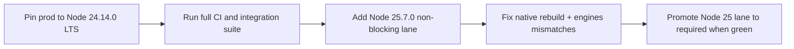
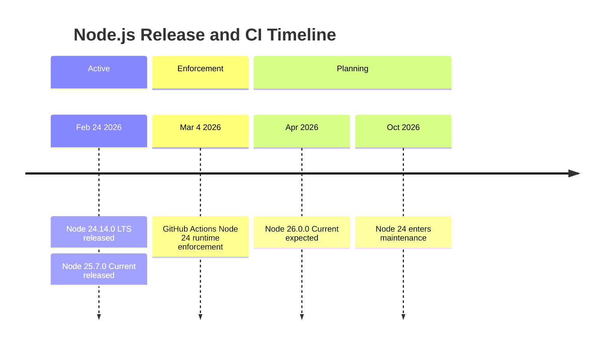

import Tabs from '@theme/Tabs';
import TabItem from '@theme/TabItem';

As of February 25, 2026, the short answer is: move production to Node 24.14.0 LTS first, test Node 25.7.0 in a non-blocking lane, and treat native addons plus framework engine ranges as the main risk surface. Both were released on February 24, 2026, but 25.x is still the Current line while 24.x is LTS.

<!-- truncate -->

## The problem

Teams upgrading Node runtime images in CI often ship regressions from three avoidable gaps:

| Risk area | What breaks first | Why this changed now |
|---|---|---|
| CI runners and actions | Pipelines pinned to old runtime assumptions | GitHub Actions moving runtime from Node 20 to Node 24 (enforcement begins March 4, 2026) |
| Native modules | Addon installs/rebuilds fail or load mismatched binaries | New major/current lines increase rebuild pressure for non-Node-API addons |
| Framework apps | Build/start fails due `engines.node` constraints | New framework releases have tightened minimum Node versions |

:::danger[CI Deadline]
GitHub Actions runtime enforcement for Node 24 begins March 4, 2026. If your actions pin Node 20, they will break.
:::

## The solution

### Upgrade-risk matrix

| Domain | 24.14.0 LTS risk | 25.7.0 Current risk | Recommended action |
|---|---|---|---|
| CI (GitHub Actions) | Medium | High | Set explicit `node-version` per job, add non-blocking Node 25 lane |
| Native addons (`node-gyp`, prebuilds) | Medium | High | Rebuild on upgrade, prefer Node-API packages, cache per Node major |
| Web frameworks | Low-Medium | Medium-High | Validate each app against package `engines` before changing base image |
| Runtime behavior/API deltas | Low-Medium | Medium | Run smoke + contract tests around streams, HTTP/2, sqlite |

### Recommended rollout flow



### Runtime deltas that matter in practice

**Node 24.14.0 LTS**

From Node's changelog:

```md title="CHANGELOG_V24.md" showLineNumbers
* **http**: add `http.setGlobalProxyFromEnv()`  (#60953)
* **sqlite**: enable defensive mode by default  (#61266)
```

Migration guidance:
- Audit startup/bootstrap code for proxy behavior if you rely on environment-driven outbound traffic.
- Keep sqlite integration tests in CI because 24.14.0 tightened sqlite defaults.

**Node 25.7.0 Current**

From Node's changelog:

```md title="CHANGELOG_V25.md" showLineNumbers
* **http2**: add `http1Options` for fallback config  (#61713)
* **stream**: rename `Duplex.toWeb()` option to `readableType`  (#61632)
```

Migration guidance:
- Review stream adapters if you typed or wrapped `Duplex.toWeb()` options.
- 25.7.0 marks sqlite as release candidate.

### CI baseline to reduce rollout risk

```yaml title=".github/workflows/ci.yml" showLineNumbers
strategy:
  matrix:
    node: [24.14.0, 25.7.0]
# highlight-next-line
continue-on-error: ${{ matrix.node == '25.7.0' }}
```

:::tip[Rollout Pattern]
Use `continue-on-error` only during rollout. Make 25.x required after green stability windows.
:::

### Framework compatibility snapshot (verified February 25, 2026)

| Framework package | Current version | Declared Node engine | Node 24 | Node 25 |
|---|---|---|---|---|
| `next` | `16.1.6` | `>=20.9.0` | Supported | Supported |
| `nuxt` | `4.3.1` | `^20.19.0 \|\| >=22.12.0` | Supported | Supported |
| `@nestjs/core` | `11.1.14` | `>= 20` | Supported | Supported |
| `vite` | `7.3.1` | `^20.19.0 \|\| >=22.12.0` | Supported | Supported |
| `express` | `5.1.0` | `>= 18` | Supported | Supported |

:::warning[Transitive Dependencies]
Node 24.14.0 satisfies these common ranges. Node 25.7.0 also satisfies ranges, but compatibility still depends on transitive tooling -- especially native dependencies in monorepos.
:::

### Node upgrade timeline



## Migration checklist

- [ ] Pin production to Node 24.14.0 LTS
- [ ] Update all CI workflows to explicit `node-version: 24.14.0`
- [ ] Add Node 25.7.0 non-blocking CI lane
- [ ] Rebuild all native addons against Node 24
- [ ] Validate framework `engines` compatibility
- [ ] Run smoke tests for HTTP proxy, sqlite, and stream behavior
- [ ] Cache node_modules per Node major version in CI
- [x] Promote Node 25 lane when green for one full release cycle

<details>
<summary>Related playbooks</summary>

- [DDEV CI acceleration and rollout guardrails](/2026-02-25-ddev-ci-acceleration-playbook-warpbuild/)
- [PHP 8.4 failure-mode triage in CI](/php-8-4-typeerror-argumentcounterror-playbook/)
- [Secrets governance for runtime safety](/2026-02-25-vault-sprawl-secrets-governance-model/)

</details>

## Why this matters for Drupal and WordPress

Many Drupal and WordPress setups rely on Node in CI or at runtime: headless frontends (Next, Nuxt, or custom React), build tooling, and GitHub Actions that run on Node. When GitHub enforces Node 24 in Actions, any workflow that pins Node 20 will break unless you set an explicit `node-version`. Decoupled Drupal/WordPress frontends and their CI pipelines should follow the same risk matrix: pin production to Node 24 LTS, add a non-blocking Node 25 lane, and validate native modules and framework `engines` before upgrading. The deadline is real; plan for it.

## What I learned

- LTS-first plus Current shadow lane is still the lowest-risk Node upgrade pattern.
- CI breakage risk is now strongly coupled to GitHub Actions runtime policy timelines, not just your `Dockerfile`.
- Native module risk is mostly a dependency-governance problem; Node-API adoption reduces upgrade friction materially.
- Framework `engines` checks catch avoidable failures early, but they do not replace full integration tests.

## References

- https://nodejs.org/en/blog/release/v24.14.0
- https://nodejs.org/en/blog/release/v25.7.0
- https://raw.githubusercontent.com/nodejs/node/main/doc/changelogs/CHANGELOG_V24.md
- https://raw.githubusercontent.com/nodejs/node/main/doc/changelogs/CHANGELOG_V25.md
- https://github.blog/changelog/2026-02-05-notice-of-upcoming-deprecations-and-breaking-changes-for-github-actions/
- https://nodejs.org/en/learn/modules/abi-stability
- https://github.com/nodejs/node-gyp#installation
- https://github.com/nodejs/release#release-schedule
- https://www.npmjs.com/package/next
- https://www.npmjs.com/package/nuxt
- https://www.npmjs.com/package/@nestjs/core
- https://www.npmjs.com/package/vite
- https://www.npmjs.com/package/express
