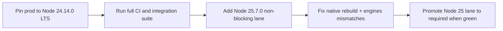

As of February 25, 2026, the short answer is: move production to Node 24.14.0 LTS first, test Node 25.7.0 in a non-blocking lane, and treat native addons plus framework engine ranges as the main risk surface. Node 24.14.0 and 25.7.0 were both released on February 24, 2026, but 25.x is still the Current line while 24.x is LTS.

<!-- truncate -->

## The Problem

Teams upgrading Node runtime images in CI often ship regressions from three avoidable gaps:

| Risk area | What breaks first | Why this changed now |
| --- | --- | --- |
| CI runners and actions | Pipelines pinned to old runtime assumptions | GitHub Actions is moving actions runtime from Node 20 to Node 24 (enforcement begins March 4, 2026) |
| Native modules | Addon installs/rebuilds fail or load mismatched binaries | New major/current lines increase rebuild pressure for non-Node-API addons |
| Framework apps | Build/start fails due `engines.node` constraints | New framework releases have tightened minimum Node versions |

If you upgrade runtime without a matrix, failures appear as "random" install, test, or startup errors.

## The Solution

Start with this risk matrix and rollout order.

| Domain | 24.14.0 LTS risk | 25.7.0 Current risk | Recommended action |
| --- | --- | --- | --- |
| CI (GitHub Actions) | Medium | High | Set explicit `node-version` per job and add one non-blocking Node 25 lane |
| Native addons (`node-gyp`, prebuilds) | Medium | High | Rebuild on upgrade, prefer Node-API packages, cache per Node major |
| Web frameworks | Low-Medium | Medium-High | Validate each app against package `engines` before changing base image |
| Runtime behavior/API deltas | Low-Medium | Medium | Run smoke + contract tests around streams, HTTP/2 fallback, sqlite usage |



### Runtime deltas that matter in practice

From Node's changelog source files (`doc/changelogs/CHANGELOG_V24.md` and `CHANGELOG_V25.md`), two examples with operational impact:

```md
* **http**: add `http.setGlobalProxyFromEnv()`  (#60953)
* **sqlite**: enable defensive mode by default  (#61266)
```

```md
* **http2**: add `http1Options` for fallback config  (#61713)
* **stream**: rename `Duplex.toWeb()` option to `readableType`  (#61632)
```

Migration guidance:
- Audit startup/bootstrap code for proxy behavior if you rely on environment-driven outbound traffic.
- Review stream adapters if you typed or wrapped `Duplex.toWeb()` options.
- Keep sqlite integration tests in CI because 25.7.0 marks sqlite as release candidate and 24.14.0 tightened sqlite defaults.

### CI baseline to reduce rollout risk

```yaml
strategy:
  matrix:
    node: [24.14.0, 25.7.0]
continue-on-error: ${{ matrix.node == '25.7.0' }}
```

Use this only during rollout; make 25.x required after green stability windows.

### Framework compatibility snapshot (verified February 25, 2026)

| Framework package | Current version | Declared Node engine |
| --- | --- | --- |
| `next` | `16.1.6` | `>=20.9.0` |
| `nuxt` | `4.3.1` | `^20.19.0 \|\| >=22.12.0` |
| `@nestjs/core` | `11.1.14` | `>= 20` |
| `vite` | `7.3.1` | `^20.19.0 \|\| >=22.12.0` |
| `express` | `5.1.0` | `>= 18` |

Interpretation:
- Node 24.14.0 satisfies these common ranges.
- Node 25.7.0 also satisfies ranges, but compatibility still depends on transitive tooling (especially native dependencies in monorepos).

Related playbooks: [DDEV CI acceleration and rollout guardrails](/2026-02-25-ddev-ci-acceleration-playbook-warpbuild/), [PHP 8.4 failure-mode triage in CI](/php-8-4-typeerror-argumentcounterror-playbook/), and [Secrets governance for runtime safety](/2026-02-25-vault-sprawl-secrets-governance-model/).

## What I Learned

- LTS-first plus Current shadow lane is still the lowest-risk Node upgrade pattern.
- CI breakage risk is now strongly coupled to GitHub Actions runtime policy timelines, not just your `Dockerfile`.
- Native module risk is mostly a dependency-governance problem; Node-API adoption reduces upgrade friction materially.
- Framework `engines` checks catch avoidable failures early, but they do not replace full integration tests.

## References

- https://nodejs.org/en/blog/release/v24.14.0
- https://nodejs.org/en/blog/release/v25.7.0
- https://raw.githubusercontent.com/nodejs/node/main/doc/changelogs/CHANGELOG_V24.md
- https://raw.githubusercontent.com/nodejs/node/main/doc/changelogs/CHANGELOG_V25.md
- https://github.blog/changelog/2026-02-05-notice-of-upcoming-deprecations-and-breaking-changes-for-github-actions/
- https://nodejs.org/en/learn/modules/abi-stability
- https://github.com/nodejs/node-gyp#installation
- https://github.com/nodejs/release#release-schedule
- https://www.npmjs.com/package/next
- https://www.npmjs.com/package/nuxt
- https://www.npmjs.com/package/@nestjs/core
- https://www.npmjs.com/package/vite
- https://www.npmjs.com/package/express
