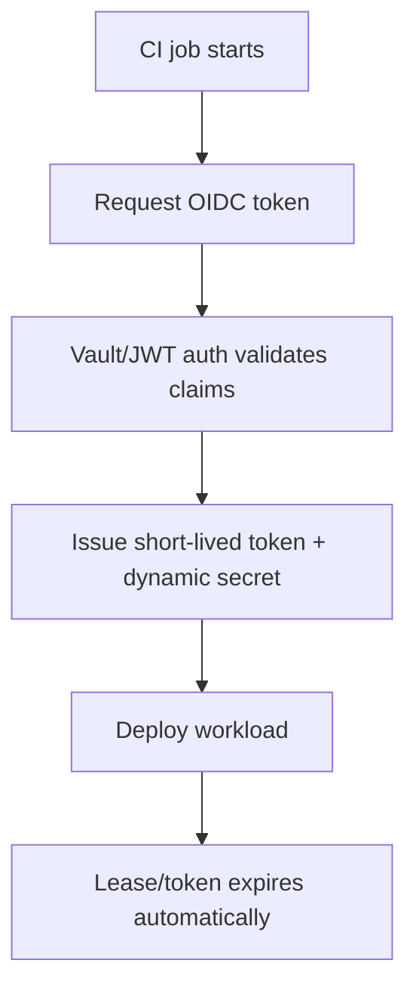

Vault sprawl in multi-team CI/CD is usually a governance failure, not a tooling failure. The practical model that works is: short-lived identity-based access (OIDC/workload identity), path ownership boundaries, policy-as-code with review gates, and measurable rotation/usage controls per team.

<!-- truncate -->

## The Problem

As teams scale, secrets handling drifts into four repeating failure patterns:

| Sprawl pattern | What breaks | Typical incident |
| --- | --- | --- |
| One shared Vault namespace for many teams | No clear ownership, broad blast radius | Team A pipeline can read Team B secrets |
| Long-lived CI tokens in repo/org secrets | Rotations lag, credentials leak and persist | Exposed token keeps working for weeks |
| Inconsistent secret paths/names | Automation and auditing become brittle | Rotation scripts miss critical paths |
| Manual exceptions outside policy review | Shadow access accumulates | Emergency grants never removed |

Kubernetes guidance still warns that native secrets can be mishandled without encryption-at-rest and strict RBAC. The same pattern appears in CI: if identity and policy are weak, secret stores become high-value failure hubs instead of controls.

## The Solution

### Governance Blueprint (Practical Baseline)

| Control plane | Standard | Enforce in CI |
| --- | --- | --- |
| Identity | OIDC/workload identity only for CI workloads | Block static token auth in pipelines |
| Authorization | Team-scoped Vault paths + least privilege policies | Validate policy diffs on PR |
| Lifecycle | TTL defaults + max TTL + mandatory rotation SLA | Fail builds for expired owners/rotation metadata |
| Observability | Audit logs mapped to repo/team/service | Daily drift report to platform + team owners |

### Reference Policy Contract

```hcl
# vault/policies/team-payments-ci.hcl
path "kv/data/payments/prod/*" {
  capabilities = ["read"]
}

path "database/creds/payments-ci" {
  capabilities = ["read"]
}
```

```yaml
# .github/workflows/deploy.yml
permissions:
  id-token: write
  contents: read
```

The `id-token: write` permission enables OIDC token minting in GitHub Actions and replaces stored long-lived cloud/Vault credentials with short-lived exchanges.

### Migration Away from Deprecated Pattern

Deprecated workflow pattern: static CI secrets for Vault/cloud auth.  
Replacement: OIDC federation + dynamic secrets + bounded TTL.



### Operating Rules That Prevent Re-Sprawl

1. One team owner for each secret path prefix (`kv/data/<team>/<env>/...`).
2. Every secret includes metadata: owner, rotation_sla_days, source_system.
3. PR checks reject policy changes without owner approval.
4. Any manual break-glass access auto-expires and creates a follow-up ticket.

Related posts: [Unprotected AI Agents Report](/2026-02-19-unprotected-ai-agents-report/), [Multi-Agent Reliability Playbook](/2026-02-24-multi-agent-reliability-playbook-github-deep-dive/), [Agentic AI without vibe coding](/agentic-ai-without-vibe-coding/).

## What I Learned

- Worth trying when many teams share one secrets platform: enforce path ownership before adding more tooling.
- OIDC plus short-lived credentials is the fastest risk reduction move in CI/CD.
- Avoid in production: emergency policy exceptions without expiry and ticketed cleanup.
- Rotation SLAs are only useful when encoded as CI gates, not documentation.

## References

- https://developer.hashicorp.com/vault/docs/updates/release-notes
- https://docs.github.com/en/actions/how-tos/secure-your-work/security-harden-deployments
- https://docs.github.com/en/actions/security-for-github-actions/security-hardening-your-deployments/configuring-openid-connect-in-cloud-providers
- https://kubernetes.io/docs/concepts/security/secrets-good-practices
- https://kubernetes.io/docs/concepts/configuration/secret/
- https://developer.hashicorp.com/vault/docs/deploy/kubernetes/vso/csi
