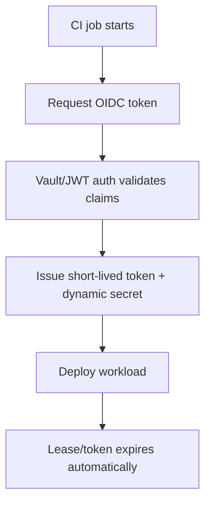
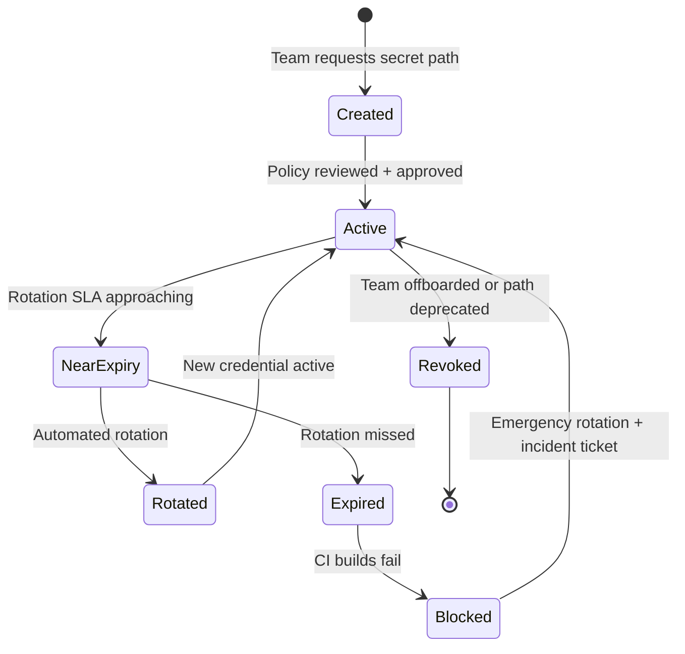

import Tabs from '@theme/Tabs';
import TabItem from '@theme/TabItem';

Vault sprawl in multi-team CI/CD is usually a governance failure, not a tooling failure. The practical model that works is: short-lived identity-based access (OIDC/workload identity), path ownership boundaries, policy-as-code with review gates, and measurable rotation/usage controls per team.

<!-- truncate -->

## The problem

As teams scale, secrets handling drifts into four repeating failure patterns:

| Sprawl pattern | What breaks | Typical incident |
|---|---|---|
| One shared Vault namespace for many teams | No clear ownership, broad blast radius | Team A pipeline can read Team B secrets |
| Long-lived CI tokens in repo/org secrets | Rotations lag, credentials leak and persist | Exposed token keeps working for weeks |
| Inconsistent secret paths/names | Automation and auditing become brittle | Rotation scripts miss critical paths |
| Manual exceptions outside policy review | Shadow access accumulates | Emergency grants never removed |

:::danger[Blast Radius]
Kubernetes guidance still warns that native secrets can be mishandled without encryption-at-rest and strict RBAC. The same pattern appears in CI: if identity and policy are weak, secret stores become high-value failure hubs instead of controls.
:::

## The solution

### Governance blueprint

| Control plane | Standard | Enforce in CI |
|---|---|---|
| Identity | OIDC/workload identity only for CI | Block static token auth in pipelines |
| Authorization | Team-scoped Vault paths + least privilege | Validate policy diffs on PR |
| Lifecycle | TTL defaults + max TTL + mandatory rotation SLA | Fail builds for expired owners/rotation metadata |
| Observability | Audit logs mapped to repo/team/service | Daily drift report to platform + team owners |

### Reference policy contract

<Tabs>
<TabItem value="vault" label="Vault Policy (HCL)" default>

```hcl title="vault/policies/team-payments-ci.hcl" showLineNumbers
# highlight-start
path "kv/data/payments/prod/*" {
  capabilities = ["read"]
}
# highlight-end

path "database/creds/payments-ci" {
  capabilities = ["read"]
}
```

</TabItem>
<TabItem value="github" label="GitHub Actions Workflow">

```yaml title=".github/workflows/deploy.yml" showLineNumbers
permissions:
  # highlight-next-line
  id-token: write
  contents: read
```

The `id-token: write` permission enables OIDC token minting in GitHub Actions and replaces stored long-lived cloud/Vault credentials with short-lived exchanges.

</TabItem>
</Tabs>

### Migration from deprecated pattern

```diff
- # Deprecated: static CI secrets for Vault/cloud auth
- env:
-   VAULT_TOKEN: ${{ secrets.VAULT_TOKEN }}
+ # Replacement: OIDC federation + dynamic secrets + bounded TTL
+ permissions:
+   id-token: write
```

### OIDC authentication flow



### Secret lifecycle states



### Operating rules that prevent re-sprawl

1. One team owner for each secret path prefix (`kv/data/<team>/<env>/...`).
2. Every secret includes metadata: owner, rotation_sla_days, source_system.
3. PR checks reject policy changes without owner approval.
4. Any manual break-glass access auto-expires and creates a follow-up ticket.

:::tip[Fastest Risk Reduction]
OIDC plus short-lived credentials is the fastest risk reduction move in CI/CD. Start there before adding more tooling.
:::

## Migration checklist

- [ ] Audit all static CI tokens across repos
- [ ] Configure OIDC/workload identity for all CI pipelines
- [ ] Establish team-scoped Vault path ownership
- [ ] Write and review Vault policies as code
- [ ] Set TTL defaults and max TTL for all secret paths
- [ ] Add rotation SLA metadata to all secrets
- [ ] Configure CI to fail on expired owners/rotation metadata
- [ ] Set up daily drift reports for platform and team owners
- [x] Remove all static long-lived tokens from CI secrets

<details>
<summary>Related posts</summary>

- [Unprotected AI Agents Report](/2026-02-19-unprotected-ai-agents-report/)
- [Multi-Agent Reliability Playbook](/2026-02-24-multi-agent-reliability-playbook-github-deep-dive/)
- [Agentic AI without vibe coding](/agentic-ai-without-vibe-coding/)

</details>

## Why this matters for Drupal and WordPress

Drupal and WordPress deployments often run on platform or agency CI: Pantheon, Acquia, WP Engine, or custom pipelines that build, test, and deploy sites and contrib/plugins. Those pipelines need DB credentials, API keys, and sometimes Vault (or similar) for secrets. Multi-tenant or multi-team setups suffer the same sprawl — shared namespaces, long-lived tokens in GitHub Actions or GitLab CI, and no clear path ownership. Applying this governance model (OIDC for CI, team-scoped paths, policy-as-code, rotation SLAs as CI gates) reduces risk for any team that deploys Drupal/WordPress from CI. If you maintain contrib modules or plugins and use a shared secrets store, push for identity-based access and required rotation metadata so one leaked token doesn't expose every site or environment.

## What I learned

- Worth trying when many teams share one secrets platform: enforce path ownership before adding more tooling.
- OIDC plus short-lived credentials is the fastest risk reduction move in CI/CD.
- Avoid in production: emergency policy exceptions without expiry and ticketed cleanup.
- Rotation SLAs are only useful when encoded as CI gates, not documentation.

## References

- https://developer.hashicorp.com/vault/docs/updates/release-notes
- https://docs.github.com/en/actions/how-tos/secure-your-work/security-harden-deployments
- https://docs.github.com/en/actions/security-for-github-actions/security-hardening-your-deployments/configuring-openid-connect-in-cloud-providers
- https://kubernetes.io/docs/concepts/security/secrets-good-practices
- https://kubernetes.io/docs/concepts/configuration/secret/
- https://developer.hashicorp.com/vault/docs/deploy/kubernetes/vso/csi


***
*Looking for an Architect who doesn't just write code, but builds the AI systems that multiply your team's output? View my enterprise CMS case studies at [victorjimenezdev.github.io](https://victorjimenezdev.github.io) or connect with me on LinkedIn.*
