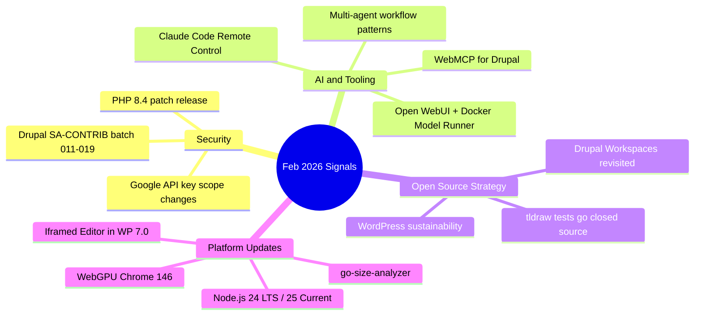

import TOCInline from '@theme/TOCInline';

February 2026 feels like the month where the industry admitted two things at once: security assumptions were wrong, and "AI everywhere" still does not mean "useful everywhere." The signal is in practical changes, not launch videos.

<!-- truncate -->

<TOCInline toc={toc} minHeadingLevel={2} maxHeadingLevel={2} />

<details>
<summary>TL;DR — 30 second version</summary>

- Google API keys that were "safe" for Maps now unlock billable Gemini operations -- key governance is broken overnight
- Drupal had 9 security advisories (SA-CONTRIB-2026-011 through 019) -- update everything
- tldraw moved tests to closed source because tests encode product behavior = strategic IP
- AI tooling (Claude Code remote, Open WebUI, WebMCP for Drupal) keeps advancing, but product fit still lags capability
- PHP 8.4 patch, Node.js 24 LTS and 25 Current updates, WebGPU Chrome 146 improvements

</details>



## Security: The Rules Changed

### Google API Keys and Gemini

The old rule ("browser keys are fine if restricted") broke when key scopes and product boundaries blurred. If a key pattern that was safe for Maps can now expose Gemini-powered billable and sensitive operations, your key governance model is outdated overnight.

```bash title="Terminal — audit your API key scopes"
# Check what services your GCP API keys can access
gcloud services list --enabled --project=YOUR_PROJECT
# Review key restrictions in the console
gcloud alpha services api-keys list --project=YOUR_PROJECT
```

:::warning[Key Governance]
If keys that used to be "public-ish" now unlock private/billable AI behavior, old key management assumptions are dead. Treat API keys by capability, not by legacy habit.
:::

### Drupal Security Advisories Batch (SA-CONTRIB-2026-011 through 019)

This was a heavy week. Nine advisories across contrib modules:

| Advisory | Module | Issue | Severity |
|---|---|---|---|
| SA-CONTRIB-2026-019 | Responsive Favicons | Persistent XSS from admin-entered text | High |
| SA-CONTRIB-2026-018 | SAML SSO - Service Provider | Critical reflected XSS in auth module | Critical |
| SA-CONTRIB-2026-017 | Drupal Canvas | SSRF + information disclosure | High |
| SA-CONTRIB-2026-016 | Islandora | Arbitrary file upload + XSS | Critical |
| SA-CONTRIB-2026-015 | CAPTCHA | Access bypass via weak token invalidation | Medium |
| SA-CONTRIB-2026-014 | Anti-Spam by CleanTalk | Reflected XSS with complex conditions | Medium |
| SA-CONTRIB-2026-013 | Tagify | XSS risk in admin/editorial interfaces | High |
| SA-CONTRIB-2026-012 | Theme Negotiation by Rules | CSRF on configuration behavior | Medium |
| SA-CONTRIB-2026-011 | Material Icons | Route permission mistakes | Medium |

:::tip[Top Takeaway]
"Admin input" is still untrusted input. Internal users are still attack paths. Route permission mistakes remain one of the most boring and most common Drupal security failures -- and boring failures are still expensive.
:::

### PHP 8.4 Latest Patch Release

Patch-level updates still matter because ecosystems quietly depend on them for stability and security. "No new feature" does not mean "no urgency."

## AI and Tooling: Advancing Fast, Fitting Slowly

### Claude Code Remote Control

Remote-control sessions from web/mobile clients are useful, but early reliability friction shows the usual enterprise rollout gap: feature exists, entitlement path is messy.

### Open WebUI + Docker Model Runner

Zero-config local model wiring lowers self-hosting friction significantly. The real win is not "open source AI" branding, it is operational simplicity for teams.

```bash title="Terminal — quick Docker Model Runner setup"
# Pull and run with Open WebUI auto-detection
docker run -d -p 3000:8080 --name openwebui ghcr.io/open-webui/open-webui:main
# Models served at localhost:12434 are auto-detected
```

### WebMCP for Drupal (mark.ie)

WebMCP interest shows where things are heading: protocolized agent-tool interaction inside CMS workflows. Early, but worth tracking.

### Multi-Agent Workflows

> Most failures are architecture failures, not model failures.

Reliability comes from orchestration patterns, constraints, and clear handoffs -- not from better models alone.

### Quoting Benedict Evans on Capability vs Product-Market Fit

> The "capability gap" framing is polite language for weak day-to-day product fit.

This matters because model demos are no longer the bottleneck; habit-forming product design is.

### Quoting Kellan Elliott-McCrea

> Coding was never the full job; agency was.

This framing matters now because AI changes implementation speed, not the need for judgment and responsibility.

## Open Source Strategy

### tldraw: Moving Tests to Closed Source

Open tests can become replication blueprints for commercial competitors. Harsh, but real: if tests encode product behavior comprehensively, they are strategic IP, not just QA assets.

:::info[Context]
This is a hard open-source business signal: test suites can act as executable specs for cloning. Teams now have to balance openness with commercial defensibility.
:::

### WordPress Sustainability (#206 -- Jonathan Desrosiers)

Tying releases to community events sounds nice until time zones, holidays, and contributor availability collide. Governance logistics are product strategy, not admin overhead.

### Drupal Workspaces Revisited (mark.ie)

Workspaces are powerful but still cognitively expensive. Better guidance and defaults matter more than adding another feature flag.

## Platform and Runtime Updates

### WebGPU (Chrome 146)

Compatibility mode on OpenGL ES 3.1 and transient attachments improve practical portability and memory behavior. This is infrastructure progress, not headline hype.

### Node.js Updates

- **Node.js 25.7.0 (Current)**: Keeps moving fast, useful for experimentation but still risky for conservative production stacks.
- **Node.js 24.14.0 (LTS)**: LTS updates remain the sane default for teams that value predictability over novelty. Stability is a feature.

### Iframed Editor Changes in WordPress 7.0

Switching to checking only inserted blocks for iframe eligibility is a practical compatibility improvement. Fewer global assumptions, fewer accidental regressions.

### go-size-analyzer

Treemap-driven Go binary analysis is exactly the kind of tooling that improves engineering decisions fast. Visibility into size costs should be standard in CI.

## Community and Practice

### Tag1 Insights: AI for Drupal Development

The useful part is not "AI replaced dev work," it is where AI reduced grind in specific module tasks. Applied AI wins come from bounded, testable tasks, not from asking for magic.

### Linear Walkthroughs (Agentic Engineering Patterns)

Structured codebase walkthroughs are becoming a core onboarding pattern. If an agent can explain architecture quickly, team ramp-up gets cheaper.

### "First Run the Tests" (Agentic Engineering Patterns)

With coding agents, tests are no longer optional guardrails. They are the contract that keeps fast iteration from becoming fast damage.

### How We Rebuilt Next.js with AI in One Week

The interesting part is not the speed claim; it is measurable outcomes (build time, bundle size, deployment path). Benchmarkable claims are the only claims that matter.

### How to Turn Off AI Features in Firefox

User-choice controls for AI are now a competitive feature. Consent and configurability are product differentiators, not legal afterthoughts.

### Specbee: Drupal Agency vs General Web Agency

Stack specialization still matters because platform-specific failure modes are expensive. "Any web agency can do it" is often procurement optimism.

### Joachim's Blog: Release More Code

Releasing custom code as contrib is less about heroics and more about packaging discipline, abstraction, and maintenance readiness. Open source starts with cleanup work.

## Signal Summary

| Topic | Signal | Action | Priority |
|---|---|---|---|
| Google API Keys + Gemini | Key scope boundaries blurred | Audit all key restrictions immediately | Critical |
| Drupal SA-CONTRIB batch | 9 advisories in one week | Update all affected modules | Critical |
| PHP 8.4 Patch | Stability + security | Apply patch release | High |
| tldraw Tests Closed | Tests = strategic IP | Review your own test exposure | Medium |
| Multi-Agent Patterns | Architecture > model quality | Invest in orchestration, not just models | High |
| Node.js 24 LTS | Stability update | Update production stacks | Medium |
| WebMCP for Drupal | Protocol-level CMS integration | Track early development | Low |

## Why this matters for Drupal and WordPress

Drupal's 9-advisory batch and the WordPress sustainability discussion highlight the same reality: extension ecosystems are the primary attack surface for both CMS platforms. Drupal maintainers need to audit contrib modules against the SA-CONTRIB batch immediately, while WordPress site owners should map Wordfence weekly reports against their plugin inventories. Agencies running both platforms can unify their triage pipelines using the same act-now / queue / ignore taxonomy.

## The Bottom Line

The pattern this month is simple: security assumptions are shifting, governance and tooling decisions are getting more strategic, and AI value appears where teams apply structure, tests, and clear constraints. Hype is loud; operational rigor is winning.


***
*Looking for an Architect who doesn't just write code, but builds the AI systems that multiply your team's output? View my enterprise CMS case studies at [victorjimenezdev.github.io](https://victorjimenezdev.github.io) or connect with me on LinkedIn.*
