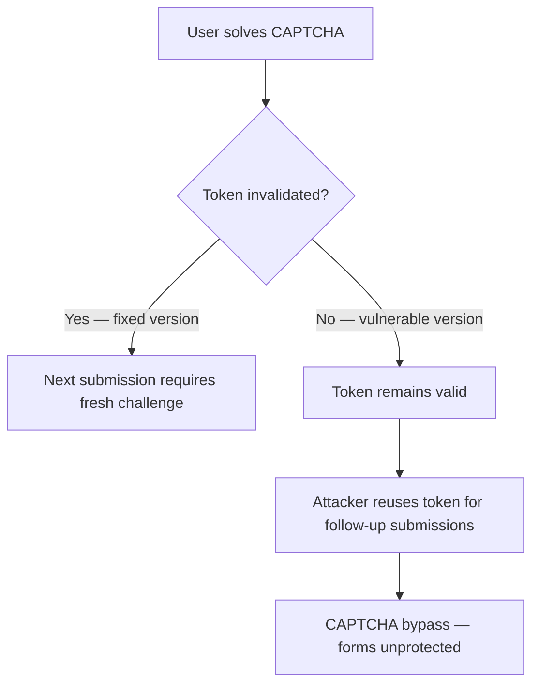

SA-CONTRIB-2026-015 is a token lifecycle failure: solved CAPTCHA tokens were not invalidated reliably, which means follow-up submissions could bypass CAPTCHA checks entirely.

<!-- truncate -->

:::danger[Patch Now — Token Reuse Bypass]
CVE-2026-3214 allows CAPTCHA bypass through token reuse. If you run `drupal/captcha` below 1.17.0 (1.x) or below 2.0.10 (2.x), your forms are not protected the way you think they are. Update today.
:::

## Severity Snapshot

| SA ID | CVE | Severity | Affected Versions | Patched Version | Action |
|---|---|---|---|---|---|
| SA-CONTRIB-2026-015 | CVE-2026-3214 | Moderately Critical | `< 1.17.0` or `>= 2.0.0, < 2.0.10` | `8.x-1.17` / `2.0.10` | Update immediately |

## What Happened

The Drupal Security Team published SA-CONTRIB-2026-015 on February 25, 2026 for the CAPTCHA module (`drupal/captcha`). The advisory is classified as an access bypass vulnerability.

The core issue: under certain scenarios, used security tokens could remain reusable instead of being invalidated after a successful CAPTCHA solve.



> "An access bypass vulnerability exists in the CAPTCHA module that could allow used security tokens to remain reusable instead of being invalidated after a successful CAPTCHA solve."
>
> — Drupal Security Team, [SA-CONTRIB-2026-015](https://www.drupal.org/sa-contrib-2026-015)

## Why This Matters

CAPTCHA is a baseline anti-abuse control on login, registration, contact, and form-heavy workflows. If token invalidation is weak, that control degrades silently. Teams overestimate their bot resistance while automated abuse continues unchecked.

:::tip[Fast Triage — 10 Seconds]
Run `composer show drupal/captcha` to check your installed version. If the output shows anything below `1.17.0` or below `2.0.10`, patch now.
:::

## Triage Checklist

- [ ] Check installed version: `composer show drupal/captcha`
- [ ] Verify current branch (1.x or 2.x)
- [ ] Apply patch for your branch
- [ ] Clear caches: `drush cr`
- [ ] Re-test protected forms for one-time token behavior
- [x] Confirm repeated submissions require a fresh challenge

```bash title="Terminal — update CAPTCHA (2.x branch)"
composer require drupal/captcha:^2.0.10
drush cr
```

```bash title="Terminal — update CAPTCHA (1.x branch)"
composer require drupal/captcha:^1.17
drush cr
```

<details>
<summary>Full advisory details and references</summary>

- **Project:** CAPTCHA (`drupal/captcha`)
- **Advisory:** SA-CONTRIB-2026-015
- **CVE:** CVE-2026-3214
- **Published:** 2026-02-25
- **Risk:** Moderately critical
- **Type:** Access bypass
- **Affected versions:** `< 1.17.0` on 1.x branch, `>= 2.0.0, < 2.0.10` on 2.x branch
- **Fixed versions:** `8.x-1.17`, `2.0.10`

</details>

## Bottom Line

If you rely on CAPTCHA as a core spam gate and are below the fixed versions, treat this as active security patch work. Upgrade first, then verify token reuse is no longer possible in your real submission flows.

## References

- [SA-CONTRIB-2026-015](https://www.drupal.org/sa-contrib-2026-015)
- [OSV: DRUPAL-CONTRIB-2026-015](https://api.osv.dev/v1/vulns/DRUPAL-CONTRIB-2026-015)
- [Advisory JSON](https://github.com/DrupalSecurityTeam/drupal-advisory-database/blob/main/advisories/captcha/DRUPAL-CONTRIB-2026-015.json)
