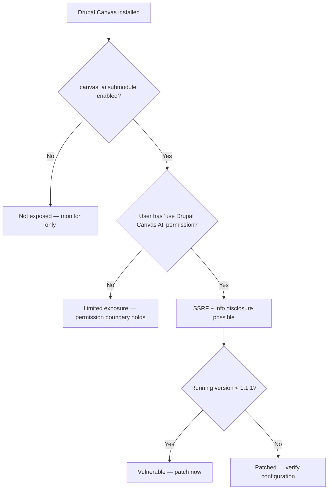

SA-CONTRIB-2026-017 is a moderately critical Drupal Canvas advisory, but the real risk hinges on one question: is the hidden `canvas_ai` submodule enabled? If you do not know the answer, that is the problem.

<!-- truncate -->

:::danger[SSRF + Information Disclosure]
CVE-2026-3216 enables server-side request forgery and information disclosure via the `canvas_ai` submodule. If you run Drupal Canvas below 1.1.1 with `canvas_ai` enabled, your server can be used to make arbitrary outbound requests.
:::

## Severity Snapshot

| SA ID | CVE | Severity | Affected Versions | Patched Version | Action |
|---|---|---|---|---|---|
| SA-CONTRIB-2026-017 | CVE-2026-3216 | Moderately Critical | `< 1.1.1` | `1.1.1` | Update immediately |

## What Happened

On February 25, 2026, Drupal published SA-CONTRIB-2026-017 for Drupal Canvas, covering server-side request forgery (SSRF) and information disclosure.

The vulnerability sits in the `canvas_ai` submodule — a hidden submodule that is often enabled via recipes or deployment scripts without explicit awareness.



## Exposure Conditions

Your site is exposed when **all** of these are true:

1. You run Drupal Canvas below `1.1.1`
2. The hidden submodule `canvas_ai` is enabled (often via recipes or deployment scripts)
3. An attacker has a role with `use Drupal Canvas AI` permission

:::tip[Check canvas_ai Status — 5 Seconds]
Run `drush config:get core.extension | grep canvas_ai` to see if the submodule is active. If it shows nothing, you are not exposed through this vector.
:::

> "A server-side request forgery and information disclosure vulnerability exists in the Drupal Canvas module when the canvas_ai submodule is enabled."
>
> — Drupal Security Team, [SA-CONTRIB-2026-017](https://www.drupal.org/sa-contrib-2026-017)

## Triage Checklist

- [ ] Check if `drupal/canvas` is installed: `composer show drupal/canvas`
- [ ] Verify if `canvas_ai` submodule is enabled: `drush config:get core.extension | grep canvas_ai`
- [ ] Update to `1.1.1`: `composer require drupal/canvas:^1.1.1`
- [ ] Clear caches: `drush cr`
- [ ] Review roles with `use Drupal Canvas AI` permission and reduce scope
- [x] Check logs for unusual outbound request behavior

```bash title="Terminal — update and verify"
composer require drupal/canvas:^1.1.1
drush cr
drush config:get core.extension | grep canvas_ai
```

<details>
<summary>Why hidden submodules are a deployment risk</summary>

Recipe-driven and script-driven enablement can introduce hidden runtime surface area. If your deployment enables dependencies automatically, your security checks must validate what is actually enabled in `core.extension`, not just what appears in the UI.

This is a pattern I see repeatedly in Drupal CMS deployments: a recipe enables a submodule during provisioning, nobody audits the result, and the extra attack surface sits there until an advisory forces the question.

**Action:** Add a CI step that dumps `drush pm:list --status=enabled` and diffs it against your expected module list. Flag any unexpected modules before deploy.

</details>

## Why this matters for Drupal and WordPress

The hidden submodule problem has a direct WordPress parallel: plugins that bundle AI features as optional add-ons or companion plugins that get activated during setup wizards without explicit user awareness. WordPress sites using AI-integrated plugins (like AI-powered content generators or chatbot widgets) should audit whether those plugins make outbound HTTP requests to third-party endpoints and whether SSRF protections are in place. Drupal's recipe-driven enablement and WordPress's one-click activation flows both create attack surface that does not appear in obvious admin UI listings.

## Bottom Line

If you run Drupal Canvas below `1.1.1`, update now. But the bigger lesson here is that recipe-driven deployments need explicit module inventory checks. A submodule you did not knowingly enable is still your attack surface.

## References

- [SA-CONTRIB-2026-017](https://www.drupal.org/sa-contrib-2026-017)
- [Drupal Canvas 1.1.1 release](https://www.drupal.org/project/canvas/releases/1.1.1)


***
*Need an Enterprise CMS Architect to modernize your legacy PHP platforms? View my case studies at [victorjimenezdev.github.io](https://victorjimenezdev.github.io) or connect with me on LinkedIn.*
